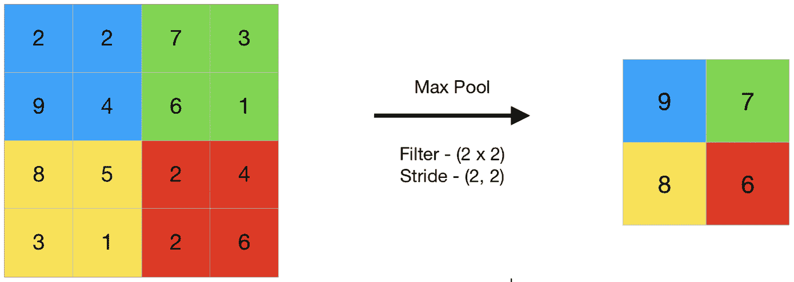
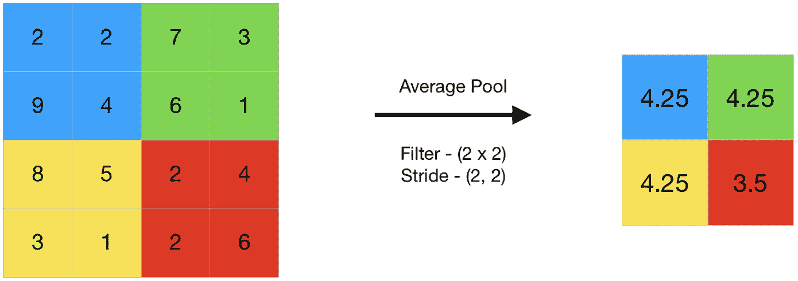

# CNN |汇聚层介绍

> 原文:[https://www . geeksforgeeks . org/CNN-引入池层/](https://www.geeksforgeeks.org/cnn-introduction-to-pooling-layer/)

汇集操作包括在特征图的每个通道上滑动二维过滤器，并汇总过滤器覆盖区域内的特征。
对于尺寸为**n<sub>h</sub>x n<sub>w</sub>x n<sub>c</sub>T8】的要素图，汇集图层后得到的输出尺寸为** 

```
(n<sub>h - f + 1) / s x (nw - f + 1)/s x nc</sub>
```

哪里，

```
-> n<sub>h -</sub> height of feature map
-> n<sub>w -</sub> width of feature map
-> n<sub>c -</sub> number of channels in the feature map
-> f  - size of filter
-> s  - stride length
```

常见的 CNN 模型架构是将多个卷积层和池层一个接一个地堆叠起来。

#### **为什么要使用汇集图层？**

*   汇集图层用于减少要素地图的维度。因此，它减少了要学习的参数数量和网络中执行的计算量。
*   汇集图层汇总了由卷积图层生成的要素地图区域中存在的要素。因此，对概括的特征而不是由卷积层生成的精确定位的特征执行进一步的操作。这使得该模型对输入图像中特征位置的变化更加稳健。

#### **汇集图层类型:**

**最大汇集**

1.  最大池化是一种池化操作，从过滤器覆盖的要素地图区域中选择最大元素。因此，最大池化图层后的输出将是包含先前要素图中最显著要素的要素图。



1.  这可以使用 keras 中的 Max Pooling 层来实现，如下所示:
    **代码#1:使用 keras 执行 Max Pooling】**

## 蟒蛇 3

```
import numpy as np
from keras.models import Sequential
from keras.layers import MaxPooling2D

# define input image
image = np.array([[2, 2, 7, 3],
                  [9, 4, 6, 1],
                  [8, 5, 2, 4],
                  [3, 1, 2, 6]])
image = image.reshape(1, 4, 4, 1)

# define model containing just a single max pooling layer
model = Sequential(
    [MaxPooling2D(pool_size = 2, strides = 2)])

# generate pooled output
output = model.predict(image)

# print output image
output = np.squeeze(output)
print(output)
```

1.  **输出:**

```
[[9\. 7.]
[8\. 6.]]
```

### **平均分摊**

1.  平均池计算过滤器覆盖的要素地图区域中存在的元素的平均值。因此，虽然最大池提供了要素地图中某个特定斑块的最显著要素，但平均池提供了斑块中存在的要素的平均值。



1.  **代码#2:使用 keras 执行平均池**

## 蟒蛇 3

```
import numpy as np
from keras.models import Sequential
from keras.layers import AveragePooling2D

# define input image
image = np.array([[2, 2, 7, 3],
                  [9, 4, 6, 1],
                  [8, 5, 2, 4],
                  [3, 1, 2, 6]])
image = image.reshape(1, 4, 4, 1)

# define model containing just a single average pooling layer
model = Sequential(
    [AveragePooling2D(pool_size = 2, strides = 2)])

# generate pooled output
output = model.predict(image)

# print output image
output = np.squeeze(output)
print(output)
```

1.  **输出:**

```

[[4.25 4.25]
[4.25 3.5 ]]
```

### **全局汇集**

1.  全局池化将要素图中的每个通道减少到一个值。因此，一个**n<sub>h</sub>x n<sub>w</sub>x n<sub>c</sub>**特征图被简化为 **1 x 1 x n <sub>c</sub>** 特征图。这相当于使用尺寸**n<sub>h</sub>x n<sub>w</sub>**的过滤器，即特征图的尺寸。
    进一步说，可以是全局最大池化，也可以是全局平均池化。
    **代码#3:使用 keras 执行全局池化**

## 蟒蛇 3

```
import numpy as np
from keras.models import Sequential
from keras.layers import GlobalMaxPooling2D
from keras.layers import GlobalAveragePooling2D

# define input image
image = np.array([[2, 2, 7, 3],
                  [9, 4, 6, 1],
                  [8, 5, 2, 4],
                  [3, 1, 2, 6]])
image = image.reshape(1, 4, 4, 1)

# define gm_model containing just a single global-max pooling layer
gm_model = Sequential(
    [GlobalMaxPooling2D()])

# define ga_model containing just a single global-average pooling layer
ga_model = Sequential(
    [GlobalAveragePooling2D()])

# generate pooled output
gm_output = gm_model.predict(image)
ga_output = ga_model.predict(image)

# print output image
gm_output = np.squeeze(gm_output)
ga_output = np.squeeze(ga_output)
print("gm_output: ", gm_output)
print("ga_output: ", ga_output)
```

1.  **输出:**

```

gm_output:  9.0
ga_output:  4.0625 
```