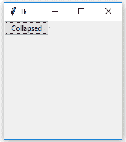
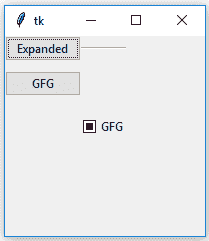

# Tkinter | Python 中的可折叠窗格

> 原文:[https://www . geesforgeks . org/可折叠窗格 in-tkinter-python/](https://www.geeksforgeeks.org/collapsible-pane-in-tkinter-python/)

顾名思义，可折叠窗格就是可以折叠的窗格。用户可以展开窗格，以便他们可以执行某些任务，当任务完成时，窗格可以折叠。
在 Tkinter 中，可折叠窗格是一个带有嵌入式按钮状控件的容器，用于展开或折叠该容器。
**先决条件:**

```
Frame Class
Checkbutton Class
Styling in widgets
configure() method
```

**折叠窗格类–**
折叠窗格小部件用于存储其中的任何其他小部件。它可以打开或关闭，所以它里面的小部件并不总是显示出来。

> **参数:**
> **父代=** 小部件的父代。
> **展开文本=** 窗格打开时按钮上显示的文本。
> **折叠 _ 文本=** 窗格关闭时按钮上显示的文本。
> **功能:**
> **_ activate()**=检查变量的值并显示或隐藏框架。
> **切换()** =将标签框架切换到相反的状态。
> **小部件:**
> **self_button =** 切换框架的按钮。
> **框架=** 保存小部件的框架。
> **_ 分离器=** 分离器。

## 蟒蛇 3

```
# Implementation of Collapsible Pane container

# importing tkinter and ttk modules
import tkinter as tk
from tkinter import ttk

class CollapsiblePane(ttk.Frame):
    """
     -----USAGE-----
    collapsiblePane = CollapsiblePane(parent,
                          expanded_text =[string],
                          collapsed_text =[string])

    collapsiblePane.pack()
    button = Button(collapsiblePane.frame).pack()
    """

    def __init__(self, parent, expanded_text ="Collapse <<",
                               collapsed_text ="Expand >>"):

        ttk.Frame.__init__(self, parent)

        # These are the class variable
        # see a underscore in expanded_text and _collapsed_text
        # this means these are private to class
        self.parent = parent
        self._expanded_text = expanded_text
        self._collapsed_text = collapsed_text

        # Here weight implies that it can grow it's
        # size if extra space is available
        # default weight is 0
        self.columnconfigure(1, weight = 1)

        # Tkinter variable storing integer value
        self._variable = tk.IntVar()

        # Checkbutton is created but will behave as Button
        # cause in style, Button is passed
        # main reason to do this is Button do not support
        # variable option but checkbutton do
        self._button = ttk.Checkbutton(self, variable = self._variable,
                            command = self._activate, style ="TButton")
        self._button.grid(row = 0, column = 0)

        # This wil create a separator
        # A separator is a line, we can also set thickness
        self._separator = ttk.Separator(self, orient ="horizontal")
        self._separator.grid(row = 0, column = 1, sticky ="we")

        self.frame = ttk.Frame(self)

        # This will call activate function of class
        self._activate()

    def _activate(self):
        if not self._variable.get():

            # As soon as button is pressed it removes this widget
            # but is not destroyed means can be displayed again
            self.frame.grid_forget()

            # This will change the text of the checkbutton
            self._button.configure(text = self._collapsed_text)

        elif self._variable.get():
            # increasing the frame area so new widgets
            # could reside in this container
            self.frame.grid(row = 1, column = 0, columnspan = 2)
            self._button.configure(text = self._expanded_text)

    def toggle(self):
        """Switches the label frame to the opposite state."""
        self._variable.set(not self._variable.get())
        self._activate()
```

**演示折叠窗格使用的程序–**

## 蟒蛇 3

```
# Importing tkinter and ttk modules
from tkinter import * from tkinter.ttk import *

# Importing Collapsible Pane class that we have
# created in separate file
from collapsiblepane import CollapsiblePane as cp

# Making root window or parent window
root = Tk()
root.geometry('200x200')

# Creating Object of Collapsible Pane Container
# If we do not pass these strings in
# parameter the the default strings will appear
# on button that were, expand >>, collapse <<
cpane = cp(root, 'Expanded', 'Collapsed')
cpane.grid(row = 0, column = 0)

# Button and checkbutton, these will
# appear in collapsible pane container
b1 = Button(cpane.frame, text ="GFG").grid(
            row = 1, column = 2, pady = 10)

cb1 = Checkbutton(cpane.frame, text ="GFG").grid(
                  row = 2, column = 3, pady = 10)

mainloop()
```

**输出:**



