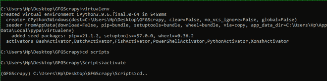

# 用 Scrapy 收集数据

> 原文:[https://www.geeksforgeeks.org/collecting-data-with-scrapy/](https://www.geeksforgeeks.org/collecting-data-with-scrapy/)

**先决条件:**

*   [刺痒](https://www.geeksforgeeks.org/implementing-web-scraping-python-scrapy/)
*   [SQLite3](https://www.geeksforgeeks.org/introduction-to-sqlite-in-python/)

**Scrapy** 是一个网页抓取库，用于抓取、解析和收集网页数据。现在，一旦我们的蜘蛛抓取了数据，它就会决定是否:

*   保留数据。
*   删除数据或项目。
*   停止并存储已处理的数据项。

因此，对于所有这些功能，我们有一个 **pipelines.py** 文件，用于通过顺序执行的各种组件(称为**类**)来处理刮擦的数据。在本文中，我们将通过 pipelines.py 文件了解如何使用 SQLite3 数据库语言来使用它来**收集由 scrapy 刮下的数据**。

## **初始化目录并设置**项目

让我们，首先，创建一个剪贴簿项目。为此，请确保系统中安装了 Python 和 PIP。然后一个接一个地运行下面给出的命令，创建一个类似于我们将在本文中使用的项目。

*   让我们首先在名为 GFGScrapy 的文件夹中创建一个虚拟环境，并在那里激活该虚拟环境。

```py
# To create a folder named GFGScrapy
mkdir GFGScrapy    
cd GFGScrapy

# making virtual env there.
virtualenv .    
cd scripts  

# activating it.
activate     
cd..
```

**输出:**



创建虚拟环境

*   现在是时候创建一个项目了。为此，请确保系统中是否安装了 scrapy。如果没有安装，请使用下面给出的命令进行安装。

**语法:**

```py
pip install scrapy
```

现在要创建一个剪贴簿项目，使用下面给出的命令，并创建一个蜘蛛。

```py
# project name is scrapytutorial
scrapy startproject scrapytutorial  
cd scrapytutorial

# link is of the website we are looking to crawl
scrapy genspider spider_to_crawl https://quotes.toscrape.com
```

一旦您使用 pip 安装程序创建了一个杂乱的项目，那么项目目录的输出看起来就像图像中给出的一样。


目录结构

## 杂乱的目录结构

**目录结构**由以下路径组成(示例)

```py
C://<project-name>/<project-name>
```

在上面的图片中，项目名是 scrapytutorial，里面有很多文件，如图所示。

*   我们感兴趣的文件是 **spider_to_crawl.py** 文件(在这里我们曾经描述了我们的蜘蛛的方法)和 **pipelines.py** 文件，在这里我们将描述处理我们的进一步数据处理的组件，这些数据处理是用抓取的数据完成的。简单来说，这个文件用于描述对数据进行进一步操作的方法。
*   第三个最重要的文件是 **settings.py** 文件，我们将在其中注册我们的组件(在管道中创建，。py 文件)有序。
*   下一个最重要的文件是 **items.py 文件**。该文件用于描述数据将从 spider_to_crawl 流向 pipelines.py 文件的形式或字典结构。在这里，我们将给出一些钥匙，它们将出现在每个项目中。

## 用 Scrapy 收集数据

让我们看看蜘蛛文件夹中的文件。这是我们在其中编写我们的蜘蛛必须爬行的网址的文件，也是一个名为 parse()的方法，用于描述应该如何处理蜘蛛抓取的数据。

该文件由上面使用的 **scrapy genspider** 命令自动生成。该文件以蜘蛛的名字命名。下面给出的是生成的默认文件。


默认蜘蛛到爬行文件的结构

**注:**

*   请注意，我们在上面的默认文件中做了一些更改，即注释掉了 allowed _ domains 行，我们还在 start _ urls 中做了一些更改(删除了**“http://**)。
*   我们不需要在系统中安装 SQLite3，因为它是与 python 一起预装的。因此，我们可以导入它并开始使用它。

既然现在我们已经准备好了我们的项目，那么现在我们可以继续看看 pipelines.py 文件是如何实现来存储蜘蛛抓取的数据的。

**项管道**是写入 **pipelines.py** 文件中的一种管道方法，用于对刮出的数据依次执行下述操作。下面列出了我们可以对刮下的物品执行的各种操作:

*   解析抓取的文件或数据。
*   将收集到的数据存储在数据库中。
*   将文件从一种格式转换为另一种格式。例如到 JSON。

为了对项目执行不同的操作，我们必须声明一个独立的组件(**类【文件中的 T1】)，它由各种方法组成，用于执行操作。默认情况下，管道文件有一个以项目名称命名的类。我们还可以创建自己的类来编写它们必须执行的操作。如果任何管道文件包含一个以上的类，我们应该明确提到它们的执行顺序。**

操作是按顺序执行的，所以我们使用**设置. py** 文件来描述操作的顺序。即，我们可以提到首先执行哪个操作，然后执行哪个操作。这通常是在我们对项目执行几个操作时完成的。

每个组件(类)必须有一个名为 **process_item()** 的**默认**函数，这是管道文件的类或组件内部总是调用的默认方法。

> **语法:**
> 
> process_item(自身、项目、spider)
> 
> **参数:**
> 
> *   self:这是对调用方法的 self 对象的引用。
> *   物品:这些是蜘蛛刮出来的物品清单
> *   蜘蛛:提到了用来刮的蜘蛛。
> 
> 此方法的返回类型是已修改或未修改的项对象，否则如果在项中发现任何错误，将会引发错误。
> 
> 此方法还用于调用此类中可用于修改或存储数据的其他方法。

除此之外，我们还可以定义自己的方法(如 init()等)来执行其他任务，如创建数据库来存储数据或编写将数据转换为其他形式的代码。

### **管道的工作**

现在让我们看看管道是如何工作的。

*   首先，我们的蜘蛛将抓取网络数据，并使用它的解析方法从其中创建项目(在 items.py 文件中描述)。然后这些项目被传递到 pipelines.py 文件。
*   接收到项目后，pipelines 文件按照 settings.py 文件中提到的顺序调用自身描述的所有组件。这些组件使用它们的默认函数来处理数据项。
*   因此，在处理完成之后，下一个数据项从蜘蛛转移，并且相同的现象继续，直到网刮擦完成。

### **注册组件**

在 ITEM_PIPELINES 标题下的目录结构中的 settings.py 文件中注册我们在 items pipelines 文件中创建的所有组件是很重要的。

**语法:**

> ITEM _ PIPELINES = {
> 
> my project . pipelines . component:
> 
> #许多其他组件
> 
> }

在这里，优先级数字是由 scrapy 调用组件的顺序。

**创建要传递到文件的项目**

还有一点需要注意的是，我们将要求描述我们的项目将包含在 items.py 文件中。因此，我们的 items.py 文件包含下面给出的代码:

## 蟒蛇 3

```py
# Define here the models for your scraped items

import scrapy

class ScrapytutorialItem(scrapy.Item):
    # define the fields for your item here like:
    # name = scrapy.Field()

    # only one field that it of Quote.
    Quote = scrapy.Field()
```

我们将要求将此文件导入我们的 spider_to_crawl.py 文件。因此，通过这种方式，我们可以创建要传递给管道的项目。现在我们清楚管道的概念以及它们是如何工作的。

### **实现 SQLite3**

现在是时候学习如何用 python 实现 SQLite3 来[创建数据库和表](https://www.geeksforgeeks.org/python-sqlite-create-table/)了。

*   首先，我们将创建 **init()** 方法，因为它在任何 python 类中都是第一个被调用的。因此，在这个函数中，我们将提到对名为: **create_conn()** 和 **create_table()** 的其他方法的调用，以分别创建数据库的连接和表。
*   现在在 **create_conn()** 中，我们将使用 SQLite 类的 **connect()** 方法来连接(如果不存在，则创建)所提到的数据库。
*   在 **create_table()** 中，我们编写了一个 SQL 命令，并告诉连接的游标引用执行该命令来创建表。
*   最后 **process_item()** 方法将被调用(默认)，该方法调用另一个方法，该方法依次将刮取的项目数据放入在 **init()** 中创建的表中。

因此，通过这种方式，我们可以将数据存储在数据库中。为了可视化收集的数据，我们必须在线使用 SQLite，因为默认情况下，我们的系统没有方法打开这种类型的文件。如果你安装了一些助手软件，那么你就不需要这个了。

现在我们准备进入**示例。**在这个例子中，我们将使用我们所学的所有上述技术，并创建一个我们收集的数据的数据库。我们将使用上述网站刮取报价数据，并将其存储在我们的数据库中。因此，我们将使用如何在 python 中实现 SQLite3 的思想来创建一个管道，该管道将从 spider scratch 接收数据，并将该数据插入到创建的数据库中的表中。所以让我们开始在 **spider_to_crawl.py** 文件中编写代码。在这里，我们声明我们的蜘蛛，并给出所需的网址作为输入，以便蜘蛛可以通过它。

**spider_to_crawl.py:**

## 蟒蛇 3

```py
import scrapy

# importing the items structure described 
# in items.py file
from ..items import ScrapytutorialItem

class SpiderToCrawlSpider(scrapy.Spider):
    name = 'spider_to_crawl'
    #allowed_domains = ['https://quotes.toscrape.com/']
    start_urls = ['https://quotes.toscrape.com/']

    def parse(self, response):

        # creating items dictionary
        items = ScrapytutorialItem()

        # this is selected by pressing ctrl+f in console 
        # and selecting the appropriate rule of Xpath
        Quotes_all = response.xpath('//div/div/div/span[1]')

        # These paths are based on the selectors

        for quote in Quotes_all:  # extracting data
            items['Quote'] = quote.css('::text').extract()
            yield items
            # calling pipelines components for further 
            # processing.
```