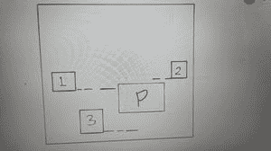
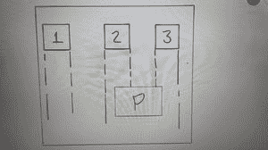

# PyGame 中的碰撞检测

> 原文:[https://www . geesforgeks . org/pygame 中的碰撞检测/](https://www.geeksforgeeks.org/collision-detection-in-pygame/)

**先决条件:**[pygame 简介](https://www.geeksforgeeks.org/introduction-to-pygame/)

**碰撞检测**是一个非常常见的概念，几乎用在乒乓球游戏、太空入侵者等游戏中。简单直接的概念是匹配两个物体的坐标，为碰撞的发生设定条件。

在本文中，我们将检测两个物体之间的碰撞，其中一个物体将向下移动，另一个物体将通过按键控制从左向右移动。这和从落在玩家身上的方块中逃脱是一样的，如果方块碰撞了玩家，那么碰撞就被检测到了。

我们来看看部分实现:

**第一部分:**

## 蟒蛇 3

```
# import required libraries
import pygame
import random

# initialize pygame objects
pygame.init()

# define the colours
white = (255, 255, 255)
red = (255, 0, 0)
green = (0, 255, 0)
blue = (0, 0, 255)
black = (0, 0, 0)

# set the Dimensions
width = 650
height = 700

# size of a block
pixel = 64

# set Screen
screen = pygame.display.set_mode((width,
                                  height))

# set caption
pygame.display.set_caption("CORONA SCARPER")

# load the image
gameIcon = pygame.image.load("rectangleBlock.png")

# set icon
pygame.display.set_icon(gameIcon)

# load the image
backgroundImg = pygame.image.load("wallBackground.jpg")
```

这是创建窗口屏幕和设置标题、图标以及一些预定义变量的基本简单代码，这些对于深入了解并不重要。像素变量是块图像的大小，即 64 个像素。

**部分**T2**2:**T5】

## 蟒蛇 3

```
# load the image
playerImage = pygame.image.load("player.png")

# set the position
playerXPosition = (width/2) - (pixel/2)

# So that the player will be
# at height of 20 above the base
playerYPosition = height - pixel - 10    

# set initially 0
playerXPositionChange = 0

# define a function for setting
# the image at particular
# coordinates
def player(x, y):
  # paste image on screen object
  screen.blit(playerImage, (x, y))

# load the image
blockImage = pygame.image.load("rectangleBlock.png")

# set the random position
blockXPosition = random.randint(0,
                                (width - pixel))

blockYPosition = 0 - pixel

# set the speed of
# the block
blockXPositionChange = 0
blockYPositionChange = 2   

# define a function for setting
# the image at particular
# coordinates
def block(x, y):
  # paste image on screen object
  screen.blit(blockImage,
              (x, y))
```

这里我们显示了玩家和方块在各自的 X 和 Y 位置。该区块的 X 位置在每轮都是随机的。

**注意:**无论在哪里使用像素字，它都用于从给定位置减去 64 个像素，以便显示完整的图像

例如:如果显示的块在宽度位置，那么它将从该点开始绘制，因此它将显示在屏幕之外。因此，我们要减去 64 个像素才能看到完整的图像

现在，



水平碰撞

首先，我们检查街区是否穿过玩家的水平线。我们将设置范围，使区块的基本水平线与玩家的水平线相匹配。在上图中，区块 2 和区块 3 的基线超出了玩家 P 的顶面线和底面线的范围。因此，它们不在碰撞范围内。1 区的基线在玩家 P 的顶部和底部范围内。因此，我们进一步看到，该区块是否在玩家的垂直范围内。



垂直碰撞

在这里，我们用方块的左右表面来检查玩家左右表面尺寸的范围。这里，第 2 和第 3 块在落下时会碰撞玩家，因此第 2 和第 3 块的范围在玩家的 X 和 Y 位置之间。

因此，这个概念是用来检测碰撞的。

**部分** **3:**

## 蟒蛇 3

```
# define a function for
# collision detection
def crash():
  # take a global variable
  global blockYPosition

  # check conditions
  if playerYPosition < (blockYPosition + pixel):

      if ((playerXPosition > blockXPosition
           and playerXPosition < (blockXPosition + pixel))
          or ((playerXPosition + pixel) > blockXPosition
           and (playerXPosition + pixel) < (blockXPosition + pixel))):

          blockYPosition = height + 1000
```

碰撞功能定义碰撞条件。

在第一个 **IF** 条件下，我们检查水平碰撞。这里，如果玩家的 Y 位置小于区块的 Y 位置，即区块离开了玩家的水平范围，那么接下来要检查的条件是水平。像素被添加到块位置，因为它的 Y 位置在块的顶部，而块的底部或底部是块的顶部位置+它的像素大小(图像大小)。

第二个 **IF** 条件检查垂直碰撞。如果块从水平范围通过，那么只检查垂直范围，这样块的碰撞在其所有四个侧面都被检测到。现在，如果玩家的 X 位置大于布洛克的 X 位置，也就是说，布洛克在玩家的左侧。这里，如果区块的起始位置小于玩家起始位置，而区块的结束位置(区块 Y 位置+像素)大于玩家起始位置，这意味着区块将与玩家起始位置重叠，从而发生碰撞。这显示在上面的块 2 的垂直碰撞图像中。

类似地，给出第二个范围，如果方块的开始位置小于玩家的结束位置，并且方块的结束位置大于玩家的结束位置。这是针对块 3 的相同图像显示的。

这张图片清楚地解释了碰撞的景象。

因此，如果发生碰撞，我们会将该块移动到屏幕下方，即下方 1000+距离处，这样它将不可见，新块也不会出现。

**部分**T2**4:**T5】

## 蟒蛇 3

```
running = True

while running:
  # set the image on screen object
  screen.blit(backgroundImg, (0, 0))

  # loop through all events
  for event in pygame.event.get():

      # check the quit condition
       if event.type == pygame.QUIT:
          # quit the game
          pygame.quit()

       # movement key control of player
       if event.type == pygame.KEYDOWN:

          if event.key == pygame.K_RIGHT:

              playerXPositionChange = 3

          if event.key == pygame.K_LEFT:

              playerXPositionChange = -3

       if event.type == pygame.KEYUP:

           if event.key == pygame.K_RIGHT or pygame.K_LEFT:

               playerXPositionChange = 0
```

这是控制玩家运动的游戏循环。游戏开始了。

**部分**T2**5:**T5】

## 蟒蛇 3

```
# Boundaries to the Player

# if it comes at right end,
# stay at right end and
# does not exceed
if playerXPosition >= (width - pixel):
  playerXPosition = (width - pixel)

# if it comes at left end,
# stay at left end and
# does not exceed
if playerXPosition <= 0:
  playerXPosition = 0
```

这些是玩家的边界，因此当玩家移动到屏幕上最右边或最左边的位置时，它不应该走得更远并反弹回来。

**部分**T2**6:**T5】

## 蟒蛇 3

```
# Multiple Blocks Movement after each other
# and condition used because of game over function
if (blockYPosition >= height - 0 and
    blockYPosition <= (height + 200)):

  blockYPosition = 0 - pixel

  # randomly assign value in range
  blockXPosition = random.randint(0, (width - pixel))
```

当没有碰撞的方块离开玩家时，那么我们需要让他从顶部再次出现。因此，我们提供了一个条件，如果块的 Y 位置低于屏幕高度，并且低于高度+200(如高于 1000+，当块碰撞时，块出现)，然后在顶部再次移动它。

**部分**T2**7:**T5】

## 蟒蛇 3

```
# movement of Player
playerXPosition += playerXPositionChange

# movement of Block
blockYPosition += blockYPositionChange

# player Function Call
player(playerXPosition, playerYPosition)

# block Function Call
block(blockXPosition, blockYPosition)

# crash function call
crash()

# update screen
pygame.display.update()
```

最后给出玩家和区块的移动，刷新屏幕

**输出:**

<video class="wp-video-shortcode" id="video-451323-1" width="640" height="360" preload="metadata" controls=""><source type="video/mp4" src="https://media.geeksforgeeks.org/wp-content/uploads/20200710161618/gfg3.mp4?_=1">[https://media.geeksforgeeks.org/wp-content/uploads/20200710161618/gfg3.mp4](https://media.geeksforgeeks.org/wp-content/uploads/20200710161618/gfg3.mp4)</video>