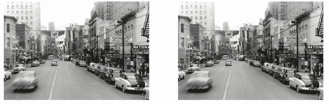
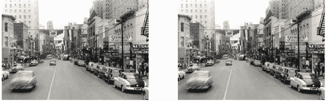

# 使用去模糊化为图像着色

> 原文:[https://www . geeksforgeeks . org/colored-images-using-deo ldify/](https://www.geeksforgeeks.org/colorize-images-using-deoldify/)

去模糊化是一个用于从黑白格式中着色和恢复旧图像的项目。它是由杰森·安蒂克开发的。Deoldify 使用 GAN 架构为图像着色。它包含一个生成器，为批评家(鉴别者)添加颜色，目的是批评生成器生成的颜色。它提出了一种特殊类型的氮化镓训练方法，称为无氮化镓。

### 建筑细节

作者在这些模型中使用了以下深度学习概念。这些概念是:

*   **自我关注:**作者使用 U-Net 架构作为生成器，他们还修改了架构，在模型中使用了光谱归一化和自我关注。
*   **双时标更新规则:**是训练 GAN 架构的一种方式。这只是一个一对一的生成器/评论家架构，以及更高的评论家学习率。这是修改，以纳入一个临界批评损失，以确保批评是“赶上”之前，继续发电机培训。这对于 NoGAN 训练特别有用。
*   **No-GAN:** 这种 GAN 训练方法是由模型的作者开发的。该模型背后的主要思想是，您可以获得氮化镓培训的好处，同时花费最少的时间进行直接氮化镓培训。我们将更详细地讨论 NoGAN。
*   **发电机损耗:**发电机中有两种类型的 NoGAN 学习:
    *   **永久损失:**该损失在发电机中用于报告和最小化由于模型中的偏差而产生的损失。
    *   **批评家损失:**是鉴别者/批评家中使用的损失。

#### 不-GAN

这是 Deoldify 的作者开发的一种新型的 GAN 训练。它提供了氮化镓训练的好处，同时花费最少的时间进行直接氮化镓训练。相反，我们用更直截了当、更快、更可靠的传统方法，花了大部分时间分别训练生成器和批评家。

步骤如下:

*   首先，我们以常规方式单独训练发电机，仅损失特征。
*   接下来，我们从训练好的生成器生成图像，并训练评论家将这些输出和真实图像区分开来，作为一个基本的二进制分类器。
*   最后，在 GAN 环境中一起训练生成器和批评家(在这种情况下从目标大小 192px 开始)。

所有重要的 GAN 训练只在很短的时间内进行。出现了一个转折点，似乎批评家已经把所有有用的知识转移给了生成器。在模型达到拐点后，似乎没有生产性培训。困难的部分似乎是找到拐点，模型相当不稳定，所以作者不得不创建许多检查点。无 GAN 的另一个关键是，您可以在最初的 GAN 训练后，在生成的图像上重复预训练批评家，然后以同样的方式重复 GAN 训练本身。

Deoldify 训练了 3 种类型的模型:

*   **艺术性:**该模型在图像着色、细节和活力方面取得了最佳效果。这些模型使用带有 U-Net 的 ResNet 34 主干架构，强调解码器侧的层深度。该模型存在一些缺点，例如该模型不能为自然场景和人像等常见任务提供稳定性，并且需要大量时间和参数调整才能获得最佳结果。
*   **稳定:**该模型在风景和人像中取得最佳效果。它为人脸提供了更好的颜色，而不是人脸的灰色。这些模型使用带有 U-Net 的 ResNet 101 主干架构，强调解码器侧的层深度。这种模型通常没有艺术模型那么怪异的杂色，但也没有那么丰富多彩。
*   **视频:**该模型针对平滑、一致和无闪烁的视频进行了优化。这将是所有三个模型中最没有色彩的。该模型类似于“稳定”的架构，但在训练上有所不同。

#### 履行

## 蟒蛇 3

```py
# Clone deoldify Repository
! git clone https://github.com/jantic/DeOldify.git DeOldify

# change directory to DeOldify Repo
cd DeOldify

# For Colab
! pip install -r colab_requirements.txt
# For Local Script
! pip install -r requirements.txt

# import pytorch library
import torch
# check for GPU
if not torch.cuda.is_available():
    print('GPU not available.')
# necessary imports
import fastai
from deoldify.visualize import *
import warnings
warnings.filterwarnings("ignore",
                        category=UserWarning, message=".*?Your .*? set is empty.*?")
# download the artistic model
!mkdir 'models'
!wget https://data.deepai.org/deoldify/ColorizeArtistic_gen.pth -O
  ./models/ColorizeArtistic_gen.pth

# use the get image colorizer function with artistic model
colorizer = get_image_colorizer(artistic=True)

# Here, we provide the parameters such as source URL, render factor etc.
source_url = 'https://preview.redd.it/a702q2585j961.jpg?width=640'+
'&crop=smart&auto=webp&s=a5f2523513bb24648737760369d2864eb1f57118' #@param {type:"string"}
render_factor = 39  #@param {type: "slider", min: 7, max: 40}
watermarked = False #@param {type:"boolean"}

if source_url is not None and source_url !='':
    image_path = colorizer.plot_transformed_image_from_url(url=source_url,
          render_factor=render_factor, compare=True, watermarked=watermarked)
    show_image_in_notebook(image_path)
else:
    print('Provide the valid image URL.')
```



解密结果(此处为原始黑白图像信用)



分解稳定的结果

#### **参考文献:**

*   [脱模 GitHub](https://github.com/jantic/DeOldify)