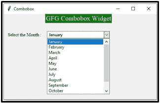

# tkinter | python 中的 combobox widget

> 哎哎哎:# t0]https://www . geeksforgeeks . org/combobox-in-tkinter-python/widget

Python 提供了各种图形用户界面类型，如 PyQT、Tkinter、Kivy、WxPython 和 PySide。其中，`tkinter`是 Python 中最常用的 GUI 模块，因为它简单易懂。Tkinter 这个词来自于 Tk 接口。tkinter 模块在 Python 标准库中可用，在用 Python 编写程序以生成图形用户界面时必须导入该模块。

**注:** Tkinter(大写 T)与 Tkinter 不同。Tkinter 在 Python2.x 中使用，在 Python.3x 中改为 tkinter

组合框是列表框和输入字段的组合。它是 Tkit 小部件之一，其中包含一个向下箭头，可以从选项列表中进行选择。它帮助用户根据显示的选项列表进行选择。当用户单击输入字段上的下拉箭头时，会弹出一个滚动列表框，显示在输入字段的下方。仅当选择列表框中的选项时，选定的选项才会显示在输入字段中。

**语法:**

```py
combobox = ttk.Combobox(master, option=value, ...)

```

**示例 1:** 不设置默认值的组合框小部件。

```py
# python program demonstrating
# Combobox widget using tkinter

import tkinter as tk
from tkinter import ttk

# Creating tkinter window
window = tk.Tk()
window.title('Combobox')
window.geometry('500x250')

# label text for title
ttk.Label(window, text = "GFG Combobox Widget", 
          background = 'green', foreground ="white", 
          font = ("Times New Roman", 15)).grid(row = 0, column = 1)

# label
ttk.Label(window, text = "Select the Month :",
          font = ("Times New Roman", 10)).grid(column = 0,
          row = 5, padx = 10, pady = 25)

# Combobox creation
n = tk.StringVar()
monthchoosen = ttk.Combobox(window, width = 27, textvariable = n)

# Adding combobox drop down list
monthchoosen['values'] = (' January', 
                          ' February',
                          ' March',
                          ' April',
                          ' May',
                          ' June',
                          ' July',
                          ' August',
                          ' September',
                          ' October',
                          ' November',
                          ' December')

monthchoosen.grid(column = 1, row = 5)
monthchoosen.current()
window.mainloop()
```

**输出:**



**示例 2:** 带有初始默认值的组合框。
我们还可以在 Combobox 小部件中设置初始默认值，如下例代码所示。

```py
import tkinter as tk
from tkinter import ttk

# Creating tkinter window
window = tk.Tk()
window.geometry('350x250')
# Label
ttk.Label(window, text = "Select the Month :", 
        font = ("Times New Roman", 10)).grid(column = 0, 
        row = 15, padx = 10, pady = 25)

n = tk.StringVar()
monthchoosen = ttk.Combobox(window, width = 27, 
                            textvariable = n)

# Adding combobox drop down list
monthchoosen['values'] = (' January', 
                          ' February',
                          ' March',
                          ' April',
                          ' May',
                          ' June', 
                          ' July', 
                          ' August', 
                          ' September', 
                          ' October', 
                          ' November', 
                          ' December')

monthchoosen.grid(column = 1, row = 15)

# Shows february as a default value
monthchoosen.current(1) 
window.mainloop()
```

**输出:**

