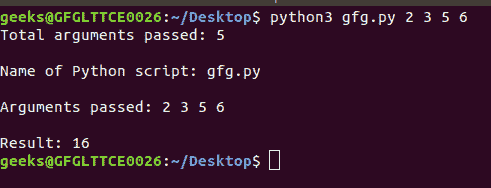
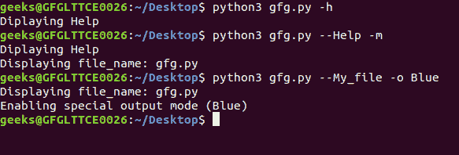
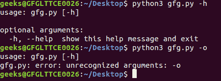
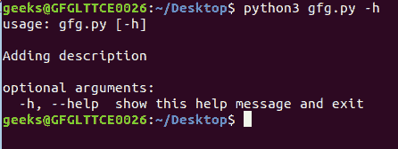
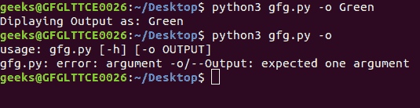

# Python 中的命令行参数

> 原文:[https://www . geesforgeks . org/命令行-python 中的参数/](https://www.geeksforgeeks.org/command-line-arguments-in-python/)

操作系统命令行外壳中程序名称后面给出的参数称为**命令行参数**。Python 提供了各种方法来处理这些类型的参数。最常见的三种是:

*   [使用 sys.argv](#sys)
*   [使用 getopt 模块](#getopt)
*   [使用 argparse 模块](#argparse)

## 使用 sys.argv

sys 模块提供了用于操作 Python 运行时环境不同部分的函数和变量。该模块提供对解释器使用或维护的一些变量以及与解释器强交互的函数的访问。
一个这样的变量是 sys.argv，它是一个简单的列表结构。它的主要目的是:

*   这是一个命令行参数列表。
*   len(sys.argv)提供命令行参数的数量。
*   sys.argv[0]是当前 Python 脚本的名称。

**示例:**让我们假设有一个 Python 脚本用于将两个数字相加，并且这些数字作为命令行参数传递。

## 蟒蛇 3

```
# Python program to demonstrate
# command line arguments

import sys

# total arguments
n = len(sys.argv)
print("Total arguments passed:", n)

# Arguments passed
print("\nName of Python script:", sys.argv[0])

print("\nArguments passed:", end = " ")
for i in range(1, n):
    print(sys.argv[i], end = " ")

# Addition of numbers
Sum = 0
# Using argparse module
for i in range(1, n):
    Sum += int(sys.argv[i])

print("\n\nResult:", Sum)
```

**输出:**



## 使用 getopt 模块

Python **getopt 模块**类似于 c 的 [getopt()](https://www.geeksforgeeks.org/getopt-function-in-c-to-parse-command-line-arguments/) 函数，不同于 sys 模块，getopt 模块通过参数验证扩展了输入字符串的分离。它允许包括赋值在内的短选项和长选项。但是，该模块需要使用 sys 模块来正确处理输入数据。要使用 getopt 模块，需要从命令行参数列表中移除第一个元素。

> **语法:** getopt.getopt(args，options，【long _ options】)
> **参数:**
> **args:** 要传递的参数列表。
> **选项:**脚本想要识别的一串选项字母。需要参数的选项后面应该跟一个冒号(:)。
> **长选项:**长选项名称的字符串列表。需要参数的选项后面应该跟一个等号(=)。
> **返回类型:**返回由两个元素组成的值:第一个是(选项，值)对的列表。第二个是选项列表被剥离后剩下的程序参数列表。

**示例:**

## 蟒蛇 3

```
# Python program to demonstrate
# command line arguments

import getopt, sys

# Remove 1st argument from the
# list of command line arguments
argumentList = sys.argv[1:]

# Options
options = "hmo:"

# Long options
long_options = ["Help", "My_file", "Output ="]

try:
    # Parsing argument
    arguments, values = getopt.getopt(argumentList, options, long_options)

    # checking each argument
    for currentArgument, currentValue in arguments:

        if currentArgument in ("-h", "--Help"):
            print ("Displaying Help")

        elif currentArgument in ("-m", "--My_file"):
            print ("Displaying file_name:", sys.argv[0])

        elif currentArgument in ("-o", "--Output"):
            print (("Enabling special output mode (% s)") % (currentValue))

except getopt.error as err:
    # output error, and return with an error code
    print (str(err))
```

**输出:**



## 使用 argparse 模块

使用 argparse 模块是比上面两个选项更好的选择，因为它提供了许多选项，如位置参数、参数默认值、帮助消息、指定参数的数据类型等。

**注意:**作为默认的可选参数，它包括-h，以及它的长版本–help。

**例 1:**arg parse 模块的基本用法。

## 蟒蛇 3

```
# Python program to demonstrate
# command line arguments

import argparse

# Initialize parser
parser = argparse.ArgumentParser()
parser.parse_args()
```

**输出:**



**示例 2:** 在帮助消息中添加描述。

## 蟒蛇 3

```
# Python program to demonstrate
# command line arguments

import argparse

msg = "Adding description"

# Initialize parser
parser = argparse.ArgumentParser(description = msg)
parser.parse_args()
```

**输出:**



**示例 3:** 定义可选值

## 蟒蛇 3

```
# Python program to demonstrate
# command line arguments

import argparse

# Initialize parser
parser = argparse.ArgumentParser()

# Adding optional argument
parser.add_argument("-o", "--Output", help = "Show Output")

# Read arguments from command line
args = parser.parse_args()

if args.Output:
    print("Displaying Output as: % s" % args.Output)
```

**输出:**

