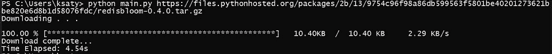

# Python 中的命令行文件下载器

> 原文:[https://www . geesforgeks . org/命令行-文件-python 下载器/](https://www.geeksforgeeks.org/command-line-file-downloader-in-python/)

Python 是最流行的通用编程语言之一，有着广泛的用例，从通用编码到像人工智能这样的复杂领域。python 作为一种编程语言如此受欢迎的原因之一是许多内置以及第三方库和包的可用性。

在本文中，我们将构建一个简单的命令行文件下载器，如果您有下载链接，您可以下载一个文件。

#### 方法:

我们将通过 HTTP 而不是 FTP 下载文件。一旦我们请求了文件，我们将使用响应作为输入流将文件写入或保存到文件系统。下载时，将显示下载速度、时间和下载文件量等详细信息。

*   通过命令行获取文件网址
*   通过 HTTP 请求打开文件输入或下载流。
*   通过将文件从下载/输入流分块写入文件系统来下载文件。
*   显示详细信息
*   保存文件。

### **分步实施:**

**步骤 1:** 需要库

## 蟒蛇 3

```
import requests
import sys
import time
```

**第 2 步:**以适当的单位检测文件大小的字典

下载文件时，会显示速度、大小、时间等参数。让我们看看如何做到这一点。根据下载量获取文件大小和下载速度单位的字典以字节为单位。

## 蟒蛇 3

```
units = {
'B':{'size':1, 'speed':'B/s'},
'KB':{'size':1024, 'speed':'KB/s'},
'MB':{'size':1024*1024, 'speed':'MB/s'},
'GB':{'size':1024*1024*1024, 'speed':'GB/s'}
}
```

检查下载文件长度单位的功能。长度以字节为单位，因此会检查相应的单位。

## 蟒蛇 3

```
def check_unit(length): # length in bytes
  if length < units['KB']['size']:
    return 'B'
  elif length >= units['KB']['size'] and length <= units['MB']['size']:
    return 'KB'
  elif length >= units['MB']['size'] and length <= units['GB']['size']:
    return 'MB'
  elif length > units['GB']['size']:
    return 'GB'
```

**第三步:**通过 HTTP 下载文件

我们将使用请求通过 HTTP 打开一个文件流，然后将数据分块保存到本地文件中。让我们看看代码的样子，然后把它们放在一起。

## 蟒蛇 3

```
# Opening file stream

r = requests.get(link_to_file, stream = True)  

# writing file data in chunks.
# for examples, A file of 10 MB written in
# chunk size of 8096 Bytes.
with open(file_name, 'wb') as f:  
  for chunk in r.iter_content(chunk_size):  
    f.write(chunk)
```

**第 4 步:**打印输出

输出将包括一个带有下载细节的动态进度条。为此，我们使用 stdout.write()和 stdout.flush()方法

## 蟒蛇 3

```
sys.stdout.write(format_string % (list_of_variables))

# for printing details in single 
# line which updates without going to the next line
# once the details are updated.

sys.stdout.flush() 
```

**以下是完整实现:**

## 蟒蛇 3

```
import requests
import sys
import time

units = {    
'B' : {'size':1, 'speed':'B/s'},
'KB' : {'size':1024, 'speed':'KB/s'},
'MB' : {'size':1024*1024, 'speed':'MB/s'},
'GB' : {'size':1024*1024*1024, 'speed':'GB/s'}
}

def check_unit(length): # length in bytes
    if length < units['KB']['size']:
        return 'B'
    elif length >= units['KB']['size'] and length <= units['MB']['size']:
        return 'KB'
    elif length >= units['MB']['size'] and length <= units['GB']['size']:
        return 'MB'
    elif length > units['GB']['size']:
        return 'GB'

# takes download link and directory where file to be saved.
def downloadFile(url, directory) :

    localFilename = url.split('/')[-1] # files name

    with open(directory + '/' + localFilename, 'wb') as f:
        print ("Downloading . . .\n")
        start = time.time() # start time
        r = requests.get(url, stream=True)

        # total length in bytes of the file
        total_length = float(r.headers.get('content-length')) 

        d = 0 # counter for amount downloaded 

        # when file is not available
        if total_length is None:
            f.write(r.content)
        else:
            for chunk in r.iter_content(8192):

                d += float(len(chunk))
                f.write(chunk) # writing the file in chunks of 8192 bytes

                # amount downloaded in proper units
                downloaded = d/units[check_unit(d)]['size']

                # converting the unit of total length or size of file from bytes.
                tl = total_length / units[check_unit(total_length)]['size'] 

                trs = d // (time.time() - start) # speed in bytes per sec

                #speed in proper unit
                download_speed = trs/units[check_unit(trs)]['size']

                speed_unit = units[check_unit(trs)]['speed'] # speed in proper units

                done = 100 * d / total_length # percentage downloaded or done.

                fmt_string = "\r%6.2f %s [%s%s] %7.2f%s  /  %4.2f %s  %7.2f %s"

                set_of_vars = ( float(done), '%',
                                '*' * int(done/2),  
                                '_' * int(50-done/2),  
                                downloaded, check_unit(d),  
                                tl, check_unit(total_length),  
                                download_speed, speed_unit)

                sys.stdout.write(fmt_string % set_of_vars)

                sys.stdout.flush()

    return (time.time() - start) # total time taken for download

def main() :
    directory = '.'
    if len(sys.argv) > 1 :
        url = sys.argv[1] # url from cmd line arg
        if len(sys.argv) > 2:
            directory = sys.argv[2]

        total_time = downloadFile(url, directory)
        print ('')
        print ("Download complete...")
        print ("\rTime Elapsed: %.2fs" % total_time)
    else :
        print("No link found!")

if __name__ == "__main__" :
    main()
```

将代码保存在 python 文件中，并按如下方式使用

```
python <program_name>.py <file_link> <save_location(by default '.')>
```

**输出:**

