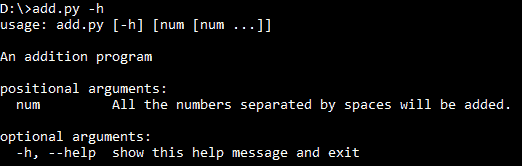
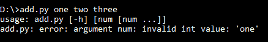
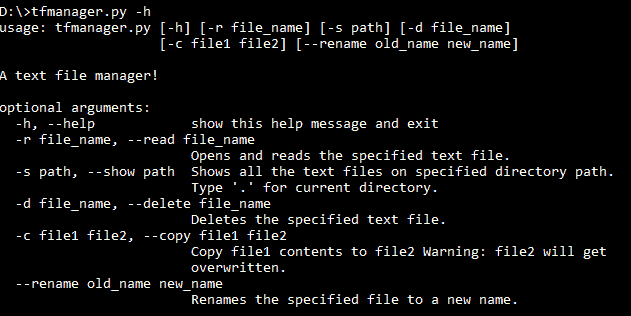
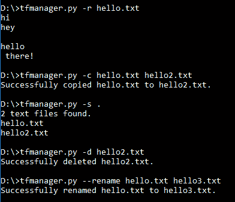

# Python 中的命令行界面编程

> 原文:[https://www . geesforgeks . org/命令行-界面-编程-python/](https://www.geeksforgeeks.org/command-line-interface-programming-python/)

本文讨论如何使用一个示例为 python 程序创建 CLI，在这个示例中，我们制作了一个基本的“文本文件管理器”。
我们先讨论一些基础知识。

**什么是命令行界面？**

命令行界面或命令语言解释器(CLI)，也称为命令行用户界面、控制台用户界面和字符用户界面(CUI)，是一种与计算机程序交互的方式，其中用户(或客户端)以连续文本行(命令行)的形式向程序发出命令。([维基](https://en.wikipedia.org/wiki/Command-line_interface))

**CLI 的优势:**

*   需要更少的资源
*   简洁有力
*   专家友好型
*   通过脚本更容易实现自动化

**为什么要在自己的 python 程序中使用 CLI？**

*   即使你的程序只有一个非常基本的命令行界面(CLI)，也可以让每个人的生活变得更容易修改参数，包括程序员，但也包括非程序员。
*   当你想用 cronjob 或者 os.system 调用来运行你的程序时，你的程序的命令行界面也可以使运行和修改程序中的变量变得更加容易。

现在，让我们开始制作我们的“文本文件管理器”。在这里，我们将使用一个名为[](https://docs.python.org/2/library/argparse.html)**的内置 python 库。**

****关于 Argparse:****

*   **它使得编写用户友好的命令行界面变得容易。**
*   **该程序定义了它需要什么参数，argparse 将找出如何从 sys.argv 中解析这些参数。**
*   **argparse 模块还会自动生成帮助和用法消息，并在用户给程序提供无效参数时发出错误。**

**好的，让我们从一个非常基本的程序开始，了解 argparse 是做什么的。**

```
# importing required modules
import argparse

# create a parser object
parser = argparse.ArgumentParser(description = "An addition program")

# add argument
parser.add_argument("add", nargs = '*', metavar = "num", type = int, 
                     help = "All the numbers separated by spaces will be added.")

# parse the arguments from standard input
args = parser.parse_args()

# check if add argument has any input data.
# If it has, then print sum of the given numbers
if len(args.add) != 0:
    print(sum(args.add))
```

**让我们来看看与上述计划相关的一些要点:**

*   **首先，我们导入了 argparse 模块。**
*   **然后，创建了一个 **ArgumentParser** 对象，并提供了我们程序的描述。**
*   **现在，我们可以通过添加参数来用信息填充解析器对象。在这个例子中，我们创建了一个参数 **add。**很多参数都可以传递给 **add_argument** 函数。这里我解释一下我在上面例子中使用的:
    **参数 1:** (“添加”)它只是参数的名称。我们将使用此名称通过键入 **args.add** 来访问 **add** 参数。
    **参数 2:** (nargs = '* ')应该消耗的命令行参数的数量。将它指定为“*”意味着它可以是任意数量的参数，即从 0 到任何值。
    **参数 3:** (metavar = 'num ')用法信息中参数的名称。
    **参数 4:** (type = int)命令行参数应该转换为的类型。默认情况下，它是字符串。
    **论证 5:** (帮助)简要说明论证的作用。**
*   **一旦我们指定了所有的参数，就该从标准命令行输入流中解析参数了。为此，我们使用 parse_args()函数。**
*   **现在，可以简单地检查输入是否调用了特定的参数。这里，我们检查 args.add 的长度，以检查是否有任何从输入接收到的数据。请注意，一个参数的值是作为**列表获得的。****
*   **有两种类型的参数:位置参数和可选参数。
    位置型的是不需要调用任何规范的。然而，可选参数需要首先通过它们的名称来指定(以“–”符号开头)，-”也是一种简写。)**
*   **您可以随时使用–help 或-h 可选参数来查看帮助消息。
    这里有一个例子(python 脚本已经保存为 add.py):
    **
*   **现在，让我们看看另一个例子，其中调用了我们的位置参数 **add** 。
    T3】**
*   **另一个值得一提的特性是，当用户给程序提供无效参数时，argparse 如何发出错误。
    **

**所以，这是一个基本的例子，这样您就可以熟悉 argparse 和 CLI 的概念。现在，让我们继续我们的**“文本文件管理器”**程序。**

```
# importing the required modules
import os
import argparse

# error messages
INVALID_FILETYPE_MSG = "Error: Invalid file format. %s must be a .txt file."
INVALID_PATH_MSG = "Error: Invalid file path/name. Path %s does not exist."

def validate_file(file_name):
    '''
    validate file name and path.
    '''
    if not valid_path(file_name):
        print(INVALID_PATH_MSG%(file_name))
        quit()
    elif not valid_filetype(file_name):
        print(INVALID_FILETYPE_MSG%(file_name))
        quit()
    return

def valid_filetype(file_name):
    # validate file type
    return file_name.endswith('.txt')

def valid_path(path):
    # validate file path
    return os.path.exists(path)

def read(args):
    # get the file name/path
    file_name = args.read[0]

    # validate the file name/path
    validate_file(file_name)

    # read and print the file content
    with open(file_name, 'r') as f:
        print(f.read())

def show(args):
    # get path to directory
    dir_path = args.show[0]

    # validate path
    if not valid_path(dir_path):
        print("Error: No such directory found.")
        exit()

    # get text files in directory
    files = [f for f in os.listdir(dir_path) if valid_filetype(f)]
    print("{} text files found.".format(len(files)))
    print('\n'.join(f for f in files))

def delete(args):
    # get the file name/path
    file_name = args.delete[0]

    # validate the file name/path
    validate_file(file_name)

    # delete the file
    os.remove(file_name)
    print("Successfully deleted {}.".format(file_name))

def copy(args):
    # file to be copied
    file1 = args.copy[0]
    # file to copy upon
    file2 = args.copy[1]

    # validate the file to be copied
    validate_file(file1)

    # validate the type of file 2
    if not valid_filetype(file2):
        print(INVALID_FILETYPE_MSG%(file2))
        exit()

    # copy file1 to file2
    with open(file1, 'r') as f1:
        with open(file2, 'w') as f2:
            f2.write(f1.read())
    print("Successfully copied {} to {}.".format(file1, file2))

def rename(args):
    # old file name
    old_filename = args.rename[0]
    # new file name
    new_filename = args.rename[1]

    # validate the file to be renamed
    validate_file(old_filename)

    # validate the type of new file name
    if not valid_filetype(new_filename):
        print(INVALID_FILETYPE_MSG%(new_filename))
        exit()

    # renaming
    os.rename(old_filename, new_filename)
    print("Successfully renamed {} to {}.".format(old_filename, new_filename))
def main():
    # create parser object
    parser = argparse.ArgumentParser(description = "A text file manager!")

    # defining arguments for parser object
    parser.add_argument("-r", "--read", type = str, nargs = 1,
                        metavar = "file_name", default = None,
                        help = "Opens and reads the specified text file.")

    parser.add_argument("-s", "--show", type = str, nargs = 1,
                        metavar = "path", default = None,
                        help = "Shows all the text files on specified directory path.\
                        Type '.' for current directory.")

    parser.add_argument("-d", "--delete", type = str, nargs = 1,
                        metavar = "file_name", default = None,
                        help = "Deletes the specified text file.")

    parser.add_argument("-c", "--copy", type = str, nargs = 2,
                        metavar = ('file1','file2'), help = "Copy file1 contents to \
                        file2 Warning: file2 will get overwritten.")

    parser.add_argument("--rename", type = str, nargs = 2,
                        metavar = ('old_name','new_name'),
                        help = "Renames the specified file to a new name.")

    # parse the arguments from standard input
    args = parser.parse_args()

    # calling functions depending on type of argument
    if args.read != None:
        read(args)
    elif args.show != None:
        show(args)
    elif args.delete !=None:
        delete(args)
    elif args.copy != None:
        copy(args)
    elif args.rename != None:
        rename(args)

if __name__ == "__main__":
    # calling the main function
    main()
```

**在前面的例子之后，上面的代码看起来是不言自明的。
我们所做的只是为我们的文件管理器程序添加一组参数。请注意，所有这些参数都是可选参数。因此，我们使用一些 if-elif 语句将命令行输入与正确的参数类型函数相匹配，以便可以处理查询。
下面是一些截图，描述了上述程序的用法:**

*   **帮助消息(python 脚本已保存为 tfmanager.py):
    **
*   **以下是使用文本文件管理器的操作示例:
    **

**这是我们制作的一个简单的命令行界面 python 程序的例子。Argparse 模块可以轻松创建许多复杂的 CLi。我希望这些例子能让你在这方面领先一步。**

**本文由**尼克尔·库马尔**供稿。如果你喜欢极客博客并想投稿，你也可以用 write.geeksforgeeks.org 写一篇文章或者把你的文章邮寄到 review-team@geeksforgeeks.org。看到你的文章出现在极客博客主页上，帮助其他极客。**

**如果你发现任何不正确的地方，或者你想分享更多关于上面讨论的话题的信息，请写评论。**