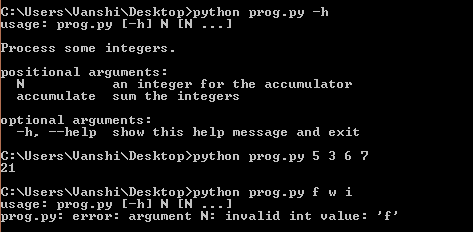
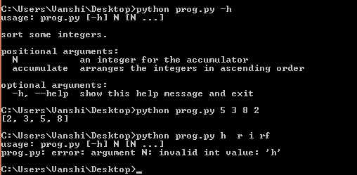
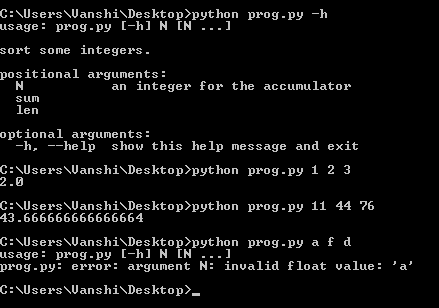

# Python 中使用 argparse 的命令行选项和参数解析

> 原文:[https://www . geesforgeks . org/命令行-选项-参数-解析-使用-argparse-in-python/](https://www.geeksforgeeks.org/command-line-option-and-argument-parsing-using-argparse-in-python/)

命令行参数是那些在程序调用过程中与调用语句一起传递的值。通常，python 使用`sys.argv`数组来处理这样的参数，但是在这里我们描述如何通过使用`argparse`模块来使它变得更加足智多谋和用户友好。

## 参数解析模块

Python 中的`argparse`模块有助于在命令行环境中创建程序，这种方式不仅易于编码，而且还能改善交互。当用户给程序无效参数时，`argparse`模块还会自动生成帮助和使用信息并发出错误。

#### 使用参数解析的步骤

1.  **创建解析器:**导入 argparse 模块是处理概念的第一种方式。导入之后，您必须创建一个解析器或 ArgumentParser 对象，该对象将存储从 python 命令行传递的所有必要信息。

    > **语法:**类 argparse .argument parser(Prog =无，用法=None，description=None，epilog=None，parents=[]，formatter_class=argparse .帮助格式化程序，前缀字符='-'，fromfile _ prefix _ chars =无，参数 _ 默认值=无，冲突处理程序= '错误'，add _ help =真，允许 _ 缩写 ev =真)
    > 
    > **参数:**
    > 
    > *   **Prog**–程序名称(默认=sys.argv[0])
    > *   **用法**–描述程序用法的字符串(默认:从添加到解析器的参数生成)
    > *   **说明**–参数帮助前显示的文本(默认:无)
    > *   **epilog**–参数帮助后显示的文本(默认:无)
    > *   **父级**–其参数也应包括在内的 ArgumentParser 对象列表
    > *   **formatter _ class**–用于自定义帮助输出的类
    > *   **prefix _ chars**–为可选参数加前缀的字符集(默认为:'-')
    > *   **from file _ prefix _ chars**–为要从中读取附加参数的文件加前缀的字符集(默认为:无)
    > 
    > *   **conflict _ handler**–解决冲突选项的策略(通常是不必要的)
    > *   **Add _ help**–向解析器添加 a-h/–help 选项(默认值:True)
    > *   **allow _ a prev**–如果缩写明确，则允许缩写长选项。 (默认:真)

2.  **添加参数:**下一步是用关于程序参数的信息填充 ArgumentParser。这意味着对`add_argument()`方法的调用。这些信息告诉 ArgumentParser 如何从命令行获取参数，并将它们转换为对象。

    > **语法:** argumentparser。add _ argument(名称或 flags…[，action][，nargs][，const][，default][，type][，choices，required][，help][，metavar][，dest])
    > 
    > **参数:**
    > 
    > *   **名称或标志**–选项字符串的名称或列表
    > *   **操作**–在命令行中遇到此参数时要采取的基本操作类型
    > *   **nargs**–应该消耗的命令行参数数量
    > *   **const**–某些操作和 nargs 选择所需的常量值
    > *   【T3T 如果命令行中缺少参数
    > *   **类型**–命令行参数应转换到的类型。
    > *   **选项**–参数允许值的容器
    > *   **必需的**–命令行选项是否可以省略(仅限选项)
    > *   **帮助**–参数作用的简要说明
    > *   **metavar**–用法信息中参数的名称
    > *   **dest**–属性的名称

3.  **Parsing Arguments:** The information gathered in the step 2 is stored and used when arguments are parsed through parse_args(). The data is initially stored in sys.argv array in a string format. Calling parse_args() with the command-line data first converts them into the required data type and then invokes the appropriate action to produce a result.

    > **语法:**引数剖析器. parse_args(args=None，namespace=None)
    > 
    > **参数:**
    > 
    > *   **参数**–要解析的字符串列表。默认值取自 sys.argv。
    > *   **命名空间**–获取属性的对象。默认值是一个新的空命名空间对象

    在大多数情况下，这意味着一个简单的 Namespace 对象将由命令行解析出的属性构建而成:

    ```py
    Namespace(accumulate=, integers=[ 2, 8, -7, 41 ])
    ```

这些是处理 argparse 时需要熟悉的基本概念。以下是支持此应用程序的一些示例。

**示例 1:使用 argparse 找到命令行参数的总和**

```py
import argparse

# Initialize the Parser
parser = argparse.ArgumentParser(description ='Process some integers.')

# Adding Arguments
parser.add_argument('integers', metavar ='N', 
                    type = int, nargs ='+',
                    help ='an integer for the accumulator')

parser.add_argument(dest ='accumulate', 
                    action ='store_const',
                    const = sum, 
                    help ='sum the integers')

args = parser.parse_args()
print(args.accumulate(args.integers))
```

**输出:**



**例 2:按升序排列整数输入的程序**

```py
import argparse

# Initializing Parser
parser = argparse.ArgumentParser(description ='sort some integers.')

# Adding Argument
parser.add_argument('integers',
                    metavar ='N',
                    type = int,
                    nargs ='+',
                    help ='an integer for the accumulator')

parser.add_argument(dest ='accumulate',
                    action ='store_const',
                    const = sorted,
                    help ='arranges the integers in ascending order')

args = parser.parse_args()
print(args.accumulate(args.integers))
```

**输出:**


**例 3:求输入的命令行数值参数的平均值**

```py
import argparse

# Initializing Parser
parser = argparse.ArgumentParser(description ='sort some integers.')

# Adding Argument
parser.add_argument('integers',
                    metavar ='N',
                    type = float,
                    nargs ='+',
                    help ='an integer for the accumulator')

parser.add_argument('sum',
                    action ='store_const',
                    const = sum)

parser.add_argument('len',
                    action ='store_const',
                    const = len)

args = parser.parse_args()
add = args.sum(args.integers)
length = args.len(args.integers)
average = add / length
print(average)
```

**输出:**
