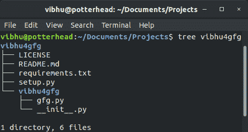

# 命令行脚本| Python 打包

> 原文:[https://www . geesforgeks . org/命令行-脚本-python-打包/](https://www.geeksforgeeks.org/command-line-scripts-python-packaging/)

我们如何用 Python 执行任何脚本？

```py
$ python do_something.py
$ python do_something_with_args.py gfg vibhu

```

可能你就是这么做的。
如果你的回答是你只需点击 IDE 上的一个按钮来执行你的 Python 代码，就假设你在命令行上被特别询问如何执行。

让我们让你更容易。

```py
$ do_something
$ do_something_with_args gfg vibhu

```

那看起来确实干净多了。基本上，它们只是转换成命令行工具的 python 脚本。在本文中，我们将讨论您如何自己做到这一点。

这个过程可以分为 6 个步骤:

1.  [创建您的命令行脚本。](https://www.geeksforgeeks.org/command-line-interface-programming-python/)
2.  [打包的设置文件和文件夹结构。](https://www.geeksforgeeks.org/packaging-and-publishing-python-code/)
3.  修改您的`setup.py`文件以合并您的命令行界面脚本。
4.  发布前测试您的包，然后构建。
5.  在 [pypi](https://pypi.org/) 上传，发布你的包。
6.  安装您新发布的软件包。

前两个步骤将在各自的文章中全面介绍。建议在前进之前看一看。本文将主要从步骤 3 继续。

**第一步:制作你的命令行脚本**
- > *gfg.py*

```py
import argparse

def main():

    parser = argparse.ArgumentParser(prog ='gfg',
                                     description ='GfG article demo package.')

    parser.add_argument('integers', metavar ='N', type = int, nargs ='+',
                        help ='an integer for the accumulator')
    parser.add_argument('-greet', action ='store_const', const = True,
                        default = False, dest ='greet',
                        help ="Greet Message from Geeks For Geeks.")
    parser.add_argument('--sum', dest ='accumulate', action ='store_const',
                        const = sum, default = max,
                        help ='sum the integers (default: find the max)')

    args = parser.parse_args()

    if args.greet:
        print("Welcome to GeeksforGeeks !")
        if args.accumulate == max:
            print("The Computation Done is Maximum")
        else:
            print("The Computation Done is Summation")
        print("And Here's your result:", end =" ")   

    print(args.accumulate(args.integers))
```

**第 2 步:设置文件和文件夹结构**


**第 3 步:修改 setup.py 文件**

Setuptools 允许模块注册入口点(`entry_points`)，其他包可以挂接这些入口点来提供某些功能。它本身也提供了几个，包括 **`console_scripts`** 的入口点。
这允许 Python *函数*(不是脚本！)直接注册为命令行可访问工具！
- > *setup.py*

```py
from setuptools import setup, find_packages

with open('requirements.txt') as f:
    requirements = f.readlines()

long_description = 'Sample Package made for a demo \
      of its making for the GeeksforGeeks Article.'

setup(
        name ='vibhu4gfg',
        version ='1.0.0',
        author ='Vibhu Agarwal',
        author_email ='vibhu4agarwal@gmail.com',
        url ='https://github.com/Vibhu-Agarwal/vibhu4gfg',
        description ='Demo Package for GfG Article.',
        long_description = long_description,
        long_description_content_type ="text/markdown",
        license ='MIT',
        packages = find_packages(),
        entry_points ={
            'console_scripts': [
                'gfg = vibhu4gfg.gfg:main'
            ]
        },
        classifiers =(
            "Programming Language :: Python :: 3",
            "License :: OSI Approved :: MIT License",
            "Operating System :: OS Independent",
        ),
        keywords ='geeksforgeeks gfg article python package vibhu4agarwal',
        install_requires = requirements,
        zip_safe = False
)
```

**第四步:测试&构建**
测试:将目录更改为你的包的顶层，与`setup.py`文件相同。
通过键入以下命令安装您想要的软件包。

```py
$ python3 setup.py install
```

如果安装程序中没有错误，这将安装您的软件包。
现在你可以测试你的包的所有功能。如果出了什么问题，你仍然可以解决问题。

**构建:**确保您已经升级了 pip 版本以及最新的`setuptools`和`wheel`。现在使用这个命令来构建包的发行版。

```py
$ python3 setup.py sdist bdist_wheel

```

**第五步:发布包**
`twine`是一个帮助你上传包分发到 pypi 的库。执行以下命令前，确保您在 [PyPI](https://pypi.org/) 上有账户

```py
$ twine upload dist/*

```

提供凭据并完成！您刚刚在 PyPI 上发布了第一个 Python 包。

**第六步:安装软件包**
现在使用`pip`安装你新发布的软件包。

```py
$ pip install vibhu4gfg

```

玩吧。

```py
$ gfg
usage: gfg [-h] [-greet] [--sum] N [N ...]
gfg: error: the following arguments are required: N

$ gfg -h
usage: gfg [-h] [-greet] [--sum] N [N ...]

GfG article demo package.

positional arguments:
  N           an integer for the accumulator

optional arguments:
  -h, --help  show this help message and exit
  -greet      Greet Message from Geeks For Geeks.
  --sum       sum the integers (default: find the max)

$ gfg 5 10 15 -greet
Welcome to GeeksforGeeks!
The Computation Done is Maximum
And Here's your result: 15

$ gfg 5 10 15 -greet --sum
Welcome to GeeksforGeeks!
The Computation Done is Summation
And Here's your result: 30

```

参考:[https://python-packaging . read the docs . io/en/latest/命令行-scripts.html](https://python-packaging.readthedocs.io/en/latest/command-line-scripts.html)