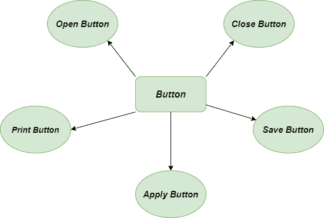
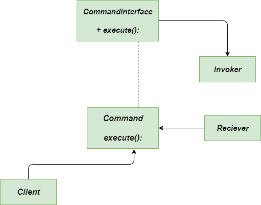

# 命令方法–Python 设计模式

> 原文:[https://www . geesforgeks . org/command-method-python-design-patterns/](https://www.geeksforgeeks.org/command-method-python-design-patterns/)

命令方法是[](https://www.geeksforgeeks.org/design-patterns-set-1-introduction/)**行为设计模式，它将一个请求封装为一个对象，从而允许具有不同请求的客户端的参数化以及请求的排队或记录。在我们的类比中，用不同的请求参数化其他对象意味着用来开灯的按钮以后可以用来打开立体声或者打开车库门。它有助于将“对象上的方法调用”提升到完全对象状态。基本上，它封装了执行操作或触发事件所需的所有信息。**

### **不使用命令方法时出现问题**

**假设您正在使用代码编辑器。您当前的任务是在编辑器的工具栏中为各种不同的操作添加新按钮。创建一个单一的**按钮类**可以用于按钮，这绝对很容易。由于我们知道编辑器中使用的所有按钮看起来都很相似，那么我们应该怎么做呢？我们应该为每个使用按钮的地方创建很多子类吗？**

**

没有命令的问题方法** 

### **使用命令方法的解决方案**

**让我们来看看上述问题的解决方案。将软件分成不同的层总是一个好主意，这有助于简化编码和调试。命令模式建议对象不应该直接发送这些请求。相反，您应该将所有请求的详细信息(如被调用的对象、方法的名称和参数列表)提取到一个单独的命令类中，该命令类包含一个触发该请求的方法。**

## **蟒蛇 3**

```
"""Use built-in abc to implement Abstract classes and methods"""
from abc import ABC, abstractmethod

"""Class Dedicated to Command"""
class Command(ABC):

    """constructor method"""
    def __init__(self, receiver):
        self.receiver = receiver

    """process method"""
    def process(self):
        pass

"""Class dedicated to Command Implementation"""
class CommandImplementation(Command):

    """constructor method"""
    def __init__(self, receiver):
        self.receiver = receiver

    """process method"""
    def process(self):
        self.receiver.perform_action()

"""Class dedicated to Receiver"""
class Receiver:

    """perform-action method"""
    def perform_action(self):
        print('Action performed in receiver.')

"""Class dedicated to Invoker"""
class Invoker:

    """command method"""
    def command(self, cmd):
        self.cmd = cmd

    """execute method"""
    def execute(self):
        self.cmd.process()

"""main method"""
if __name__ == "__main__":

    """create Receiver object"""
    receiver = Receiver()
    cmd = CommandImplementation(receiver)
    invoker = Invoker()
    invoker.command(cmd)
    invoker.execute()
```

### **输出**

```
Action performed in receiver.
```

### **类图**

**下面是命令方法的类图**

**

类图命令方法** 

### **优势**

*   ****打开/关闭原则:**我们可以在不破坏现有客户端代码的情况下将新命令引入应用程序。**
*   ****单一责任原则:**这里调用操作的类与其他类的解耦真的很容易。**
*   ****可实现撤销/重做:**借助命令方法可以实现**撤销/重做**的功能。**
*   ****封装:**它有助于封装执行动作或事件所需的所有信息。**

### **不足之处**

*   ****复杂度增加:**当我们在发送方和接收方之间引入某些层时，代码的复杂度会增加。**
*   ****类的数量增加:**对于每个单独的命令，类的数量增加。**
*   ****具体命令:**每一个单独的命令都是一个**具体命令**类，它增加了实现和维护类的数量。**

### **适应性**

*   ****实现可逆操作:**由于 Command 方法为 **UNDO/REDO** 操作提供了功能，我们可能会反转这些操作。**
*   ****参数化:**当我们必须用操作参数化对象时，总是倾向于使用命令方法。**

****进一步阅读–**[**爪哇**](https://www.geeksforgeeks.org/command-pattern/)
的命令方法**