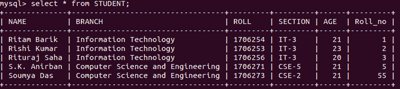
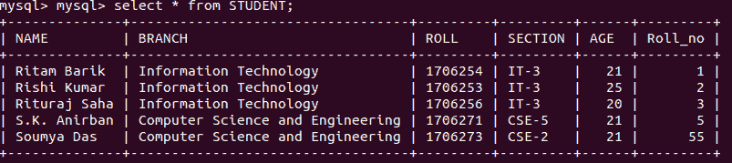

# 在 Python 中提交&回滚操作

> 原文:[https://www . geesforgeks . org/commit-roll back-operation-in-python/](https://www.geeksforgeeks.org/commit-rollback-operation-in-python/)

Python 的 **commit()** 方法和 **rollback()** 方法是用于进行数据库事务的各种方法之一。数据库事务是必要的，因为它们确保了数据库的原子性、一致性、隔离性和持久性。
在本文中，我们将重点详细介绍 commit()和 rollback()方法的使用。

**1。commit()方法:**

commit()方法用于确保对数据库的更改是一致的。它基本上提供了关于用户或应用程序在数据库中所做更改的数据库确认。

**语法:**

```py
comm.commit() #comm refers to the database connection object
```

为了更好地理解这个概念，请看下面的代码，然后是代码解释。下面的 commit()方法演示是在 MySQL 数据库上执行的。

**示例:**
更新名为 Rishi Kumar 的学生年龄并将其提交到数据库的程序。
使用中的 MySQL 表:



## 蟒蛇 3

```py
# Python program to demonstrate
# commit() method

import mysql.connector

# Connecting to the Database
mydb = mysql.connector.connect(
host ='localhost',
database ='College',
user ='root',
)

cs = mydb.cursor()

# drop clause
statement ="UPDATE STUDENT SET AGE = 23 WHERE Name ='Rishi Kumar'"

cs.execute(statement)

# commit changes to the database
mydb.commit()

# Disconnecting from the database
mydb.close()
```

**输出:**



**2。回滚()方法:**

rollback()方法用于还原上次对数据库所做的更改。如果出现对数据库更改不满意或数据库事务失败的情况，可以使用 rollback()方法检索通过 commit()方法更改的原始数据。

**语法:**

```py
comm.rollback() #comm refers to the database connection object
```

下面的代码显示了在数据库事务失败时使用 rollback()方法来还原更改:

## 蟒蛇 3

```py
# Python program to demonstrate
# rollback() method

import mysql.connector
from mysql.connector import Error
from mysql.connector import errorcode

try:
    # Connecting to the Database
    mydb = mysql.connector.connect(
    host ='localhost',
    database ='College',
    user ='root',
    )

    cs = mydb.cursor()

    # drop clause
    statement ="UPDATE STUDENT SET AGE = 23 WHERE Name ='Rishi Kumar'"

    cs.execute(statement)

    # commit changes to the database
    mydb.commit()

    # update successful message
    print("Database Updated !")

except mysql.connector.Error as error :

    # update failed message as an error
    print("Database Update Failed !: {}".format(error))

    # reverting changes because of exception
    mydb.rollback()

 # Disconnecting from the database
mydb.close()
```

**输出:**

如果数据库事务成功，输出将是，

```py
Database Updated!
```

如果数据库事务失败，输出将是一个错误，

```py
Database Update Failed!
```