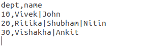
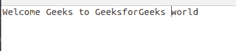
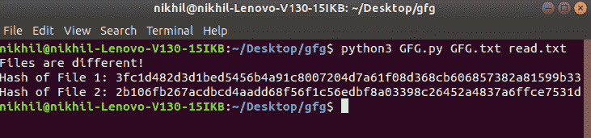
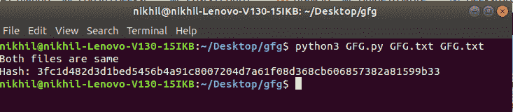

# 使用 Python 中的哈希比较两个文件

> 原文:[https://www . geesforgeks . org/compare-two-files-使用 python 中的哈希算法/](https://www.geeksforgeeks.org/compare-two-files-using-hashing-in-python/)

在本文中，我们将创建一个程序来确定提供给它的两个文件是否相同。同样意味着它们的内容相同或不相同(不包括任何元数据)。为此，我们将使用加密哈希。加密散列函数是一种接收输入数据并产生统计上唯一的输出的函数，该输出对于特定的数据集是唯一的。我们将使用密码散列函数的这个属性来识别两个文件的内容，然后将它们进行比较，以确定它们是否相同。

**注:**对于两个不同的数据集得到相同 have 的概率非常非常低。即使这样，好的加密散列函数也是偶然产生的，而不是有意的。

我们将使用 **SHA256** (安全散列算法 256)作为这个程序中的散列函数。SHA256 非常耐碰撞。我们将使用 hashlib 库的 sha256()来使用 python 中函数的实现。
hashlib 模块预装在大多数 python 发行版中。如果您的环境中不存在该模块，您可以通过在命令中运行以下命令来获取该模块–

```
pip install hashlib
```

下面是实现。
**文本文件 1:**



**文本文件 2:**



## 蟒蛇 3

```
import sys
import hashlib

def hashfile(file):

    # A arbitrary (but fixed) buffer
    # size (change accordingly)
    # 65536 = 65536 bytes = 64 kilobytes
    BUF_SIZE = 65536

    # Initializing the sha256() method
    sha256 = hashlib.sha256()

    # Opening the file provided as
    # the first commandline argument
    with open(file, 'rb') as f:

        while True:

            # reading data = BUF_SIZE from
            # the file and saving it in a
            # variable
            data = f.read(BUF_SIZE)

            # True if eof = 1
            if not data:
                break

            # Passing that data to that sh256 hash
            # function (updating the function with
            # that data)
            sha256.update(data)

    # sha256.hexdigest() hashes all the input
    # data passed to the sha256() via sha256.update()
    # Acts as a finalize method, after which
    # all the input data gets hashed hexdigest()
    # hashes the data, and returns the output
    # in hexadecimal format
    return sha256.hexdigest()

# Calling hashfile() function to obtain hashes
# of the files, and saving the result
# in a variable
f1_hash = hashfile(sys.argv[1])
f2_hash = hashfile(sys.argv[2])

# Doing primitive string comparison to
# check whether the two hashes match or not
if f1_hash == f2_hash:
    print("Both files are same")
    print(f"Hash: {f1_hash}")

else:
    print("Files are different!")
    print(f"Hash of File 1: {f1_hash}")
    print(f"Hash of File 2: {f2_hash}")
```

**输出:**
**为不同的文件作为输入:**



**对于与输入相同的文件:**



**解释:-**
我们输入文件名(通过命令行参数)，因此必须从命令行提供文件路径。函数 hashfile()被定义为在不耗尽内存的情况下处理任意大小的文件。就像我们将文件中的所有数据传递给 sha256.update()函数一样，它不会对数据进行适当的哈希处理，从而导致结果不一致。hashfile()以 base16(十六进制格式)返回文件的哈希。我们为这两个文件调用相同的函数，并将它们的散列存储在两个独立的变量中。之后我们用散列来比较它们。如果两个散列相同(意味着文件包含相同的数据)，我们输出消息两个文件相同，然后散列。如果它们不同，我们会输出一条否定的消息，以及每个文件的哈希(这样用户就可以直观地看到不同的哈希)。