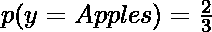
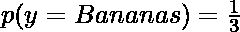
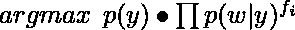
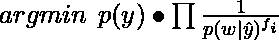
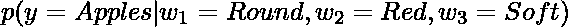
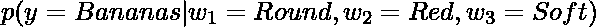
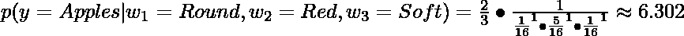

# 补充朴素贝叶斯(CNB)算法

> 原文:[https://www . geesforgeks . org/complex-naive-Bayes-cnb-algorithm/](https://www.geeksforgeeks.org/complement-naive-bayes-cnb-algorithm/)

朴素贝叶斯算法是一组非常流行和常用的用于分类的机器学习算法。朴素贝叶斯算法有多种不同的实现方式，如高斯朴素贝叶斯、多项式朴素贝叶斯等。要了解更多关于朴素贝叶斯的基础知识，您可以点击[这个](https://www.geeksforgeeks.org/naive-bayes-classifiers/)链接。

补充朴素贝叶斯在某种程度上是标准多项式朴素贝叶斯算法的改编。多项式朴素贝叶斯在不平衡数据集上表现不佳。**不平衡数据集**是某类样本数高于其他类样本数的数据集。这意味着例子的分布是不均匀的。这种类型的数据集可能很难处理，因为模型可能很容易过度填充这些数据，从而有利于具有更多示例的类。

**CNB 是如何工作的:**
补充朴素贝叶斯特别适合处理不平衡的数据集。在补集朴素贝叶斯中，我们不是计算一个项目属于某个类的概率，而是计算该项目属于所有类的概率。这是单词**补语**的字面意思，因此被称为补语朴素贝叶斯。

算法的分步高级概述(不涉及任何数学问题):

*   对于每个类，计算给定实例不属于它的概率。
*   在对所有类进行计算后，我们检查所有计算值并选择最小值。
*   选择最小值(最低概率)是因为它不是该特定类别的概率最低。这意味着它有最高的概率真正属于那个类。所以选择了这个类。

**注意:**我们不选择数值最高的那个，因为我们在计算概率的补数。具有最高值的最不可能是该项所属的类。

现在，让我们考虑一个例子:比方说，我们有两个类:**苹果和香蕉**，我们必须根据一定数量的单词出现的频率来分类给定的句子是与苹果相关还是与香蕉相关。下面是简单数据集的表格表示:

<figure class="table">

| 句子编号 | 轮次 | 红色 | 长的 | 黄色 | 柔软的 | **级** |
| one | Two | one | one | Zero | Zero | 苹果 |
| Two | one | one | Zero | nine | five | 香蕉 |
| three | Two | one | Zero | Zero | one | 苹果 |

</figure>

“苹果”类总字数= (2+1+1) + (2+1+1) = 8
类总字数“香蕉”类= (1 + 1 + 9 + 5) = 16

所以，一个句子属于类的概率，‘苹果’，


同样，一个句子属于类的概率，‘香蕉’，


在上表中，我们表示了一个数据集，其中列表示给定句子中单词的频率，然后显示该句子属于哪个类别。在我们开始之前，你必须先了解**贝叶斯定理**。假设另一个事件发生，贝叶斯定理被用来寻找一个事件的概率。公式为:


其中 A 和 B 是事件，P(A)是 A 发生的概率，P(A|B)是假设事件 B 已经发生，A 发生的概率。P(B)，事件 B 发生的概率不能为 0，因为它已经发生了。如果你想了解更多关于常规朴素贝叶斯和贝叶斯定理的知识，可以关注[这个](https://www.geeksforgeeks.org/naive-bayes-classifiers/)链接。

现在让我们看看朴素贝叶斯和补充朴素贝叶斯是如何工作的。常规的朴素贝叶斯算法是，


其中 f <sub>i</sub> 是某个属性的出现频率。例如，某个单词在一个句子中出现的次数。

但是，在补码朴素贝叶斯中，公式为:


如果你仔细看看这些公式，你会发现互补的朴素贝叶斯只是常规朴素贝叶斯的逆。在朴素贝叶斯中，从公式中获得最大值的类就是预测类。所以，由于补数朴素贝叶斯只是逆，从 CNB 公式得到的最小值的类就是预测类。

现在，让我们举个例子，试着用我们的数据集和 CNB 预测它，

<figure class="table">

| 轮次 | 红色 | 长的 | 黄色 | 柔软的 | 班级 |
| one | one | Zero | Zero | one | ？ |

</figure>

所以，我们需要找到，

和


我们需要比较这两个值，并选择作为预测类的类作为具有较小值的类。我们也要为香蕉这样做，挑选价值最小的那一个。即，如果(y = Apples)的值较小，则该类被预测为 apple，如果(y = Bananas)的值较小，则该类被预测为 banans。

对两个类使用补数朴素贝叶斯公式，



现在，从 6.302 < 85.333, the predicted class is **苹果**开始。

我们不使用具有较高值的类，因为较高的值意味着带有这些单词的句子更有可能不属于该类。这也正是这个算法被称为**补**朴素贝叶斯的原因。

**什么时候用 CNB？**

*   当数据集不平衡时:如果要进行分类的数据集不平衡，多项式和高斯朴素贝叶斯可能给出较低的精度。然而，互补朴素贝叶斯将表现得相当好，并将给出相对较高的准确性。
*   对于文本分类任务:补充朴素贝叶斯在文本分类任务中优于高斯朴素贝叶斯和多项式朴素贝叶斯。

**Python 中 CNB 的实现:**
对于这个例子，我们将使用稍微不平衡的葡萄酒数据集。它从各种化学参数来确定葡萄酒的来源。要了解更多关于这个数据集的信息，可以查看[这个](https://archive.ics.uci.edu/ml/datasets/wine)链接。

为了评估我们的模型，我们将检查测试集的准确性和分类器的分类报告。我们将使用 scikit-learn 库来实现补码朴素贝叶斯算法。

**代码:**

```
# Import required modules
from sklearn.datasets import load_wine
from sklearn.model_selection import train_test_split
from sklearn.metrics import accuracy_score, classification_report
from sklearn.naive_bayes import ComplementNB

# Loading the dataset 
dataset = load_wine()
X = dataset.data
y = dataset.target

# Splitting the data into train and test sets
X_train, X_test, y_train, y_test = train_test_split(X, y, test_size = 0.15, random_state = 42)

# Creating and training the Complement Naive Bayes Classifier
classifier = ComplementNB()
classifier.fit(X_train, y_train)

# Evaluating the classifier
prediction = classifier.predict(X_test)
prediction_train = classifier.predict(X_train)

print(f"Training Set Accuracy : {accuracy_score(y_train, prediction_train) * 100} %\n")
print(f"Test Set Accuracy : {accuracy_score(y_test, prediction) * 100} % \n\n")
print(f"Classifier Report : \n\n {classification_report(y_test, prediction)}")
```

**输出**

```
Training Set Accuracy : 65.56291390728477 %

Test Set Accuracy : 66.66666666666666 % 

Classifier Report : 

               precision    recall  f1-score   support

           0       0.64      1.00      0.78         9
           1       0.67      0.73      0.70        11
           2       1.00      0.14      0.25         7

    accuracy                           0.67        27
   macro avg       0.77      0.62      0.58        27
weighted avg       0.75      0.67      0.61        27

```

我们在训练集上得到 65.56%的准确率，在测试集上得到 66.66%的准确率。它们几乎是一样的，考虑到数据集的质量，它们实际上是相当好的。这个数据集因难以用简单的分类器分类而臭名昭著，就像我们在这里使用的分类器一样。所以精度是可以接受的。
**结论:**
现在你已经知道了什么是补数朴素贝叶斯分类器以及它们是如何工作的，下次遇到不平衡的数据集时，你可以尝试使用补数朴素贝叶斯。
**参考文献:**

*   [sci kit-学习文档](https://scikit-learn.org/stable/modules/naive_bayes.html#complement-naive-bayes)。