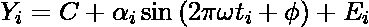
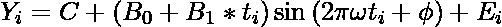
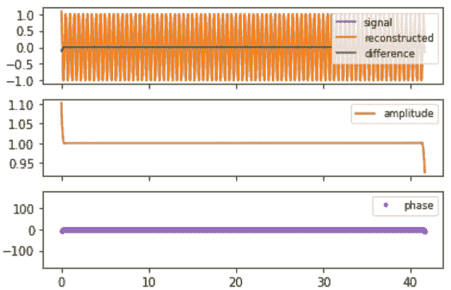

# 复解调相位和振幅图

> 原文:[https://www . geeksforgeeks . org/复数解调-相位和幅度-绘图/](https://www.geeksforgeeks.org/complex-demodulation-phase-and-amplitude-plot/)

### 复杂解调相位图

在时间序列模型的频率分析中，常见的模型是正弦波:


其中，∝为振幅，φ为相移，ω为主频。复杂解调图的目标是改善频率估计。

复杂的解调曲线由两部分组成:

*   纵轴:相位
*   横轴:时间

#### **频率的良好初始估计值的重要性:**

正弦波的非线性拟合


上述方程对良好的初始值敏感。频率ω的初始值可以通过频谱图获得。复杂的解调相位图用于评估该估计是否足够。如果估计不充分，那么是否应该增加或减少。

### 复杂解调幅度图:

在时间序列模型的频率分析中，常见的模型是正弦波:


其中，∝为振幅，φ为相移，ω为主频。

如果复解调幅度图的斜率不为零，那么上面的等式最终被模型代替。



其中，a <sub>i</sub> 是用标准最小二乘法拟合的某种类型的线性模型。最常见的情况是线性拟合，即模型变成如下:



复解调幅度图由下式形成

*   纵轴:振幅
*   横轴:时间

复振幅解调图回答了以下问题:

*   振幅随时间变化吗？
*   有没有启动效应导致启动时振幅不稳定？
*   振幅有异常值吗？

#### **实现:**
**代码:Python 代码进行复杂解调分析**

## 蟒蛇 3

```py
# code
import numpy as np
import matplotlib.pyplot as plt

def gen_test_data(periods, noise=0, rotary=False, npts=1000, dt=1.0/24):
    """
    Generate a simple time series for testing complex demodulation.

    *periods* is a sequence with the periods of one or more
        harmonics that will be added to make the test signal.
        They can be positive or negative.
    *noise* is the amplitude of independent Gaussian noise.   
    *rotary* is Boolean; if True, the test signal is complex.
    *npts* is the length of the series.
    *dt* is the time interval (default is 1.0/24)

    Returns t, x: ndarrays with the test times and test data values..
    """    

    t = np.arange(npts, dtype=float) * dt

    if rotary:
        x = noise * (np.random.randn(npts) + 1j * np.random.randn(npts))
    else:
        x = noise * np.random.randn(npts)

    for p in periods:
        if rotary:
            x += np.exp(2j * np.pi * t / p)
        else:
            x += np.cos(2 * np.pi * t / p)

    return t, x

def complex_demodulation(t, x, central_period, hwidth = 2):
    """
    Complex demodulation of a real or complex series, *x*
    of samples at times *t*, assumed to be uniformly spaced.

    *central_period* is the period of the central frequency
        for the demodulation.  It should be positive for real
        signals. For complex signals, a positive value will
        return the CCW rotary component, and a negative value
        will return the CW component (negative frequency).
        Period is in the same time units as are used for *t*.

    *hwidth* is the Blackman filter half-width in units of the
        *central_period*.  For example, the default value of 2
        makes the Blackman half-width equal to twice the
        central period.

    Returns a dictionary.
    """    

    rotary = x.dtype.kind == 'c'  # complex input

    # Make the complex exponential for demodulation:
    c = np.exp(-1j * 2 * np.pi * t / central_period)

    product = x * c

    # filter half-width number of points
    dt = t[1] - t[0]
    hwpts = int(round(hwidth * abs(central_period) / dt))
    nf = hwpts * 2 + 1
    x1 = np.linspace(-1, 1, nf, endpoint=True)
    x1 = x1[1:-1]   # chop off the useless endpoints with zero weight
    w1 = 0.42 + 0.5 * np.cos(x1 * np.pi) + 0.08 * np.cos(x1 * 2 * np.pi)
    ytop = np.convolve(product, w1, mode='same')
    ybot = np.convolve(np.ones_like(product), w1, mode='same')
    demod = ytop/ybot
    if not rotary:   
        # The factor of 2 below comes from fact that the
        # mean value of a squared unit sinusoid is 0.5.
        demod *= 2

    reconstructed = (demod * np.conj(c))
    if not rotary:
        reconstructed = reconstructed.real

    if np.sign(central_period) < 0:
        demod = np.conj(demod)
        # This is to make the phase increase in time
        # for both positive and negative demod frequency
        # when the frequency of the signal exceeds the
        # frequency of the demodulation.

    d = {'t':t,'signal' : x,'hwpts' : hwpts,'demod': demod,'reconstructed' : reconstructed}
    return d

def plot_demodulation(dm):
    fig, axs = plt.subplots(3, sharex=True)
    resid = dm.get('signal') - dm.get('reconstructed')
    if dm.get('signal').dtype.kind == 'c':
        axs[0].plot(dm.get('t'), dm.get('signal').real, label='signal.real')
        axs[0].plot(dm.get('t'), dm.get('signal').imag, label='signal.imag')
        axs[0].plot(dm.get('t'), resid.real, label='difference real')
        axs[0].plot(dm.get('t'), resid.imag, label='difference imag')
    else:   
        axs[0].plot(dm.get('t'), dm.get('signal'), label='signal')
        axs[0].plot(dm.get('t'), dm.get('reconstructed'), label='reconstructed')
        axs[0].plot(dm.get('t'), dm.get('signal') - dm.get('reconstructed'), label='difference')

    axs[0].legend(loc='upper right', fontsize='small')

    axs[1].plot(dm.get('t'), np.abs(dm.get('demod')), label='amplitude', color='C3')
    axs[1].legend(loc='upper right', fontsize='small')

    axs[2].plot(dm.get('t'), np.angle(dm.get('demod'), deg=True), '.', label='phase',
                color='C4')
    axs[2].set_ylim(-180, 180)
    axs[2].legend(loc='upper right', fontsize='small')

    for ax in axs:
        ax.locator_params(axis='y', nbins=5)
    return fig, axs

def test_demodulation(periods, central_period,
                 noise=0,
                 rotary=False,
                 hwidth = 1,
                 npts=1000,
                 dt=1.0/24):

    t, x = gen_test_data(periods, noise=noise, rotary=rotary,
                     npts=npts, dt=dt)
    dm = complex_demodulation(t, x, central_period, hwidth=hwidth)
    fig, axs = plot_demodulation(dm)
    return fig, axs, dm
# Example 1
test_demodulation([12.0/24], 12.0/24);
# Example 2
test_demodulation([11.0/24], 12.0/24)
```



示例 1:信号、幅度解调和相位解调


示例 2:信号、幅度解调和相位解调