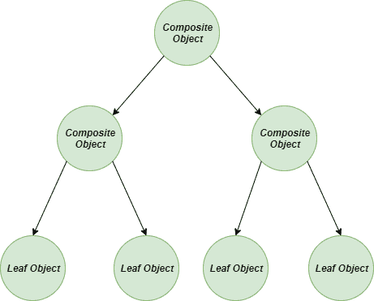
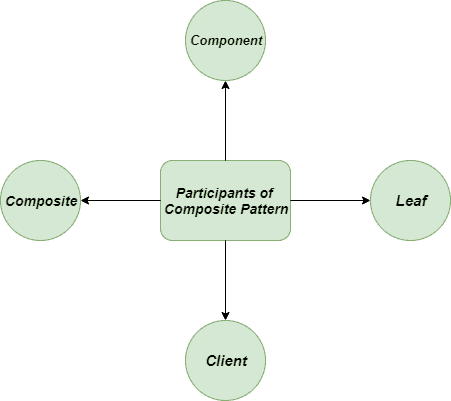
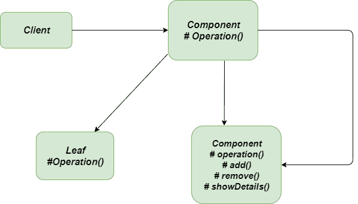
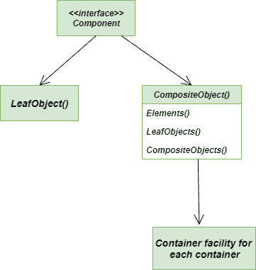

# 合成方法–Python 设计模式

> 原文:[https://www . geesforgeks . org/composite-method-python-design-patterns/](https://www.geeksforgeeks.org/composite-method-python-design-patterns/)

复合方法是一种 **[结构设计模式](https://www.geeksforgeeks.org/design-patterns-set-1-introduction/)** ，它描述了一组对象，这些对象被视为同一类型对象的单个实例。复合方法的目的是**将**对象组合成树形结构来表示整体-部分层次结构。

使用复合方法的主要优点之一是，首先，它允许您将对象组合到**树结构**中，然后将这些结构作为单个对象或实体使用。



复合树结构

您可以对所有复合对象执行的操作通常具有最小公分母关系。

### 复合模式有四个参与者:



参与者-综合-方法

*   **组件:**组件帮助实现所有类通用的接口的默认行为。它声明组合中对象的接口，并用于访问和管理其子组件。
*   **Leaf:** 定义了构图中图元对象的行为。它表示组合中的叶对象。
*   **Composite:** 存储子组件，在组件接口实现子相关操作。
*   **客户端:**用于通过组件接口对合成中的对象进行操作。

### 不使用复合方法的问题

假设我们正在研究一个由总经理、经理和开发人员组成的组织结构。一个总经理手下可能有很多经理，一个经理手下可能有很多开发人员。
假设，你要确定所有员工的工资总额。*那么，你如何确定呢？*

一个普通的开发人员肯定会尝试直接的方法，检查每个员工，计算总工资。看起来容易吗？说到实现，情况就不是这样了。因为我们必须知道所有员工总经理、经理和开发人员的类别。
在基于树的结构中，通过直接方法进行计算似乎甚至是一项不可能的任务。

### 使用复合方法的解决方案

上述问题的最佳解决方案之一是使用**复合方法**，方法是使用一个公共接口，该接口声明了一种计算总工资的方法。
每当我们有“包含组件的复合材料，每个组件都可以是复合材料”时，我们通常会使用复合方法。



复合-运行-示例

```
"""Here we attempt to make an organizational hierarchy with sub-organization,
 which may have subsequent sub-organizations, such as:
GeneralManager                                   [Composite]
      Manager1                                   [Composite]
              Developer11                        [Leaf]
              Developer12                        [Leaf]
      Manager2                                   [Composite]
              Developer21                        [Leaf]
              Developer22                        [Leaf]"""

class LeafElement:

    '''Class representing objects at the bottom or Leaf of the hierarchy tree.'''

    def __init__(self, *args):

        ''''Takes the first positional argument and assigns to member variable "position".'''
        self.position = args[0]

    def showDetails(self):

        '''Prints the position of the child element.'''
        print("\t", end ="")
        print(self.position)

class CompositeElement:

    '''Class representing objects at any level of the hierarchy
     tree except for the bottom or leaf level. Maintains the child
      objects by adding and removing them from the tree structure.'''

    def __init__(self, *args):

        '''Takes the first positional argument and assigns to member
         variable "position". Initializes a list of children elements.'''
        self.position = args[0]
        self.children = []

    def add(self, child):

        '''Adds the supplied child element to the list of children
         elements "children".'''
        self.children.append(child)

    def remove(self, child):

        '''Removes the supplied child element from the list of
        children elements "children".'''
        self.children.remove(child)

    def showDetails(self):

        '''Prints the details of the component element first. Then,
        iterates over each of its children, prints their details by
        calling their showDetails() method.'''
        print(self.position)
        for child in self.children:
            print("\t", end ="")
            child.showDetails()

"""main method"""

if __name__ == "__main__":

    topLevelMenu = CompositeElement("GeneralManager")
    subMenuItem1 = CompositeElement("Manager1")
    subMenuItem2 = CompositeElement("Manager2")
    subMenuItem11 = LeafElement("Developer11")
    subMenuItem12 = LeafElement("Developer12")
    subMenuItem21 = LeafElement("Developer21")
    subMenuItem22 = LeafElement("Developer22")
    subMenuItem1.add(subMenuItem11)
    subMenuItem1.add(subMenuItem12)
    subMenuItem2.add(subMenuItem22)
    subMenuItem2.add(subMenuItem22)

    topLevelMenu.add(subMenuItem1)
    topLevelMenu.add(subMenuItem2)
    topLevelMenu.showDetails()
```

**输出:**

```
GeneralManager
    Manager1
        Developer11
        Developer12
    Manager2
        Developer22
        Developer22

```

### 复合方法类图

以下是**合成方法**的总类图:



类图复合方法

### 优势

*   **开/关原则:**由于在不破坏客户端已有代码的情况下，允许在应用中引入新元素、新类、新接口，所以绝对遵循**开/关原则**
*   **更少的内存消耗:**在这里，与普通方法相比，我们必须创建更少数量的对象，这无疑减少了内存使用，并设法使我们远离与内存相关的错误
*   **提高了执行时间:**在 Python 中创建一个对象不需要太多时间，但是我们仍然可以通过共享对象来减少程序的执行时间。
*   **灵活性:**它通过可管理的类或接口提供了结构的灵活性，因为它定义了包含原语和复杂对象的类层次结构。

### 不足之处

*   **对组件的限制:**复合方法使限制复合材料的组件类型变得更加困难。当您不想表示对象的完整或部分层次结构时，不建议使用。
*   **一般树结构:**一旦定义了树的结构，复合方法将生成整体的一般树。
*   **语言的类型系统:**由于不允许使用编程语言的类型系统，我们的程序必须依赖运行时检查来应用约束。

### 适应性

*   **嵌套树结构的要求:**当需要生成树的嵌套结构时，最好使用**复合方法**，树的嵌套结构也包括树叶对象和其他对象容器。
*   **图形编辑器:**我们可以将一个形状定义为两种类型:简单的**表示 ex-直线，复杂的**表示 ex-矩形。由于所有形状都有许多常见的操作，例如将形状渲染到屏幕上，因此可以使用复合模式使程序能够统一处理所有形状。****

******进一步阅读:** **[爪哇](https://www.geeksforgeeks.org/composite-design-pattern/)合成法******