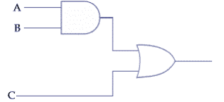
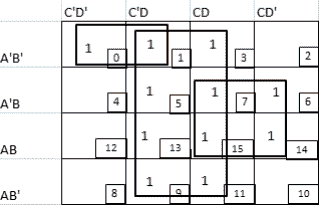
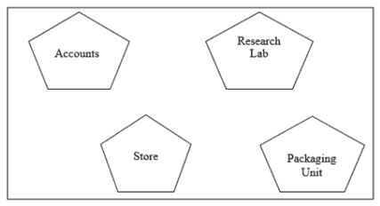
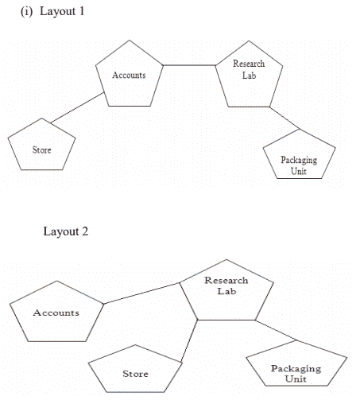

# 计算机科学十二班(2016-17)

> 原文:[https://www . geesforgeks . org/computer-science-class-XII-2016-17/](https://www.geeksforgeeks.org/computer-science-class-xii-2016-17/)

**SQP——计算机科学(代码:083)
十二班(2016-17)
时间:3 小时。MM: 70**

说明:
一、所有问题为必答。
二。编程语言:第一部分:C++
第三章。编程语言:B 节:Python
iv。回答 A 节或 B 节，C 节是强制性的

**A 区**

**1 (a)用合适的例子解释[条件算子](https://www.geeksforgeeks.org/cc-ternary-operator-some-interesting-observations/)？2**
条件运算符也称为三元运算符，因为它需要三个操作数，可以用来替换简单的 if-else 代码。它用于检查条件，如果条件为真，则执行第一个表达式，否则执行其他表达式。
**语法:**

```py
Conditional expression? Expression 1 : Expression 2;
```

**解释:**
如果条件表达式为真，则表达式 1 执行，否则表达式 2 执行。
**例:**

```py
int y = 10, x;
x = y > 10 ? 1 : 0;
cout << x;
```

输出:

```py
0
```

**(b)运行/执行以下 C++代码本质上需要包含哪些 C++头文件:1**

```py
void main()
{
    char *word1 = "Hello", *word2 = "Friends";
    strcat(word1, word2);
    cout << word1;
}
```

**< iostream.h >** 为输入输出
**< string.h >** 为 strcat 功能

**(c)删除语法错误(如有)后，重写以下程序。在每项更正下面画线。**

```py
#include <conio.h>
#include <iostream.h>
#include <stdio.h>
#include <string.h>
class product {
    int product_code, qty, price;
    char name[20];

public:
    product()
    {
        product_code = 0;
        qty = 0;
        price = 0;
        name = NULL;
    }
    void entry()
    {
        cout << "\n Enter code, qty, price";
        cin >> product_code >> qty >> price;
        gets(name);
    }
    void tot_price() { return qty * price; }
};
void main()
{
    p product;
    p.entry();
    cout << tot_price();
}
```

**代码中的修正:**

```py
#include <conio.h>
#include <iostream.h>
#include <stdio.h>
#include <string.h>
class product {
    int product_code, qty, price;
    char name[20];

public:
    product()
    {
        product_code = 0;
        qty = 0;
        price = 0;
        strcpy(name, NULL);
    }
    void entry()
    {
        cout << "\n Enter code, qty, price";
        cin >> product_code >> qty >> price;
        gets(name);
    }
    int tot_price() { return qty * price; }
};
void main()
{
    product p;
    p.entry();
    cout << p.tot_price();
}
```

**(d)编写以下 C++程序代码的输出:注意:假设程序中已经包含了所有需要的头文件。**

```py
void change(int* s)
{
    for (int i = 0; i < 4; i++) {
        if (*s < 40) {
            if (*s % 2 == 0)
                *s = *s + 10;
            else
                *s = *s + 11;
        }
        else {
            if (*s % 2 == 0)
                *s = *s - 10;
            else
                *s = *s - 11;
        }
        cout << *s << " ";
        s++;
    }
}
void main()
{
    int score[] = { 25, 60, 35, 53 };
    change(score);
}
```

**年:**

```py
36 50 46 42
```

**(e)编写以下 C++程序代码的输出:注意:假设程序中已经包含了所有需要的头文件。**

```py
class seminar {
    char topic[30];
    int charges;

public:
    seminar()
    {
        strcpy(topic, "Registration");
        charges = 5000;
    }
    seminar(char t[])
    {
        strcpy(topic, t);
        charges = 5000;
    }
    seminar(int c)
    {
        strcpy(topic, "Registration with Discount");
        charges = 5000 - c;
    }
    void regis(char t[], int c)
    {
        strcpy(topic, t);
        charges = charges + c;
    }
    void regis(int c = 2000)
    {
        charges = charges + c;
    }
    void subject(char t[], int c)
    {
        strcpy(topic, t);
        charges = charges + c;
    }
    void show()
    {
        cout << topic << "@" << charges << endl;
    }
};
void main()
{
    seminar s1, s2(1000), s3("Genetic Mutation"), s4;
    s1.show();
    s2.show();
    s1.subject("ICT", 2000);
    s1.show();
    s2.regis("Cyber Crime", 2500);
    s2.show();
    s3.regis();
    s3.show();
    s4 = s2;
    s4.show();
    getch();
}
```

**输出:**

```py
Registration@5000
Registration with Discount@4000
ICT@7000
Cyber Crime@6500
Genetic Mutation@7000
Cyber Crime@6500
```

**(f)仔细观察以下程序并尝试给定的问题:**

```py
#include <conio.h>
#include <iostream.h>
#include <stdlib.h>
void main()
{
    clrscr();
    randomize();
    char courses[][10] = { "M.Tech", "MCA", "MBA", "B.Tech" };
    int ch;
    for (int i = 1; i <= 3; i++) {
        ch = random(i) + 1;
        cout << courses[ch] << "\t";
    }
    getch();
}
```

**I .在变量课程中存储的所有四门课程中，哪门课程永远不会显示在输出中，哪门课程总是首先显示在输出中？**
由于循环从 1 开始而不是从 0 开始，M.Tech 永远不会显示在输出中。MCA 总是首先显示在输出中，因为它位于索引 1 处。
**二。提到分配给变量 ch 的最小值和最大值？**
ch = 1 的最小值
ch = 3 的最大值
**2(a)你对[函数重载](https://www.geeksforgeeks.org/function-overloading-c/)或函数多态的理解是什么？用适当的例子解释。**
是使用同一个函数或方法，使用不同的输入集合进行工作的方法。函数重载是多态性的一个例子，在多态性中，多个同名函数通过传递给它们的不同参数集表现不同。

```py
void show()
{
    cout <<”\n Hello World !”;
}
void show(char na[])
{
    cout <<”\n Hello World !Its ”<< na;
}
```

**(b)完成以下课程后，回答问题(I)和(ii):**

```py
class planet {
    char name[20];
    char distance[20];

public:
    planet() // Function 1
    {
        strcpy(name, "Venus");
        strcpy(distance, "38 million km");
    }
    void display(char na[], char d[]) // Function 2
    {
        cout << na << "has " << d << " distance from Earth" << endl;
    }
    planet(char na[], char d[]) // Function 3
    {
        strcpy(name, na);
        strcpy(distance, d);
    }
    ~planet() // Function 4
    {
        cout << "Planetarium time over!!!" << endl;
    }
};
```

**一、功能 1 指的是什么？什么时候执行？**
一、[建造师](https://www.geeksforgeeks.org/constructors-c/)。它将在对象创建时执行。

**二。编写合适的 C++语句来调用函数。2**
二。行星 p；
p.display(“冥王星”、“75 亿公里”)；

**(c)用 C++定义一个类 DanceAcademy，描述如下:**
**【私有成员】**
int 类型的参与者
类型字符串的名称
类型字符串的样式
类型浮动的费用
成员函数 chkfee()根据用户输入的样式根据下面给出的标准分配费用变量的值:

```py
Style         Fee
Classical     10000
Western       8000
Freestyle     11000
```

**公众会员**
A 功能注册()允许用户输入注册号、名称、样式的值，并调用函数 chkfee()根据用户输入的样式分配费用变量值。
一个功能显示()，允许用户查看所有数据成员的详细信息。

```py
class DanceAcademy {
    int Enrollno;
    char Name[20];
    char Style[20];
    float Fee;
    void chkfee()
    {
        if (strcmpi(Style, "Classical") == 0)
            Fee = 10000;
        else if (strcmpi(Style, "Western") == 0)
            Fee = 8000;
        else if (strcmpi(Style, "Freestyle") == 0)
            Fee = 11000;
    }

public:
    void enrollment()
    {
        cout << "Please enter Enrollno, Name, Style";
        cin >> Enrollno;
        gets(Name);
        gets(Style);
        chkfee();
    }
    void display()
    {
        cout << "\n Entered Enrollno, Name, Style and Fee is:
                "<<Enrollno<<"\t "<<Name<<"\t "<<Style<<"\t "<<Fee;
    }
};
```

**(d)根据以下内容回答问题(I)至(iv):**

```py
class indoor_sports {
    int i_id;
    char i_name[20];
    char i_coach[20];

protected:
    int i_rank, i_fee;
    void get_ifee();

public:
    indoor_sports();
    void iEntry();
    void ishow();
};
class outdoor_sports {
    int o_id;
    char o_name[20];
    char o_coach[20];

protected:
    int orank, ofee;
    void get_ofee();

public:
    outdoor_sports();
    void oEntry();
    void oshow();
};
class sports : public indoor_sports, protected outdoor_sports {
    char rules[20];

public:
    sports();
    void registration();
    void showdata();
};
```

**(i)命名上述 C++代码中说明的继承类型。**
[多重继承。](https://www.geeksforgeeks.org/multiple-inheritance-in-c/)

**(ii)写下所有成员的名字，这些成员可以从属于户外运动类的对象中获得。**
数据成员:无
成员函数:oEntry()，oShow()

**(iii)写出所有成员函数的名称，可从班级体育的成员函数中访问。**
注册()、showdata()、oEntry()、oShow()、get_ofee()、iEntry()、iShow()、get_ifee()

**(iv)属于类室内 _ 运动的物体会有多大？**
46 字节

**3(a)用 C++写一个函数 grace_score (int score []，int size)的定义，应该检查数组的所有元素，对那些分数小于 40 的给 5 加 1。3
例:如果一个七个整数的数组如下:45、35、85、80、33、27、90
执行完函数后，数组内容应该更改如下:45、40、85、80、38、32、90**

```py
void grace_score(int score[], int size)
{
    for (int i = 0; i < size; i++) {
        if (score[i] < 40)
            score[i] = score[i] + 5;
        cout << score[i] << " ";
    }
}
```

**(b)阵列 P[30][20]沿着列存储在存储器中，每个元素需要 2 字节的存储。如果数组 P 的基址是 26500，找出 P[20][10]的位置。3**
总行数= 30
总大小= 2 字节
基址= 26500
LOC (P[I][J]) =基址+((I-LBR) + (J-LBC) * R)*W
假设行的下限(LBR)=0
列的下限(LBC)=0
总行数(R)=30
每个元素的大小(W)=2
LOC(P

**(c)在 C++中为类库编写成员函数 push()的定义，以便在动态分配的[书库](https://www.geeksforgeeks.org/stack-data-structure/)中插入图书信息，考虑到以下代码已经作为程序的一部分编写:**

```py
struct book {
    int bookid;
    char bookname[20];
    book* next;
};
class Library {
    book* top;

public:
    Library()
    {
        top = NULL;
    }
    void push();
    void pop();
    void disp();
    ~Library();
};
```

答复:

```py
void Library::push()
{
    book* nptr;
    nptr = new book;
    cout << "Enter values for bookid and bookname";
    cin >> nptr->bookid;
    gets(nptr->bookname);
    nptr->next = NULL;
    if (top == NULL)
        top = nptr;
    else {
        nptr->next = top;
        top = nptr;
    }
}
```

**(d)在 C++中编写一个自定义函数 swap_row(int ARR[ ][3]，int R，int C)将第一行值与最后一行值 :**
**进行交换例如，如果数组的内容是:
10 20 30
40 50 60
70 80 90
那么在函数调用之后，数组的内容应该是:
70 80 90
440**

```py
void swap_row(int ARR[][3], int R, int C)
{
    for (int i = 0, j = 0; j < C; j++) {
        int temp = ARR[i][j];
        ARR[i][j] = ARR[R - 1][j];
        ARR[R - 1][j] = temp;
    }
}
```

**(e)评估以下[后缀表达式](https://www.geeksforgeeks.org/stack-set-4-evaluation-postfix-expression/)。分别显示每个操作执行后 Stack 的状态:45，45，+，32，20，10，/，-，***

```py
Element Scanned   Stack Status
45                45
45                45, 45
+                 90
32                90, 32
20                90, 32, 20
10                90, 32, 20, 10
/                 90, 32, 2
-                 90, 30
*                 2700
```

因此最终结果是 2700

**4(a)考虑到硬盘上已经存在有 2 条记录的二进制文件，找到以下 C++代码的输出。**

```py
class sports {
    int id;
    char sname[20];
    char coach[20];

public:
    void entry();
    void show();
    void writing();
    void reading();
} s;

void sports::reading()
{
    ifstream i;
    i.open("sp.dat");
    while (1) {
        i.read((char*)&s, sizeof(s));
        if (i.eof())
            break;
        else
            cout << "\n"
                 << i.tellg();
    }
    i.close();
}
void main()
{
    s.reading();
}
```

年:
42
84

**(b)用 C++编写一个用户定义的函数 word_count()，统计一个名为“opinion.txt”的文本文件中存在多少个单词。例如，如果文件 opinion.txt 包含以下文本:男女同校制度是平衡社会所必需的。在男女同校的制度下，女孩和男孩可能会产生一种相互尊重的感觉。
功能应显示如下:文本文件中出现的总字数为:24**

```py
void word_count()
{
    ifstream i;
    char ch[20];
    int c = 0;
    i.open("opinion.txt ");
    while (!i.eof()) {
        i >> ch;
        c = c + 1;
    }
    cout << " Total number of words present in the text file are: “<<c;
}
```

**(c)用 C++写一个函数 display()，显示从二进制文件“stud.dat”中获得区分(得分百分比大于等于 75)的所有学生，假设该二进制文件包含以下类的对象:**

```py
class student {
    int rno;
    char sname[20];
    int percent;

public:
    int retpercent()
    {
        return percent;
    }
    void getdetails()
    {
        cin >> rno;
        gets(sname);
        cin >> percent;
    }
    void showdetails()
    {
        cout << rno;
        puts(sname);
        cout << percent;
    }
};
```

```py
void display()
{
    student s;
    ifstream i(“stud.dat”);
    while (i.read((char*)&s, sizeof(s))) {
        if (s.retpercent() >= 75)
            s.showdetails();
    }
    i.close();
}
```

**B 节(Python)**

**1 (a)仔细观察以下 python 代码，并回答以下问题:**

```py
x = 5
def func2():
    x = 3
    global x
    x = x + 1
    print x
    print x
```

在执行时，上述代码产生以下输出。

```py
6
3
```

**解释关于变量的[范围的输出。2](https://www.geeksforgeeks.org/global-local-variables-python/)**
使用全局关键字声明的名称必须在文件级别引用。这是因为全局语句表明特定变量存在于全局范围内。如果没有使用全局语句，则访问具有局部作用域的变量。因此，在上面的代码中，在语句
之后的语句通知 python 增加全局变量 x。因此，输出是 6，即 5+1，这也是全局 x 的值。

**(b)命名以下功能所属的模块:**1
T3】a .统一()b .晶圆厂()T5】a .[随机()](https://www.geeksforgeeks.org/random-numbers-in-python/)T8】b .数学()

**(c)删除语法错误(如有)后，重写以下代码。在每项更正下面画线。2**

```py
def chksum:
     x = input("Enter a number")
     if (x % 2 = 0):
        for i range (2 * x):
           print i
        loop else:
           print "#"
```

```py
def chksum():
 x = input("Enter a number")
 if (x % 2 == 0):
   for i in range(2 * x):
     print i
 else:
     print "#" 
```

**(d)仔细观察下面的 Python 代码，获取输出，执行后会出现在屏幕上。** 2

```py
def Findoutput():
      L = "earn"
      X = " "
      L1 = []
      count = i
      for i in L:
          if i in ['a', 'e', 'i', 'o', 'u']:
              X = X + i.swapcase()
          else
              if(count % 2 != 0):
                  X = X + str(len(L(:count)))
              else:
                  X = X + i
          count = count + 1
      print X
Findoutput()
```

输出:

```py
 EA3n
```

**(e)执行下面的 Python 代码会产生什么输出？3**

```py
def Changelist():
    L = []
    L1 = []
    L2 = []
    for i in range (1, 10):
        L.append(i)
    for i in range (10, 1, -2):
        L1.append(i)
    for i in range (len(L1)):
        L2.append(L1[i]+L[i])
    L2.append(len(L)-len(L1))
    print L2
Changelist()
```

**(f)观察以下程序并回答以下问题:**

```py
import random
X = 3
N = random.randint(1, X)
for i in range(N):
   print i, '#', i + 1
```

**a .循环执行的最小和最大次数是多少？**
最小数量= 1
最大数量= 3

**b .找出(I)到(iv)中哪一行输出不是程序预期的？
一. 0#1
二。1#2
三。2#3
四世。3#4**
四号线预计不会成为输出的一部分

**2a。解释 Python 使用的两种内存分配策略。**
Python 使用两种内存分配策略:
i. [引用计数](https://www.geeksforgeeks.org/garbage-collection-python/)
ii。[自动垃圾收集。](https://www.geeksforgeeks.org/garbage-collection-python/)
**引用计数:**通过计算一个对象被系统中其他对象引用的次数来工作。当对象的引用计数为零时，Python 会自动收集它。
**自动垃圾收集:** Python 基于对象分配和对象解除分配的阈值来调度垃圾收集。当分配数减去解除分配数大于阈值数时，垃圾收集器将运行，未使用的内存块将被回收。

**b .观察以下课堂定义，回答以下问题:**

```py
class Info:
    ips = 0
    def__str__(self):   # Function 1
       return "Welcome to the Info Systems"
    def__init__(self):
       self.__Systemdate = " " 
       self.Systemtime = " "
    def getinput(self):
       self.__Systemdate = raw_input("Enter data") 
       self.Systemtime = raw_input("Enter data")
       Info.incrips()
    @staticmethod      # Statement 1
    def incrips():
       Info.ips = Info.ips + 1
       print "System invoked", Info.ips, "times"
I = Info()
I.getinput()
print I.systemtime
print __Systemdate    # Statement 2
```

**i .写语句调用函数 1。**
印一世
**二世。在执行上述代码时，语句 2 给出了一个错误解释。**
语句 2 给出了一个错误，因为 __Systemdate 是一个私有变量，因此不能在类外打印。

**c 用 Python 定义一个产品类，规格如下。
数据成员:
Pid–存储产品 id 的字符串。
Pname–存储产品名称的字符串。
pcost Price–存储产品成本价的十进制数
pselingprice–存储销售价格的十进制数
Margin–作为 pselingprice 计算的十进制数–pcost Price
备注–如果 Margin 为正，则存储“利润”,如果 Margin 为负，则存储“损失”。
成员函数:
用有效默认值初始化所有数据成员的构造函数。
将 Margin 指定为 Psellingprice–Pcostprice 并设置备注的方法 setrements()如下所述:**

```py
Margin               Remarks
<0 (negative) loss>0 (positive)        Profit0>
```

 **方法 Getdetails()接受 Pid、Pname、Pcostprice、Psellingprice 的值并调用 setrements()方法。
显示所有数据成员的方法 Setdetails()。** 

```py
class PRODUCT:
    def__init__(self):
         self.Pid = "  "
         self.Pname = " "
         self.Pcostprice = 0.0
         self.Psellingprice = 0.0
         self.Margin = 0.0
         self.Remarks = " "

    def SetRemarks(self):
         self.Margin = self.Psellingprice - self.Pcostprice
         if ( self.Margin < 0):
               self.Remarks = "Loss"
         else:
               self.Remarks = "Profit"

    def Getdetails(self):
         self.Pid = raw_input(" Enter Product Id ")
         self.Pname = raw_input(" Enter Product Name ")
         self.Pcostprice = raw_input(" Enter Cost Price ")
         self.Psellingprice = raw_input(" Enter Selling Price ")
         self.SetRemarks()

    def Setdetails(self):
        print "Product Id", self.Pid
        print "Product Name", self.Pname 
        print "Cost Price", self.Pcostprice
        print "Selling Price", self.Psellingprice 
        print "Margin:", self.Margin
        print "Incurred:", self.Remarks 
```

**d .根据以下内容回答问题(I)至(iv):4**

```py
class Shop(object):
    def__init__(self):
         self.no__of__employees = 0
         self.no__of__brands = 0
    def getSdata(self):
         self.no__of__employees = input("Number of employees")
         self.no__of__brands = input("Number of brands")
    def showSdata(self):
         print self.no__of__employees 
         print self.no__of__brands
class Brand(object):
    def__init__(self):
         self.name = " "
         self.category = ["Men", "Women, "Kids"]
         self.avgprice = 0.0
    def getdata(self):
         self.name = raw_input("Enter Brand Name")
         self.avgprice = input("Enter Average price")
    def showdata (self)
         print self.name
         print self.category
         print self.avgprice
Class Mall(Brandshop):
    def__init__(self):
         self__no__of__shops = 0
    def getdata(self):
         super(Mall, self).getSdata()
         super(Mall, self).getdata()
         self.no__of__shops = input("Enter no of shops")
    def showdata(self):
         print self__no__of__shops 
         print self__no__of__shops 
```

**一、以上代码演示了哪种类型的继承？**
多重继承
**二。解释陈述 1 和 2。**
语句 1 和 2 分别调用类 Shop 的 getSdata()函数和类 Brand 的 getData()函数。
**三世。命名被重写的方法及其类名。**
类 Brand 的 getdata()方法被覆盖。创建类 Mall 的对象时，调用类 Mall 的
M = Mall()
M . getdata()
getdata()方法，调用不属于类 Brand 的
。
**iv。用一条语句填充空白 1，以显示类别品牌的可变类别。**
打印品牌()。种类

**3a。考虑以下未排序的列表:95 79 19 43 52 3
写入[冒泡排序](https://www.geeksforgeeks.org/bubble-sort/)的遍数，以升序对列表进行排序，直到第三次迭代。3**
解:
【79、19、43、52、3、95】
【19、43、52、3、79、95】
【19、43、3、52、79、95】

**b. Kritika 被要求接受一个偶数列表，但她在接受该数字列表时并未提出相关条件。您需要编写一个代码，通过将所有奇数乘以 2 来将其转换为偶数。3**

```py
def oddtoeven(L):
    for i in range(len(L)):
        if (L[i] % 2 != 0):
             L[i] = L[i] * 2
```

**c. Aastha 想要创建一个程序，该程序接受一个字符串，并使用 Stack 在同一行中以相反的顺序显示字符。她已经创建了以下代码，根据下面给出的要求，通过完成定义来帮助她:4
类 mystack:
def _ _ init _ _(self):
self . mystr = _ _ _ _ _ _ _ _ _ _ #接受一个字符串
self . mylist = _ _ _ _ _ _ _ _ _ _ #将 mystr 转换为# list
编写代码以在从堆栈中移除元素时显示。
def disp(self):
:
:**

```py
class mystack:
   def __init__(self):
       self.mystr = raw_input("Enter the string")
       self.mylist = list(self.mystr)

  def display(self):
       x = len(self.mylist)
       if(x>0):
             for i in range(x):
                 print self.mylist.pop()
       else:
             print"Stack is empty"
```

**d .编写一个生成器函数生成 q()，显示从 100 到 n 的数字的平方根，其中 n 作为参数传递。2**

```py
import math
def generatesq(n):
    for i in range (100, n):
        yield (math.sqrt(i))
```

**e .评估以下后缀表达式:20，10，-15，3，/，+，5，***

```py
Symbol   Operation       Stack    Result
20       Push            20
10       Push            20, 10
-        Pop(10)         
         Pop(20)
         Push(20-10)
         =10
15      Push             10, 15
3       Push             10, 15, 3
/       Pop(3)
        Pop(15)
        Push(15/3)
        =5               10, 5
+       Pop(5)
        Pop(10)
        Push(10+5)=15    15 
5       Push             15, 5
*       Pop(5)
        Pop(15)
        Push(15*5)
        =75              75         75 
```

**4a 遵守以下代码并回答以下问题:
文件=打开(“我的数据”，“a”)
_ _ _ _ _ _ _ _ _ _ _ _ _ _ _ _ # blank 1
文件.关闭()**

**一、Mydata 是什么类型(文本/二进制)的文件？**
文本文件
**二。用在文件“我的数据”**
中写“作业成本”的语句填充空白 1

**b)文本文件“报价。Txt”中写有以下数据:
过上你可以引以为豪的生活
尽力而为
花时间与对你重要的人和活动在一起
即使在困难的时候也坚持正确的事情
成为最好的你
编写一个用户定义的函数来显示文件中存在的总字数。**

```py
def countwords():
    S = open("Mydata", "x")
    f = s.read()
    z = f.split()
    count = 0
     for i in z:
       count = count + 1
  print "Total number of words, count
```

**c .考虑下面的类声明，回答下面的问题:**

```py
import pickle
class student:
    def__int__(self):
        self.name = ""
        self.percent = 0.0
   def inputdata (self):
        self.name = raw_input("Enter name)
        self.percent = input("Enter Percentage scored")
   def returnpercent (self):
        return (self.percent)
   def displaydata(self):
        print "Name:", self name
        print "Percent:", self.percent
```

**Anuj 被要求显示辅导班成绩低于 40 分的所有学生。编写一个用户定义的函数来显示二进制文件“Student.dat”中得分低于 40 分的所有学生，假设它存储了上面提到的 Student 类的所有对象。3**

```py
def displaydata():
     X = open ("student.dat", "rb")
     S = Student()
     try:
        while (X):
            S = pickle.load(X)
            if (S.returnpercent()<40);
                S.displaydata()
     except EOFError:
        pass
     X.close()
```

**C 区**

**5 (a)观察下面给出的表格“Club”:**

```py
Club
Member_id   Member_Name   Address   Age   Fee
M002        Nisha         Gurgaon     19   3500
M003        Niharika      New Delhi  21   2100
M004        Sachin        Faridabad  18   3500
```

**i .上表的[基数和度](https://www.geeksforgeeks.org/relational-model/)是多少？**T4【地籍:4】
度:5

**二。如果添加了一个新的 contact_no 列，并且又有三个成员加入了俱乐部，那么这些变化将如何影响上面给定表的度和基数。**
基数:7
度数:6

**(b)根据下面给出的表“Watches”和“Sale”，为查询(I)至(iv)和(v)至(viii)的输出编写 SQL 命令。**

```py
Watches
Watchid   Watch_Name   Price   Type   Qty_Store
W001      HighTime      10000  Unisex  100
W002      LifeTime      15000  Ladies  150
W003      Wave          20000  Gents   200
W004      HighFashion   7000   Unisex  250
W005      GoldenTime    25000  Gents   100

```

```py
Sale
Watchid   Qty_Sold    Quarter
W001       10          1
W003       5           1
W002       20          2
W003       10          2
W001       15          3
W002       20          3
W005       10          3
W003       15          4
```

**i .显示名称以‘Time’**结尾的手表的所有详细信息

```py
select * from watches where watch_name like ‘%Time’ 
```

**二。显示价格在 5000-15000 之间的手表的名称和价格。**

```py
select watch_name, price from watches where price between 5000 and 15000;
```

**三。显示男女通用型手表的库存总量。**

```py
select sum(qty_store) from watches where type like ’Unisex’;
```

**iv。显示手表名称和第一季度的销售数量。**

```py
 select watch_name, qty_sold from watches w, sale s where
       w.watchid=s.watchid and quarter=1;
```

**v .从手表中选择最大(价格)、最小(数量 _ 商店)；**
输出:

```py
max(price)    min(qty_store)
25000         100 
```

**vi .按季度从销售组中选择季度、总和(数量 _ 已销售)；**

```py
quarter    sum(qty_sold)
1           15
2           30
3           45
4           15 
```

**vii。从手表 w、销售 s 中选择手表 _ 名称、价格、类型，其中
w.watchid！= s.watchid**T3】输出:

```py
watch_name    price     type
HighFashion   7000      Unisex 
```

**viii。从手表 w、sale s 中选择 watch_name、qty_store、sum(qty_sold)、qty _ store sum(qty _ sold)
“Stock”，其中
w.watchid=s.watchid 按 s.watchid 分组；**
输出:

```py
watch_name    qty_store    qty_sold   Stock
HighTime      100          25          75
LifeTime      150          40          110
Wave          200          30          170
GoldenTime    100          10          90 
```

**6 (a)更正以下布尔语句:**

```py
1\. X+1 = X
2\. (A')'=A'
3\. A+A'=0
4\. (A+B)' = A.B
```

更正:

```py
1\. X+1 =1 or X+0=X
2\. ((A’)’) = A
3\. A+A’= 1 or A.A’=0
4\. (A+B)’ = A’.B’
```

**(b)绘制以下布尔表达式的等效逻辑电路:(A.B)+C 1**



**(c)写出布尔函数 F 的 POS 形式，用一个真实故事表示如下:2**

```py
P   Q   R   F
0   0   0   0
0   0   1   1
0   1   0   1
0   1   1   1
1   0   0   0
1   0   1   1
1   1   0   0
1   1   1   1
```

回答:(P+Q+R)。(P’+Q+R)。(P'+Q'+R)

(D)使用 K 映射简化以下布尔表达式:F(A，B，C，D)= (0，1，3，5，6，7，9，10，11，13，14，15)



**7 (a)根据以下内容识别[拓扑](https://www.geeksforgeeks.org/network-topologies-computer-networks/)的类型:
1。由于每个节点都直接连接到服务器，因此需要大量电缆，这增加了网络的安装成本。
2。它有一条连接所有节点的公共数据路径。**
回答:
1。星型拓扑
2。总线拓扑

**(b)扩展如下:1**
**a. VOIP** :网络电话协议
**b. SMTP** :简单邮件传输协议

**(c)谁是黑客？1**
一个电脑发烧友，利用自己的电脑编程技能，在未经授权的情况下故意访问电脑，被称为黑客。黑客访问计算机时，无意破坏数据或恶意伤害计算机。

**(d)以下是一个 32 位二进制数，通常表示为 4 个十进制值，每个十进制值代表 8 位，范围为 0 到 255(称为八位字节)，由小数点 140.179.220.200 分隔。这是什么？它的重要性是什么？1**
是一个 IP 地址。它用于识别网络上的计算机。

**(e)丹尼尔必须在他位于同一城市的两个分支机构的不同计算机之间共享数据。说出在此过程中形成的网络(局域网、广域网、广域网和城域网之外的网络)。1**
回答:人

**(f)瑞哈纳医疗中心在迪拜设立了新中心。它有四栋建筑，如下图所示:**



```py
Distances between various buildings are as follows:
Accounts to Research Lab        55 m
Accounts to Store               150 m
Store to Packaging Unit         160 m
Packaging Unit to Research Lab  60 m
Accounts to Packaging Unit      125 m
Store to Research Lab           180 m
```

```py
Number of Computers
Accounts              25
Research Lab          100
Store                 15
Packaging Unit        60
```

作为网络专家，请为以下问题提供最佳答案:
**i)建议建筑物之间连接的电缆布局。**



**ii)建议最适合放置该组织服务器的地方(即建筑物)。**
最适合放置该组织服务器的地方/建筑是研究实验室，因为该建筑包含的计算机数量最多。

**iii)建议正确放置以下设备:a)中继器 b)集线器/交换机 1**
a)对于布局 1，由于帐户到商店之间的布线距离很大，因此理想情况下需要沿着其路径放置一个中继器，以避免在该路径的数据流过程中信号丢失。对于布局 2，由于商店和研究实验室之间的布线距离很大，因此最好放置一个中继器。
b)在这两种布局中，所有建筑都需要一个集线器/交换机，以便将每栋建筑中不同计算机的电缆组互连起来。

**iv)建议一个系统(硬件/软件)来防止对网络的未授权访问。1**
(四)防火墙