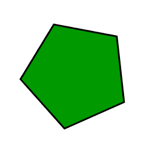

# 用于在实况摄像机中寻找目标的计算机视觉模块应用程序

> 原文:[https://www . geesforgeks . org/computer-vision-module-application-for-find-a-target-in-a-live-camera/](https://www.geeksforgeeks.org/computer-vision-module-application-for-finding-a-target-in-a-live-camera/)

*注意:使用在线编译器在这里行不通。请安装 Python 2.7x 和 cv2，argparse 模块来实际尝试这个例子。*

对于我们大多数人来说，都是那些动作片，以及《现代战争》、《黑色行动》等游戏的忠实粉丝，有机会说“目标获得……等待批准”一直是一个梦想。阿尔法小组你可以开火，任务开始。让我们搞砸吧伙计们！！！万岁！“当然，好吧，你不能总是得到你想要的——但是，至少现在，我可以让你离你的梦想足够近。这节课你所需要的是 Python 2.7，cv2 模块，如果你有一台不错的录像机，在它的帮助下你可以获得实时视频流，那就太好了。不管怎样，即使你没有也没关系。

**第一步:检查你的武器**

下载 Python 2.7，确保你有 cv2 模块(请注意 cv 模块是旧的，已经被 cv2 取代)和 argparse 模块。为此:

```py
import cv2 as cv
import argparse
```

如果这没有给一个错误，那么你就可以走了…

**第 2 步:任务详情**

现在你已经带着武器，是时候确保你拥有所有需要的任务细节了。首先，我们需要明确我们的目标。所以，我们的目标是:



现在你已经有了目标，是时候建立一个测试场了。获取目标的几个打印输出，并粘贴在你家的几个地方。现在，如果你真的想获得这种感觉，做一架四轴直升机，在里面固定一个小摄像头，并适当地记录整个房子，确保你覆盖了你粘贴目标的地方。万一你不想经历这些麻烦，就拿个相机自己录下你的房子。我建议你保持视频简短。

**第三步:系好安全带！我们有任务要完成！**

好吧。我是阿尔法 1 号报到！把任务坐标发给我们！

你有目标，现在你需要获得它！为此，我们将使用计算机视觉模块(cv2)。代码片段:

直接代码链接:【https://ide . geeksforgeeks . org/xfuette 4】

```py
import argparse
import cv2

# construct the argument parse and parse the arguments
ap = argparse.ArgumentParser()
ap.add_argument("-v", "--video", help="path to the video file")
args = vars(ap.parse_args())

# load the video
camVideo = cv2.VideoCapture(args["video"])

# keep looping
while True:

    # grab the current frame and initialize the status text
    (grabbed, frame) = camVideo.read()
    status = "No Target in sight"

    # check to see if we have reached the end of the
    # video
    if not grabbed:
        break

    # convert the frame to grayscale, blur it, and detect edges
    gray = cv2.cvtColor(frame, cv2.COLOR_BGR2GRAY) #grayscale
    blurred = cv2.GaussianBlur(gray, (7, 7), 0) #blur
    edged = cv2.Canny(blurred, 50, 150) #canny edge detection

    # find contours in the edge map
    (cnts, _) = cv2.findContours(edged.copy(), cv2.RETR_EXTERNAL,
    cv2.CHAIN_APPROX_SIMPLE)

# loop over the contours
for cnt in cnts:
    approx=cv2.approxPolyDP(cnt,0.01*cv2.arcLength(cnt,True),
    True)

if len(approx)==5:
    cv2.drawContours(frame, [approx], -1, (0, 0, 255), 4)
    status = "Target(s) in sight!"

    # draw the status text on the frame
    cv2.putText(frame, status, (20, 30), cv2.FONT_HERSHEY_SIMPLEX,
    0.5,(0, 0, 255), 2)

    # show the frame and record if a key is pressed
    cv2.imshow("Frame", frame)
    key = cv2.waitKey(1) & 0xFF

    # if the 's' key is pressed, stop the loop
    if key == ord("s"):
        break

    # cleanup the input recorded video and close any open windows

camVideo.release()
cv2.destroyAllWindows()
```

**代码解释:**

我们循环播放录制视频的每一帧，为了检测我们的目标，我们将其转换为灰度，模糊它，最后使用 canny 边缘检测方法找到轮廓图像。

请记住，camVideo.read()将返回一个元组，第一个元素指定帧是否被成功读取，第二个元素是我们将要处理的实际帧！

现在，一旦你有了框架，我们将使用轮廓近似，然后检查从上一步获得的输出中的元素数量。如果元素的数量是 5，那么我们就有了我们正在寻找的常规五边形，因此我们更新了状态。

这一切都很简单，也很基本。如果你真的想建立一个这样的程序，那么你应该看看各种过滤器，以消除噪音影响的帧，以获得更准确的结果。你能做的最好的事情就是继续尝试！

在你家试试这个练习，录下视频并与我们分享你的结果…

结束！和平！保持安全🙂

**关于作者:**

**维斯韦什·施里马里**是 BITS Pilani 的机械工程本科生。他满足了所有在他的分支机构没有教过的要求——白帽黑客、网络安全操作员和前竞争性程序员。作为 Python 力量的坚定信仰者，他的大部分工作都是用同一种语言进行的。每当他从编程、上课、看 CSI Cyber 之外抽出一些时间，他就去散步，默默地弹吉他。他的人生格言是——“享受你的生活，因为它值得享受！”

**如果你也希望在这里展示你的博客，请查看**[**GBlog**](http://geeksquiz.com/gblog/)**获取 GeeksforGeeks 上的客座博文。**