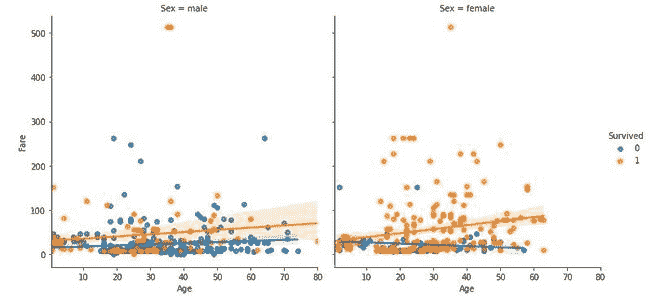
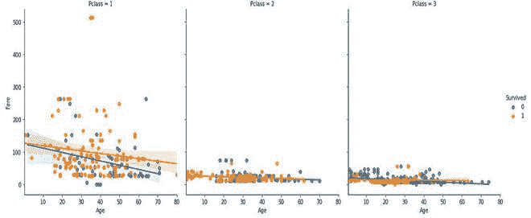
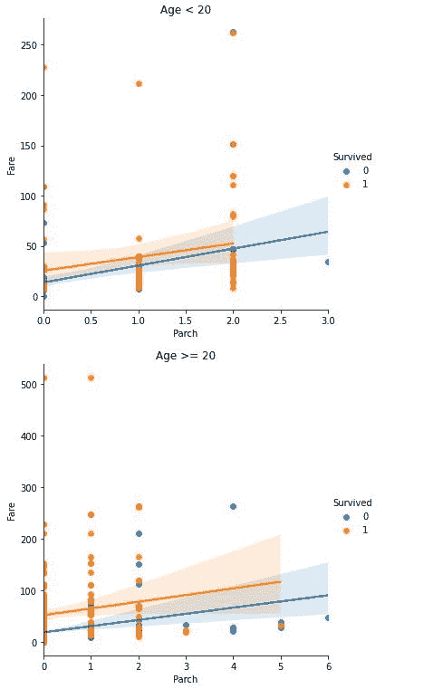

# 调节图

> 原文:[https://www.geeksforgeeks.org/conditioning-plot/](https://www.geeksforgeeks.org/conditioning-plot/)

当以第三个变量为条件时，条件图、共图或子集图是两个变量的散点图。第三个变量叫做条件变量。这个变量既可以有连续值，也可以有分类值。在连续变量中，我们通过将子集划分为更小范围的值来创建子集。在分类变量中，子集是基于不同的类别创建的。

让我们取三个变量，X，Y 和 Z。Z 是我们分成 k 组的变量。在这里，有许多方法可以形成一个组，例如:

*   通过将数据分成大小相等的 k 个组。
*   根据散点图将数据分成不同的簇。
*   通过将数据点的范围分成相等的值。
*   分类数据根据数据框架的不同类别进行自然分组。

然后，我们绘制 n 行和 m 列矩阵，其中 n*m >= k。每组(行、列)代表一个单独的散点图，其中每个散点图由以下部分组成。

*   **纵轴**:变量 Y
*   **横轴**:变量 X

其中，使用对应于行 I 和列 j 的组中的点。

条件图提供了以下问题的答案:

*   这两个变量之间有什么关系吗？
*   如果存在关系，那么关系的性质取决于第三个变量吗？
*   数据中的不同组行为相似吗？
*   数据中有异常值吗？

### **实施**

## 蟒蛇 3

```
# code
% matplotlib inline
import numpy as np
import seaborn as sns
import matplotlib.pyplot as plt
import pandas as pd

# load training file for titanic dataset
titanic_dataset =pd.read_csv('train.csv')

# head of dataset
titanic_dataset.head()

# conditioning plot on the basis of categorical variables
sns.lmplot(x='Age', y ='Fare',hue='Survived', col ='Sex',data=titanic_dataset)
sns.lmplot(x='Age', y ='Fare',hue='Survived', col ='Pclass',data=titanic_dataset)

# conditioning plot on the basis of continuous variables
df1, df2 = titanic_dataset.loc[titanic_dataset['Age'] < 20 ] ,
    titanic_dataset.loc[titanic_dataset['Age'] >= 20 ]

lm = sns.lmplot(x='Parch', y ='Fare',hue='Survived',data=df1)
ax1 =lm.axes
ax1=plt.gca()
ax1.set_title('Age < 20')

lm_2 = sns.lmplot(x='Parch', y ='Fare',hue='Survived',data=df2)

ax2 =lm_2.axes
ax2=plt.gca()
ax2.set_title('Age >= 20')
```



基于性别的条件情节



基于乘客等级的条件图



基于年龄的条件图

### 参考文献:

*   [**《NIST 手册》**](https://www.itl.nist.gov/div898/handbook/eda/section3/condplot.htm)