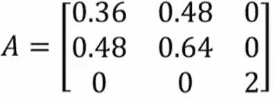
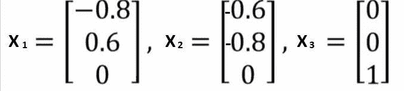
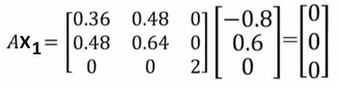

# 特征向量和零空间之间的联系

> 原文:[https://www . geeksforgeeks . org/connection-in-professional-and-nullspace/](https://www.geeksforgeeks.org/connection-between-eigenvectors-and-nullspace/)

先决条件:

*   [特征向量](https://www.geeksforgeeks.org/eigen-values-and-eigen-vectors/)
*   [零空间](https://www.geeksforgeeks.org/null-space-and-nullity-of-a-matrix/)

**关于特征值和特征向量的一些要点:**

*   即使对于实矩阵，特征值也可以是复数。
*   当特征值变复杂时，特征向量也变复杂。
*   如果矩阵是对称的(例如**A = A<sup>T</sup>T3】，那么特征值总是实的。**
*   因此，对称矩阵的特征向量也是实的。
*   对称矩阵总是有 n 个线性独立的特征向量。

现在，让我们讨论特征向量和零空间之间的联系。

从[这篇文章](https://www.geeksforgeeks.org/eigen-values-and-eigen-vectors/)我们表明

AX = λX

现在让我问你一个问题。**当λ为 0 时会发生什么？其中一个特征值变成 0。**
所以，当其中一个特征值变成 0 时，我们有这个方程，由下式给出

AX = 0 —(等式 1)

从[这篇文章](https://www.geeksforgeeks.org/null-space-and-nullity-of-a-matrix/)我们表明

AB = 0 —(等式 2)

所以你注意到方程 1 和方程 2 的形式是一样的。

所以，这基本上意味着 *X* 是对应于特征值的特征向量，λ等于 *0* ，是一个零空间向量，因为它是我们在这里注意到的形式。所以，我们可以说，零特征值对应的特征向量在原矩阵 *A* 的零空间中。反之，如果一个特征向量对应的特征值不是 *0* ，那么该特征向量就不能在 *A* 的零空间中。所以，这些都是我们需要知道的重要结果。
所以，这就是特征向量如何连接到零空间。

**示例:**
考虑下面的 *A* 矩阵

**请注意，这是一个对称矩阵，因此特征值总是真实的，正如我之前在要点部分所讲的。**
该矩阵的特征值为

ο=(0、1、2)

这些特征值对应的特征向量为


**代码:计算特征值和特征向量的 Python 代码**

```
# Python program to illustrate
# connection between eigenvectors and nullspace

# Importing required libraries
import numpy as np
from numpy import linalg

# Taking A matrix
A = np.array([
    [0.36, 0.48, 0],
    [0.48, 0.64, 0],
    [0, 0, 2]
])

# Calculating eigenvalues and eigenvectors
eigValues, eigVectors = linalg.eig(A)

# Printing those values
print("Eigenvalue are :", eigValues)
print("Eigenvectors are :", eigVectors)

# Taking eigenvector 1
eigVector1 = np.array([
    [-0.8],
    [0.6],
    [0]
])

# Matrix multiplication between A and eigenvector1
result = np.dot(A, eigVector1)
# Print the result
print(result)

# This code is contributed by Amiya Rout
```

```
Output:
Eigenvalue are : [0\. 1\. 2.]
Eigenvectors are : 
[[-0.8 -0.6  0\. ]
 [ 0.6 -0.8  0\. ]
 [ 0\.   0\.   1\. ]]
[[0.]
 [0.]
 [0.]]

```

所以我们从之前的讨论中注意到，如果 *X1* 是对应于λ等于 *0* 的特征向量，那么这将在这个矩阵的零空间 *A* 中。让我们用 *A* 乘以 *X1* 来验证一下。我们查一下

你可以很容易地看到，当你做这个计算的时候，你会得到这个 *(0，0，0)* ，基本上说明这是对应于零特征值的特征向量。