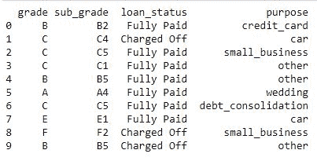
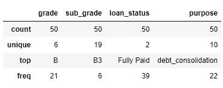
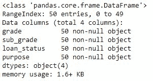
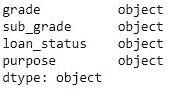
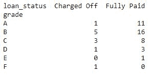
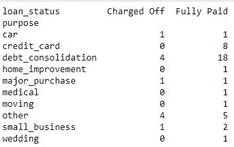
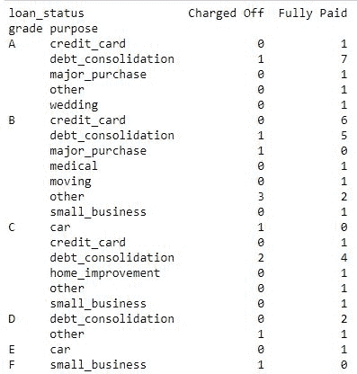

# Python 中的列联表

> 原文:[https://www.geeksforgeeks.org/contingency-table-in-python/](https://www.geeksforgeeks.org/contingency-table-in-python/)

在单变量数据分析的情况下，像均值、中值、标准差和方差这样的估计非常有用。但是在双变量分析(比较两个变量)的情况下，相关性开始发挥作用。

**列联表**是探索两个甚至更多变量的技术之一。它基本上是两个或多个分类变量之间的计数。

要获取贷款数据，请点击这里的。

**加载库**

```py
import numpy as np
import pandas as pd
import matplotlib as plt
```

**加载数据**

```py
data = pd.read_csv("loan_status.csv")

print (data.head(10))
```

**输出:**


**描述数据**

```py
data.describe()
```

**输出:**


**数据信息**

```py
data.info()
```

**输出:**


**数据类型**

```py
# data types of feature/attributes 
# in the data
data.dtypes
```

**输出:**


**代码#1:** 列联表，显示等级和贷款状态之间的相关性。

```py
data_crosstab = pd.crosstab(data['grade'],
                            data['loan_status'], 
                               margins = False)
print(data_crosstab)
```

**输出:**


**代码#2:** 列联表，显示目的和贷款状态之间的相关性。

```py
data_crosstab = pd.crosstab(data['purpose'], 
                            data['loan_status'],
                                margins = False)
print(data_crosstab)
```

**输出:**


**代码#3:** 列联表，显示等级+目的与贷款状态之间的相关性。

```py
data_crosstab = pd.crosstab([data.grade, data.purpose], 
                             data.loan_status, margins = False)
print(data_crosstab)
```

**输出:**


所以在代码中，列联表给出了两个或更多变量之间明确的相关值。从而使理解数据以便进一步提取信息变得更加有用。
。