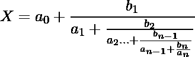
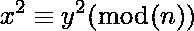
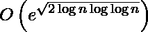

# 连分式分解算法

> 原文:[https://www . geesforgeks . org/continued-fraction-factoring-algorithm/](https://www.geeksforgeeks.org/continued-fraction-factorization-algorithm/)

连分式因式分解法( **CFRAC** )是一种对整数有效的通用因式分解算法。它计算给定整数的因子，而不考虑其唯一性。它的运行时间低于指数。1931 年由 D. H. Lehmer 和 R. E. Powers 首次描述，后来在 1975 年由迈克尔 a .莫里森和约翰布里尔哈特开发成计算机算法。

**Continued Fraction:**An expression that can be expressed in the form:

<center>

(1) 

</center>

被称为连分式，其中 a <sub>i</sub> 和 b <sub>i</sub> 是所有 *i > = 0* 的实值或复值。当 b<sub>I</sub>s<sub>的所有值都为 1 时，则称之为简单连分式。</sub>

简单连分式可以表示为:

<center>

(2) ![\begin{equation*} \left[a_{0} ; a_{1}, a_{2} \ldots a_{n}\right]=a_{0}+\frac{1}{a_{1}+\frac{1}{a_{2} \ldots+\frac{1}{a_{n-1}+\frac{1}{a_{n}}}}} \end{equation*}](img/ab6d07d0cee2e7e2b9f52dd593022a1b.png "Rendered by QuickLaTeX.com")

</center>

其中 C<sub>k</sub>=【a<sub>0；</sub> a <sub>1</sub> ，a <sub>2</sub> ，…，a <sub>n</sub> 代表 k < =n 是简单连分式的第 k 次收敛。
无限连分数[a<sub>0</sub>；a <sub>1</sub> 、a <sub>2</sub> 、…、a <sub>k、</sub> …]定义为转换器 C<sub>k</sub>=【A0；a1，a2，…，an]

**算法:**
该算法利用(mn) <sup>1/2</sup> 的连分式中产生的余数对某个 m 产生一个平方数。

该算法求解数学方程:

<center>

(3) 

通过计算 m 的值求解该方程，使得 m <sup>2</sup> (mod(n))具有最小上界。

*   CFRAC 算法的时间复杂度为:

<center>

(4) 

</center>

**例 1:**

```py

Input: continued_fraction((10/7))
Output: [1, 2, 3]

Explanation:

```

<center>

(5) ![\begin{equation*} [1,2,3]=1+\frac{1}{2+\frac{1}{3}}=1+\frac{1}{\frac{7}{3}}=1+\frac{3}{7}=\frac{10}{7} \end{equation*}](img/5e2a0a23e4d421a8a91906d2a55e0552.png "Rendered by QuickLaTeX.com")

</center>

**例 2:**

```py
Input:  list(continued_fraction_convergents([0, 2, 1, 2]))
Output: [0, 1/2, 1/3, 3/8]
Explanation:

```

<center>

(6) ![ \begin{equation*} \begin{array}{c} {[0,2,1,2]=0+\frac{1}{2+\frac{1}{1+\frac{1}{2}}}} \\ c_{1}=0, c_{2}=0+\frac{1}{2}=\frac{1}{2} \cdot c_{3}=0+\frac{1}{2+\frac{1}{1}}=\frac{1}{3} \cdot c_{4}=0+\frac{1}{2+\frac{1}{1+\frac{1}{2}}}=0+\frac{1}{2+\frac{1}{3}}=0+\frac{1}{2+\frac{1}{2}}=\frac{1}{\frac{1}{3}}=\frac{3}{8} \end{array} \end{equation*}](img/b6efd21e3be7b82efea2d693365a1861.png "Rendered by QuickLaTeX.com")

</center>

**例 3:**

```py

Input: continued_fraction_reduce([1, 2, 3, 4, 5]) 
Output: 225/157
Explanation:

```

<center>

(7) 

</center>

**Implementation:**
**Code: To convert a fraction into Continued Fraction representation**

```py
#using sympy module
from sympy.ntheory.continued_fraction import continued_fraction
from sympy import sqrt
#calling continued_fraction method
continued_fraction(10/7)
```

**输出:**

```py
[1, 2, 3]

```

**代码 2:将连分数转换为分数。**

```py
#using sympy module
from sympy.ntheory.continued_fraction import continued_fraction_reduce 

#calling continued_fraction_reduce method
continued_fraction_reduce([1, 2, 3, 4, 5])
```

**输出:**

```py
225/157

```

**代码 3:从一个连分式中获取一个转换子列表。**

```py
# using sympy module
from sympy.core import Rational, pi
from sympy import S
from sympy.ntheory.continued_fraction import continued_fraction_convergents, continued_fraction_iterator      
# calling continued_fraction_convergents method and 
# passing it as a parameter to a list
list(continued_fraction_convergents([0, 2, 1, 2]))
```

**输出:**

```py
[0, 1/2, 1/3, 3/8]

```

</center>