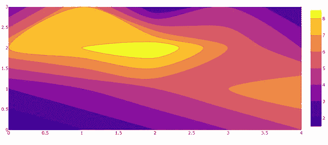
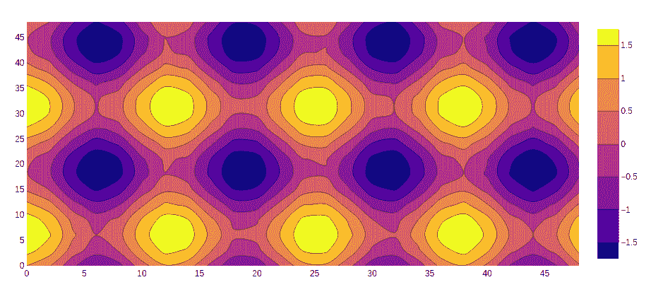

# 在 Python 中使用 Plotly 绘制等高线图

> 原文:[https://www . geeksforgeeks . org/等高线图-使用 python 中的 plotly/](https://www.geeksforgeeks.org/contour-plots-using-plotly-in-python/)

Plotly 是一个 Python 库，用于设计图形，尤其是交互式图形。它可以绘制各种图形和图表，如直方图、条形图、箱线图、展开图等。它主要用于数据分析以及财务分析。plotly 是一个交互式可视化库。

## 绘图中的等高线图

等高线图具有曲线的两个变量的函数，沿着这两个变量，函数具有恒定的值，因此这些曲线连接具有相等值的点。在等高线图中，2d 等高线图表示 2D 数值阵列 z 的等高线，即 z 的 iso 值的插值线

> **语法:** plotly.graph_objects。轮廓(参数=无，颜色条=无，悬停信息=无，x =无，y =无，**kwargs)
> 
> **参数:**
> 
> **arg:** 与此构造函数或 plotly.graph_objects 实例兼容的属性集合。轮廓
> 
> **color bar:**plot . graph _ objects . contour . color bar 实例或具有兼容属性的 dict
> 
> **x:** 设置 x 坐标。
> 
> **y:** 设置 y 坐标。
> 
> **z:** 设置 z 坐标。
> 
> **悬停信息:**确定悬停时出现哪些跟踪信息。如果设置了无或跳过，悬停时不会显示任何信息。但是，如果没有设置，点击和悬停事件仍然会触发。

**示例 1:** 创建简单等高线图

## 蟒蛇 3

```py
import plotly.graph_objects as go
import numpy as np

data = [[1,2,3,4,5],
     [3,4,5,6,7],
     [7,8,9,6,4],
     [3,7,2,4,2]]

fig = go.Figure(data =
     go.Contour(z = data))

fig.show()
```

**输出:**



**示例 2:** 用 X 和 Y 坐标创建等高线图。

## 蟒蛇 3

```py
import plotly.graph_objects as go

feature_x = np.arange(0, 50, 2)
feature_y = np.arange(0, 50, 3)

# Creating 2-D grid of features
[X, Y] = np.meshgrid(feature_x, feature_y)

Z = np.cos(X / 2) + np.sin(Y / 4)

fig = go.Figure(data =
     go.Contour(x = feature_x, y = feature_y, z = Z))

fig.show()
```

**输出:**



### 添加色阶

在 plotly 中，等高线图的色标用于添加不同的颜色，可以使用色标参数进行设置。

**示例:**

## 蟒蛇 3

```py
import plotly.graph_objects as go

feature_x = np.arange(0, 50, 2)
feature_y = np.arange(0, 50, 3)

# Creating 2-D grid of features
[X, Y] = np.meshgrid(feature_x, feature_y)

Z = np.cos(X / 2) + np.sin(Y / 4)

fig = go.Figure(data =
     go.Contour(x = feature_x, y = feature_y, z = Z,
               colorscale='rainbow'
               ))

fig.show()
```