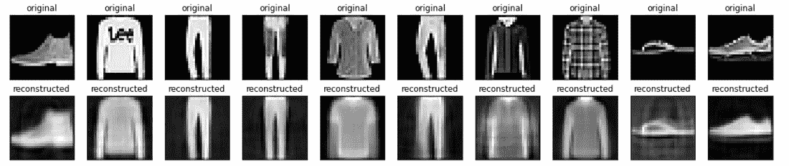

# 收缩式自锚(CAE)

> 原文:[https://www.geeksforgeeks.org/contractive-autoencoder-cae/](https://www.geeksforgeeks.org/contractive-autoencoder-cae/)

收缩自动编码器是由多伦多大学的研究人员在 2011 年的论文收缩自动编码器:特征提取过程中的显式不变性中提出的。背后的想法是使自动编码器对训练数据集中的微小变化具有鲁棒性。

为了应对上述在基本自动编码器中提出的挑战，作者建议在自动编码器的损失函数中增加另一个惩罚项。我们将详细讨论这个损失函数。

#### 损失函数:

收缩式自动编码器在自动编码器的损失函数中增加了一个额外的项，其给出如下:

<center></center>

即上述惩罚项是编码器的 frobinious 范数，Frobinious 范数只是欧氏范数的推广。

在上面的惩罚项中，我们首先需要计算隐藏层的雅可比矩阵，c 计算隐藏层相对于输入的雅可比类似于梯度计算。我们先计算隐藏层的雅可比:

<center></center>

其中，φ是非线性的。现在，为了得到 jth 隐藏单元，我们需要得到特征向量的点积和相应的权重。为此，我们需要应用链式规则。

<center>![\frac{\partial h_j}{\partial X_i} = \frac{\partial \phi(Z_j)}{\partial X_i} \\[10pt] = \frac{\partial \phi(W_i X_i)}{\partial W_i X_i} \frac{\partial W_i X_i}{\partial X_i} \\[10pt] = [\phi(W_i X_i)(1 - \phi(W_i X_i))] \, W_{i} \\[10pt] = [h_j(1 - h_j)] \, W_i](img/febbb34342baf6d0f66f78f5e89a76d9.png "Rendered by QuickLaTeX.com")</center>

上面的方法和我们计算梯度下降的方法类似，但是有一个主要的区别，那就是我们把 h(X)作为一个向量值的函数，每个都作为一个单独的输出。直观地说，例如、我们有 64 个隐藏单元，那么我们有 64 个函数输出，所以我们将为这 64 个隐藏单元中的每一个有一个梯度向量。

设 diag(x)为对角矩阵，由上述导数得到的矩阵如下:

<center>![\frac{\partial h}{\partial X} = diag[h(1 - h)] \, W^T](img/12e4807f66847b56516d641bf9784d87.png "Rendered by QuickLaTeX.com")</center>

现在，我们将 diag(x)方程放在上面的方程中并简化:

<center>![lVert J_h(X) \rVert_F^2 = \sum_{ij} \left( \frac{\partial h_j}{\partial X_i} \right)^2 \\[10pt] = \sum_i \sum_j [h_j(1 - h_j)]^2 (W_{ji}^T)^2 \\[10pt] = \sum_j [h_j(1 - h_j)]^2 \sum_i (W_{ji}^T)^2 \\[10pt]](img/5b7271c478ae1c1c077f72c8a8245913.png "Rendered by QuickLaTeX.com")</center>

#### 与稀疏自动编码器的关系

在稀疏自动编码器中，我们的目标是使表示的大部分分量接近 0，要实现这一点，它们必须位于 sigmoid 函数的左饱和部分，其中它们对应的 sigmoid 值接近 0，一阶导数非常小，这反过来导致雅可比矩阵中的条目非常小。这导致稀疏自动编码器中的高度压缩映射，尽管这不是稀疏自动编码器的目标。

#### 与去噪自动编码器的关系

去噪自动编码器背后的思想只是为了增加编码器对训练数据微小变化的鲁棒性，这与压缩自动编码器的动机非常相似。但是，有一些区别:

*   CAEs 鼓励表示 f(x)的鲁棒性，而 DAEs 鼓励重构的鲁棒性，这只是部分地增加了表示的鲁棒性。
*   DAE 通过随机训练模型进行重建来提高其鲁棒性，而 CAE 则提高雅可比矩阵一阶导数的鲁棒性。

#### 履行

## 蟒蛇 3

```py
# code
import tensorflow as tf

class AutoEncoder(tf.keras.Model):
    def __init__(self):
        super(FullyConnectedAutoEncoder, self).__init__()
        self.flatten_layer  =tf.keras.layers.Flatten()
        self.dense1 = tf.keras.layers.Dense(64, activation=tf.nn.relu)
        self.dense2 = tf.keras.layers.Dense(32, activation=tf.nn.relu)

        self.bottleneck = tf.keras.layers.Dense(16, activation=tf.nn.relu)

        self.dense4 = tf.keras.layers.Dense(32, activation=tf.nn.relu)
        self.dense5 = tf.keras.layers.Dense(64, activation=tf.nn.relu)

        self.dense_final = tf.keras.layers.Dense(784)

    def call(self, inp):
        x_reshaped = self.flatten_layer(inp)
        print(x_reshaped.shape)
        x = self.dense1(x_reshaped)
        x = self.dense2(x)
        x = self.bottleneck(x)
        x_hid= x
        x = self.dense4(x)
        x = self.dense5(x)
        x = self.dense_final(x)
        return x, x_reshaped,x_hid

# define loss function and gradient
lambd =100
def loss(x, x_bar, h, model):
    reconstruction_loss = tf.reduce_mean( 
                tf.keras.losses.mse(x, x_bar) 
            ) 
    reconstruction_loss *= 28 * 28
    W= tf.Variable(model.bottleneck.weights[0])
    dh = h * (1 - h)  # N_batch x N_hidden
    W = tf.transpose(W)
    contractive = lambd * tf.reduce_sum(tf.linalg.matmul(dh**2 ,tf.square(W)), axis=1)
    total_loss = reconstruction_loss + contractive
    return total_loss
def grad(model, inputs):
    with tf.GradientTape() as tape:
        reconstruction, inputs_reshaped,hidden = model(inputs)
        loss_value = loss(inputs_reshaped, reconstruction, hidden, model)
    return loss_value, tape.gradient(loss_value, model.trainable_variables),
      inputs_reshaped, reconstruction

# load dataset
(x_train, _), (x_test, _) = tf.keras.datasets.fashion_mnist.load_data()
x_train = x_train.astype('float32') / 255.
x_test = x_test.astype('float32') / 255.
# train the model
model = FullyConnectedAutoEncoder()
optimizer = tf.optimizers.Adam(learning_rate=0.001)
global_step = tf.Variable(0)
num_epochs = 200
batch_size = 128
for epoch in range(num_epochs):
    print("Epoch: ", epoch)
    for x in range(0, len(x_train), batch_size):
        x_inp = x_train[x : x + batch_size]
        loss_value, grads, inputs_reshaped, reconstruction = grad(model, x_inp)
        optimizer.apply_gradients(zip(grads, model.trainable_variables),
                              global_step)

    print("Step: {}, Loss: {}".format(global_step.numpy(),tf.reduce_sum(loss_value)))

    # generate results
n = 10
import matplotlib.pyplot as plt
plt.figure(figsize=(20, 4))
for i in range(n):
  # display original
  ax = plt.subplot(2, n, i + 1)
  plt.imshow(x_test[i])
  plt.title("original")
  plt.gray()
  ax.get_xaxis().set_visible(False)
  ax.get_yaxis().set_visible(False)

  # display reconstruction
  ax = plt.subplot(2, n, i + 1 + n)
  reconstruction, inputs_reshaped,hidden = model(x_test[i].reshape((1,784)))
  plt.imshow(reconstruction.numpy().reshape((28,28)))
  plt.title("reconstructed")
  plt.gray()
  ax.get_xaxis().set_visible(False)
  ax.get_yaxis().set_visible(False)
plt.show()
```



**参考文献:**

*   [**收缩自动编码器**](https://icml.cc/2011/papers/455_icmlpaper.pdf)