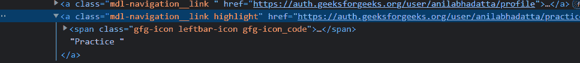
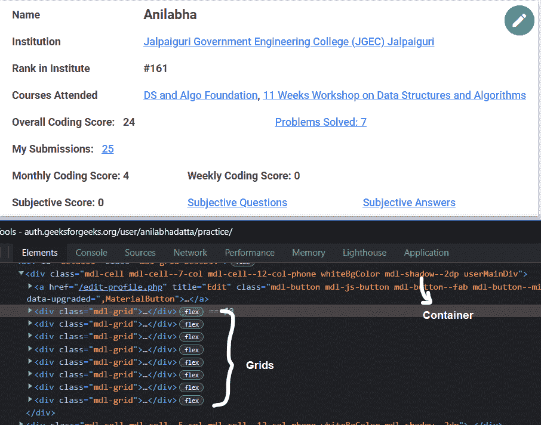
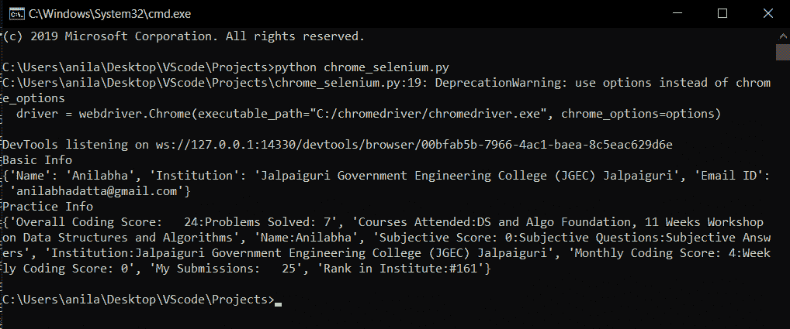

# 用 Python 控制网页浏览器

> 原文:[https://www . geesforgeks . org/用 python 控制网络浏览器/](https://www.geeksforgeeks.org/controlling-the-web-browser-with-python/)

在本文中，我们将看到如何使用 Python 使用 selenium 来控制网络浏览器。Selenium 是一个开源工具，可以自动运行网页浏览器。它提供了一个单一的接口，允许您用像 Ruby、Java、NodeJS、PHP、Perl、Python 和 C#等编程语言编写测试脚本。

#### 要安装此模块，请在您的终端上运行以下命令:

```py
pip install selenium
```

为了自动化，请从下载最新的谷歌 Chrome 和 chromedriver。

在这里，我们将在“[https://auth.geeksforgeeks.org”](https://auth.geeksforgeeks.org)自动进行授权，并从登录的档案中提取姓名、电子邮件、机构名称。

## **初始化和授权**

首先，我们需要使用 selenium 启动 web 驱动程序，并向 [url](https://auth.geeksforgeeks.org/) 发送 get 请求，并识别 HTML 文档，找到接受用户名/电子邮件、密码和登录按钮的输入标签和按钮标签。


**将用户给定的电子邮件和密码分别发送到输入标签:**

```py
driver.find_element_by_name('user').send_keys(email)
driver.find_element_by_name('pass').send_keys(password)
```

**通过 selenium 网络驱动程序使用 CSS 选择器识别按钮标签并点击:**

> driver . find _ element _ by _ CSS _ selector(' button . BTN . BTN-green . sign in-button ')。点击()

## **刮削数据**

**从 GFG 档案中抓取基本信息**

点击登录后，将会加载一个包含姓名、机构名称和电子邮件 id 的新页面。识别包含上述数据的标签并选择它们。

> container = driver . find _ elements _ by _ CSS _ selector(' div . MDL-cell . MDL-cell–9-col . MDL-cell–12-col-phone . textbold ')


**从所选 css 选择器的返回列表中获取每个标签的文本:**

```py
name = container[0].text
try:
    institution = container[1].find_element_by_css_selector('a').text
except:
    institution = container[1].text
email_id = container[2].text
```

**最后打印输出:**

```py
print({"Name": name, "Institution": institution, "Email ID": email})
```

## **从练习选项卡**中抓取信息

单击练习选项卡，等待几秒钟以加载页面。

```py
driver.find_elements_by_css_selector('a.mdl-navigation__link')[1].click()
```



找到包含所有信息的容器，并使用 CSS 选择器从包含信息的容器中选择网格。

> container = driver . find _ element _ by _ CSS _ selector(' div . MDL-cell . MDL-cell–7-col . MDL-cell–12-col-phone . whitebgcolor . MDL-shadow–2dp . user maindiv ')
> 
> grids = container . find _ elements _ by _ CSS _ selector(' div . MDL-grid ')



迭代每个选定的网格，从中提取文本，并将其添加到输出集/列表中。

```py
res = set()
for grid in grids:
    res.add(grid.text.replace('\n',':'))
```

#### 下面是完整的实现:

## 蟒蛇 3

```py
# Import the required modules
from selenium import webdriver
import time

# Main Function
if __name__ == '__main__':

    # Provide the email and password
    email = 'example@example.com'
    password = 'password'

    options = webdriver.ChromeOptions()
    options.add_argument("--start-maximized")
    options.add_argument('--log-level=3')

    # Provide the path of chromedriver present on your system.
    driver = webdriver.Chrome(executable_path="C:/chromedriver/chromedriver.exe",
                              chrome_options=options)
    driver.set_window_size(1920,1080)

    # Send a get request to the url
    driver.get('https://auth.geeksforgeeks.org/')
    time.sleep(5)

    # Finds the input box by name in DOM tree to send both 
    # the provided email and password in it.
    driver.find_element_by_name('user').send_keys(email)
    driver.find_element_by_name('pass').send_keys(password)

    # Find the signin button and click on it.
    driver.find_element_by_css_selector(
        'button.btn.btn-green.signin-button').click()
    time.sleep(5)

    # Returns the list of elements
    # having the following css selector.
    container = driver.find_elements_by_css_selector(
        'div.mdl-cell.mdl-cell--9-col.mdl-cell--12-col-phone.textBold')

    # Extracts the text from name, 
    # institution, email_id css selector.
    name = container[0].text
    try:
        institution = container[1].find_element_by_css_selector('a').text
    except:
        institution = container[1].text
    email_id = container[2].text

    # Output Example 1
    print("Basic Info")
    print({"Name": name, 
           "Institution": institution,
           "Email ID": email})

    # Clicks on Practice Tab
    driver.find_elements_by_css_selector(
      'a.mdl-navigation__link')[1].click()
    time.sleep(5)

    # Selected the Container containing information
    container = driver.find_element_by_css_selector(
      'div.mdl-cell.mdl-cell--7-col.mdl-cell--12-col-phone.\
      whiteBgColor.mdl-shadow--2dp.userMainDiv')

    # Selected the tags from the container
    grids = container.find_elements_by_css_selector(
      'div.mdl-grid')

    # Iterate each tag and append the text extracted from it.
    res = set()
    for grid in grids:
        res.add(grid.text.replace('\n',':'))

    # Output Example 2
    print("Practice Info")
    print(res)

    # Quits the driver
    driver.close()
    driver.quit()
```

**输出:**

 