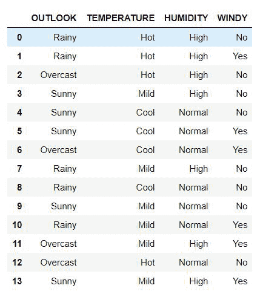
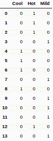
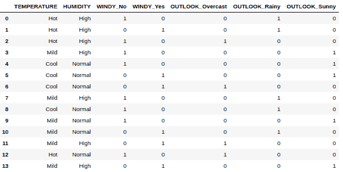

# 将分类变量转换为虚拟变量

> 原文:[https://www . geesforgeks . org/convert-a-classic-variable-to-dummy-variables/](https://www.geeksforgeeks.org/convert-a-categorical-variable-into-dummy-variables/)

所有的统计和机器学习模型都建立在数据的基础上。将与特定问题相关的分组或复合实体放在一起称为数据集。这些数据集由自变量或特征和因变量或标签组成。所有这些变量都可以分为两类数据:[定量](https://www.geeksforgeeks.org/understanding-data-attribute-types-qualitative-and-quantitative/)和[分类](https://www.geeksforgeeks.org/exploring-categorical-data/)。

在本文中，我们将讨论将分类变量转换为虚拟变量的各种方法，这是数据预处理的一个重要部分，而数据预处理本身又是机器学习或统计模型的一个组成部分。分类变量可以进一步细分为以下几类:

*   二元或二分本质上是只能有两种结果的变量，如赢/输、开/关等等。
*   名义变量用于表示没有特定排名的组，如颜色、品牌等。
*   序数变量代表具有特定排名顺序的组，例如比赛的获胜者、应用评级等等。

虚拟变量充当分类变量中类别存在与否的指示器。通常的惯例是 0 代表缺席，1 代表出席。分类变量到虚拟变量的转换导致二维二元矩阵的形成，其中每一列代表一个特定的类别。下面的例子将进一步阐明转换的过程。

**包含分类变量的数据集:**

<figure class="table">

| **展望** | **温度** | **湿度** | **wind** |
| --- | --- | --- | --- |
| 下雨的 | 热的 | 高的 | 不 |
| 下雨的 | 热的 | 高的 | 是 |
| 遮蔽 | 热的 | 高的 | 不 |
| 快活的 | 温和的 | 高的 | 不 |
| 快活的 | 凉爽的 | 常态 | 不 |

</figure>

**包含** **虚拟变量的数据集:**

<figure class="table">

| **雨天** | **阴天** | **SUNNY** | **热** | **轻度** | **酷** | **高电平** | **正常** | **是** | **否** |
| --- | --- | --- | --- | --- | --- | --- | --- | --- | --- |
| one | Zero | Zero | one | Zero | Zero | one | Zero | Zero | one |
| one | Zero | Zero | one | Zero | Zero | one | Zero | one | Zero |
| Zero | one | Zero | one | Zero | Zero | one | Zero | Zero | one |
| Zero | Zero | one | Zero | one | Zero | one | Zero | Zero | one |
| Zero | Zero | one | Zero | Zero | one | Zero | one | Zero | one |

</figure>

**说明:**

上述数据集包括四个分类栏:展望、温度、湿度、风力。

让我们考虑由两个类别组成的 wind 列:是和否。因此，在包含虚拟变量的数据集中，wind 列被两个列代替，这两个列分别代表类别:是和否。现在将 YES 和 NO 列的行与 wind 进行比较，如果它不存在，我们将 0 标记为是，如果它存在，将 1 标记为 1。对编号栏也是如此。所有分类栏都采用这种方法。需要注意的重要一点是，每个分类列都被它在包含虚拟变量的数据集中所拥有的唯一类别数所取代。

在本文中，我们将探索将分类变量转换为虚拟变量的三种方法。

**这些方法如下:**

1.  使用来自 sklearn 的 LabelBinarizer
2.  使用类别编码器中的 BinaryEncoder
3.  使用熊猫图书馆的 get_dummies()函数

### **创建数据集:**

第一步是创建数据集。该数据集由 4 个分类栏组成，分别以“展望”、“温度”、“湿度”、“风力”命名。下面是创建数据集的代码。我们用熊猫制作这个数据集。DataFrame()和字典。

## 蟒蛇 3

```
# code to create the dataset

# importing the libraries
import pandas as pd

# creating the dictionary
dictionary = {'OUTLOOK': ['Rainy', 'Rainy',
                          'Overcast', 'Sunny',
                          'Sunny', 'Sunny',
                          'Overcast', 'Rainy',
                          'Rainy', 'Sunny',
                          'Rainy', 'Overcast',
                          'Overcast', 'Sunny'],
              'TEMPERATURE': ['Hot', 'Hot', 'Hot',
                              'Mild', 'Cool',
                              'Cool', 'Cool',
                              'Mild', 'Cool',
                              'Mild', 'Mild',
                              'Mild', 'Hot', 'Mild'],
              'HUMIDITY': ['High', 'High', 'High',
                           'High', 'Normal', 'Normal',
                           'Normal', 'High', 'Normal',
                           'Normal', 'Normal', 'High',
                           'Normal', 'High'],
              'WINDY': ['No', 'Yes', 'No', 'No', 'No',
                        'Yes', 'Yes', 'No', 'No',
                        'No', 'Yes', 'Yes', 'No',
                        'Yes']}

# converting the dictionary to DataFrame
df = pd.DataFrame(dictionary)

display(df)
```

**输出:**



以上是我们将用于未来方法的数据集。

### **方法 1:**

使用这种方法，我们使用 sklearn 中的 [LabelBinarizer](https://www.geeksforgeeks.org/sklearn-binarizer-in-python/) ，它一次将一个分类列转换为一个带有虚拟变量的数据帧。在有多个分类列的情况下，该数据帧可以被附加到主数据帧。

## 蟒蛇 3

```
# importing the libraries
from sklearn.preprocessing import LabelBinarizer

# creating a copy of the
# original data frame
df1 = df.copy()

# creating an object 
# of the LabelBinarizer
label_binarizer = LabelBinarizer()

# fitting the column 
# TEMPERATURE to LabelBinarizer
label_binarizer_output = label_binarizer.fit_transform( df1['TEMPERATURE'])

# creating a data frame from the object
result_df = pd.DataFrame(label_binarizer_output,
                         columns = label_binarizer.classes_)

display(result_df)
```

**输出:**



温度柱的转换

同样，我们也可以转换其他分类列。

### **方法 2:**

使用类别编码器库中的 BinaryEncoder。使用这种方法，我们可以一次将多个分类列转换为虚拟变量。

**category _ encoders:**category _ encoders 是在 scikit-learn-transformers 库下开发的 Python 库。这个库的主要目标是将分类变量转换成可量化的数字变量。这个库有各种各样的优点，比如很容易与 sklearn transformers 兼容，这使得它们可以很容易地被训练并存储在可序列化的文件中，比如 pickle，以备后用。这个库在处理数据帧时也很有效，这在处理机器学习和统计模型时非常有用。它为从分类变量到数值变量的转换提供了大量的方法，这些变量可以分为监督变量和非监督变量。

对于安装，在终端中运行以下命令:

```
pip install category_encoders
```

对于 conda:

```
conda install -c conda-forge category_encoders
```

**代码:**

## 蟒蛇 3

```
# importing the libraries
import category_encoders as cat_encoder

# creating a copy of the original data frame
df2 = df.copy()

# creating an object BinaryEncoder
# this code calls all columns
# we can specify specific columns as well
encoder = cat_encoder.BinaryEncoder(cols = df2.columns)

# fitting the columns to a data frame
df_category_encoder = encoder.fit_transform( df2 )

display(df_category_encoder)
```

**输出:**


从所有分类列创建的数据框

### **进场 3:**

在这种方法下，我们采用最简单的方法，通过使用 pandas 库的 get_dummies()方法，将数据帧中所有可能的分类列转换为虚拟列。

我们可以指定列来获取虚拟列。默认情况下，它会将所有可能的分类列转换为它们的虚拟列。

## 蟒蛇 3

```
# importing the libraries
import pandas as pd

# creating a copy of the original data frame
df3 = df.copy()

# calling the get_dummies method
# the first parameter mentions the
# the name of the data frame to store the
# new data frame in
# the second parameter is the list of
# columns which if not mentioned
# returns the dummies for all
# categorical columns
df3 = pd.get_dummies(df3,
                     columns = ['WINDY', 'OUTLOOK'])

display(df3)
```

**输出:**



对 WINDY 和 OUTLOOK 列使用 get_dummies()