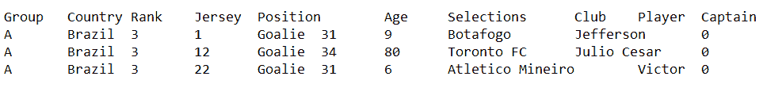
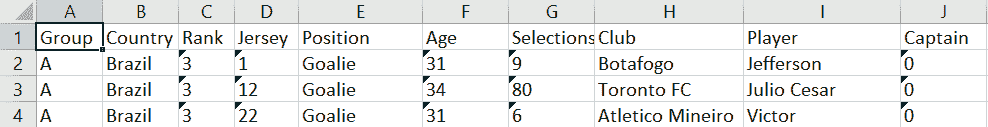
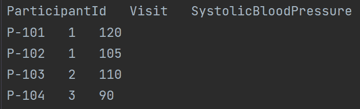
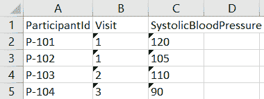

# 使用 Python 将 TSV 文件转换为 Excel】

> 原文:[https://www . geesforgeks . org/convert-a-tsv-file-to-excel-using-python/](https://www.geeksforgeeks.org/convert-a-tsv-file-to-excel-using-python/)

以制表符分隔的值(TSV) 文件是一种简单的文本格式，用于以表格结构存储和交换数据，例如数据库表或电子表格数据。表格的行与文本文件的行匹配。记录中的每个字段值都用制表符与下一个分隔开。因此，TSV 格式是更大的**(分隔符分隔的值)DSV** 格式的子集。

在本文中，我们将讨论如何使用 Python 将 TSV 文件转换为 Excel。这里我们将使用 **XlsxWriter** python 模块。它用于创建 XLSX 文件。这个模块没有内置 python，因此必须明确地安装并加载到工作空间中。要安装此软件，请在终端中键入以下命令。

```
pip install XlsxWriter
```

## 方法

*   首先导入 CSV 模块，这是一个内置模块，我们不需要安装。我们使用 csv 模块，因为 tsv 与 csv 非常相似；唯一的区别是 tsv 使用制表符而不是逗号。
*   我们还将导入我们刚刚安装的 XlsxWriter 模块。XlsxWriter 模块的主要用途是编写 Excel XLSX 文件。
*   导入两个模块后，我们将创建一个变量，其中包含输入文件的路径及其名称，以及输出文件的所需名称和路径。
*   为了构建一个工作簿，我们将利用 XlsxWriter 模块的 workbook 类。Workbook 类是 XlsxWriter 模块可访问的主要类，也是唯一需要直接实例化的类。Workbook 类代表 Excel 中显示的完整电子表格和内部写入磁盘的 Excel 文件。
*   我们定义为输出文件的变量将作为参数传递给类。

**语法:**

```
workbook_object = WorkBook(output_filename)
```

*   工作簿对象的名称可以是任何名称，就像任何变量的名称一样。要向此工作簿添加工作表，我们将使用 add_worksheet()方法。
*   之后剩下的唯一事情就是从我们的 tsv 文件中读取数据，并将其输入到我们的电子表格中。我们将使用我们的 csv 模块，特别是它的阅读器功能，请记住，我们将读取一个带有分隔符制表符空格(' \t ')的文件。

**语法:**

> 以打开( *tsv_file* ，' r’)作为 csvfile:
> 
> … read_tsv = csv.reader(csvfile，分隔符='\t ')
> 
> read_tsv = csv.reader(打开( *tsv_file* ，' r ')，分隔符='\t ')

*   现在，我们将逐行检查 tsv 文件，并使用 write row()方法将数据写入工作表。方法要求将数据作为参数以及单元格的行号和列号写入。

**语法:**

```
worksheet_object.write_row(row, col, data)
```

*   最后，我们将使用 close()方法关闭工作簿并编写一个 XLSX 文件。

**语法:**

```
workbook_object.close()
```

**示例 1:** 将 TSV 转换为 XLS

**TSV 二手:**



**代码:**

## 蟒蛇 3

```
# Importing modules
import csv
from xlsxwriter.workbook import Workbook

# Input file path
tsv_file = 'worldcup2014.tsv'
# Output file path
xlsx_file = 'worldcup2014.xlsx'

# Creating an XlsxWriter workbook object and adding 
# a worksheet.
workbook = Workbook(xlsx_file)
worksheet = workbook.add_worksheet()

# Reading the tsv file.
read_tsv = csv.reader(open(tsv_file, 'r', encoding='utf-8'), delimiter='\t')

# We'll use a loop with enumerate to pass the data 
# together with its row position number, which we'll
# use as the cell number in the write_row() function.
for row, data in enumerate(read_tsv):
    worksheet.write_row(row, 0, data)

# Closing the xlsx file.
workbook.close()
```

**输出:**



**示例 2:** 将 tsv 转换为 xls

**TSV 二手:**



**代码:**

## 蟒蛇 3

```
# Importing modules
import csv
from xlsxwriter.workbook import Workbook

# Input file path
tsv_file = 'hospital.tsv'
# Output file path
xlsx_file = 'hospital.xlsx'

# Creating an XlsxWriter workbook object and 
# adding a worksheet.
workbook = Workbook(xlsx_file)
worksheet = workbook.add_worksheet()

# Reading the tsv file.
read_tsv = csv.reader(open(tsv_file, 'r', encoding='utf-8'), delimiter='\t')

# We'll use a loop with enumerate to pass the 
# data together with its row position number, which
# we'll use as the cell number in the write_row()
# function.
for row, data in enumerate(read_tsv):
    worksheet.write_row(row, 0, data)

# Closing the xlsx file.
workbook.close()
```

**输出:**

