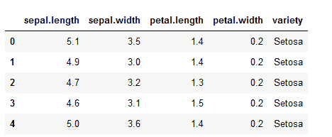
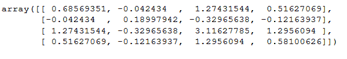
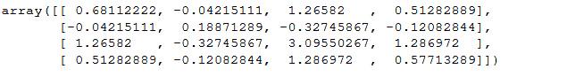
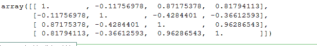

# 使用 Python 将协方差矩阵转换为相关矩阵

> 原文:[https://www . geeksforgeeks . org/convert-协方差矩阵到相关矩阵-使用-python/](https://www.geeksforgeeks.org/convert-covariance-matrix-to-correlation-matrix-using-python/)

在本文中，我们将讨论协方差和相关性之间的关系，并使用 python 编写我们自己的函数来计算协方差和相关性。

### **协方差:**

它告诉我们两个量是如何相互关联的，比如我们想计算 x 和 y 之间的协方差，那么结果可以是其中之一。


分别是 *x* 和 *y* 的意思。

解释输出:

> x 和 y 之间的协方差为:
> 
> 协方差(x，y) > 0:这意味着它们正相关
> 
> 协方差(x，y) < 0:这意味着 x 和 y 是负相关的
> 
> 如果协方差(x，y) = 0:那么 x 和 y 相互独立。

**协方差矩阵:**

协方差提供了两个变量或多组变量之间相关强度的度量，为了计算协方差矩阵，使用了 *numpy* 中的 *cov()* 方法..

**语法:**

> **ny.cov(** m，y =无，rowvar =真，bias =假，ddof =无，fw thres =无，aweights =无 **)**
> 
> **m:**【array _ like】一个 1D 或 2D 变量。变量是列
> 
> **y:**【array _ like】与 m 的形态相同。
> 
> **rowvar:**【bool，可选】如果 row var 为 True(默认)，则每行代表一个变量，在列中有观察值。否则，关系被换位:
> 
> **偏差:**默认归一化为假。如果偏差为真，则将数据点归一化。
> 
> **ddof :** 如果不是“无”，将覆盖偏差所暗示的默认值。请注意，即使同时指定了 fweights 和 aweights，ddof=1 也将返回无偏估计。
> 
> **fw 权重:**fw 权重是整数频率权重的一维数组
> 
> **awe lights:**awe lights 是观察向量权重的一维数组。
> 
> **返回:**返回一个数组协方差矩阵

### **相关性:**

它显示变量对是否相互关联以及关联的强度。相关性取-1 到+1 之间的值，其中接近+1 的值表示强正相关，接近-1 的值表示强负相关。它给出了变量之间关系的方向和强度。

**相关矩阵:**

它基本上就是一个协方差矩阵。也称为自协方差矩阵、离差矩阵、方差矩阵或方差-协方差矩阵。它是一个矩阵，其中 i-j 位置定义了给定数据集的*I<sup>th</sup>T5】和*j<sup>th</sup>T9】参数之间的相关性。使用 *numpy* 的 *corrcoeff()* 方法计算。**

**语法:**

> **numpy.corrcoef(** x，y=None，rowvar=True，bias= <无值>，ddof= <无值> **)**
> 
> **x :** 包含多个变量和观测值的一维或二维数组。x 的每一行代表一个变量，每一列代表所有这些变量的单个观察值。另见下文 rowvar。
> 
> **y** ，可选:一组额外的变量和观察值。y 和 x 的形状一样。
> 
> **rowvar :** 如果 rowvar 为 True(默认值)，则每行代表一个变量，在列中有观察值。否则，关系被调换:每列代表一个变量，而行包含观察值。
> 
> **返回:**正常

### **那么我们为什么需要相关性呢？**

1.  协方差告诉我们两个随机变量是+ve 还是-ve 相关，但它没有告诉我们相关的程度。
2.  协方差是算术变化的变体，例如:如果我们将 x 乘以 10 或除以 10，那么结果将会改变，对于相关性来说，这是不正确的，因为通过这种运算，结果保持不变。
3.  协方差的输出很难比较，因为值的范围可以从–无穷大到+无穷大。而相关的输出值范围从 0 到 1。

### **相关和协方差之间的关系**

相关性只是归一化协方差参考下面的公式。


分别是 x 和 y 的标准差。

**Python 程序将协方差矩阵转换为相关矩阵**

为了解决这个问题，我们选择了虹膜数据，因为要计算协方差，我们需要数据，如果我们使用一个真实的单词示例数据集会更好。

加载和显示数据集

## 蟒蛇 3

```
import numpy as np
import pandas as pd

# loading in the iris dataset for demo purposes

dataset = pd.read_csv("iris.csv")

dataset.head()
```



在本例中，我们将不使用目标列

## 蟒蛇 3

```
data = dataset.iloc[:, :-1].values
```

**实现协方差矩阵的程序:**

## 蟒蛇 3

```
# calculates the covariance between x and y
def calcCov(x, y):

    mean_x, mean_y = x.mean(), y.mean()
    n = len(x)

    return sum((x - mean_x) * (y - mean_y)) / n

# calculates the Covariance matrix
def covMat(data):

    # get the rows and cols
    rows, cols = data.shape

    # the covariance matroix has a shape of n_features x n_features
    # n_featurs  = cols - 1 (not including the target column)
    cov_mat = np.zeros((cols, cols))

    for i in range(cols):

        for j in range(cols):
            # store the value in the matrix
            cov_mat[i][j] = calcCov(data[:, i], data[:, j])

    return cov_mat

  covMat(data)
```

**输出**:



numpy cov()输出:

## 蟒蛇 3

```
np.cov(data,rowvar=False)
```

注意:rowVars 需要设置为 false，否则它会将行作为特征、列和观察值。

**输出**:



**计算相关性:**

在这个函数中，我们将把协方差矩阵转换成相关性。

## 蟒蛇 3

```
# Now calculating Correlation using our Covariance function (covMat())

def corrMat(data):

    rows, cols = data.shape

    corr_mat = np.zeros((cols, cols))

    for i in range(cols):

        for j in range(cols):

            x, y = data[:, i], data[:, j]
            # not here that we are just normalizing the covariance matrix
            corr_mat[i][j] = calcCov(x, y) / (x.std() * y.std())

    return corr_mat
  corrMat(data)

```

**输出:**


*numpy* 中的 *corrcoef()* 也可以用来计算相关性。

## 蟒蛇 3

```
np.corrcoef(data,rowvar=False)
```

**输出:**

