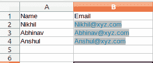
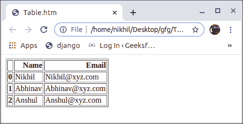
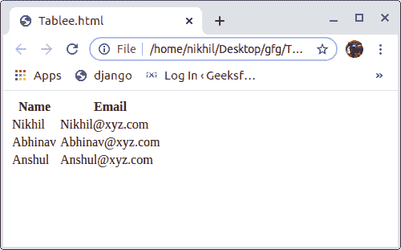

# 用 Python 将 CSV 转换成 HTML 表格

> 原文:[https://www . geesforgeks . org/convert-CSV-to-html-table-in-python/](https://www.geeksforgeeks.org/convert-csv-to-html-table-in-python/)

[CSV](https://www.geeksforgeeks.org/working-csv-files-python/) 文件是一个逗号分隔值文件，使用逗号分隔值。它基本上用于在不同的应用程序之间交换数据。在这种情况下，单独的行用换行符隔开。每行中的数据字段用逗号分隔。
**例:**

```py
Name, Salary, Age, No.of years employed
Akriti, 90000, 20, 1
Shreya, 100000, 21, 2
Priyanka, 25000, 45, 7
Neha, 46000, 25, 4
```

**注意:**更多信息请参考[使用 Python 中的 csv 文件](https://www.geeksforgeeks.org/working-csv-files-python/)

#### 在 Python 中将 CSV 转换为 HTML 表格

**方法 1 使用熊猫:**将 CSV 文件转换为 HTML 表格最简单的方法之一就是使用熊猫。在命令提示符下键入下面的代码来安装熊猫。

```py
pip install pandas 
```

**示例:**假设 CSV 文件如下所示–



## 蟒蛇 3

```py
# Python program to convert
# CSV to HTML Table

import pandas as pd

# to read csv file named "samplee"
a = pd.read_csv("read_file.csv")

# to save as html file
# named as "Table"
a.to_html("Table.htm")

# assign it to a
# variable (string)
html_file = a.to_html()
```

**输出:**



**方法 2 使用 PrettyTable:** PrettyTable 是一个简单的 Python 库，旨在使在视觉上吸引人的 ASCII 表中表示表格数据变得快速而简单。键入以下命令安装此模块。

```py
pip install PrettyTable
```

**示例:**使用上述 CSV 文件。

## 蟒蛇 3

```py
from prettytable import PrettyTable

# open csv file
a = open("read_file.csv", 'r')

# read the csv file
a = a.readlines()

# Separating the Headers
l1 = a[0]
l1 = l1.split(',')

# headers for table
t = PrettyTable([l1[0], l1[1]])

# Adding the data
for i in range(1, len(a)) :
    t.add_row(a[i].split(','))

code = t.get_html_string()
html_file = open('Tablee.html', 'w')
html_file = html_file.write(code)
```

**输出:**

