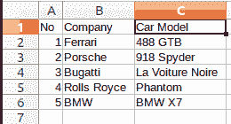
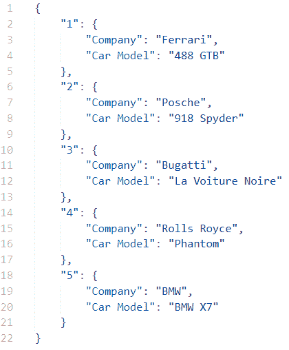

# 使用 Python 将 CSV 转换为 JSON】

> 原文:[https://www . geesforgeks . org/convert-CSV-to-JSON-using-python/](https://www.geeksforgeeks.org/convert-csv-to-json-using-python/)

**CSV(或逗号分隔值)**文件以表格格式表示数据，有几行几列。CSV 文件的一个例子是 Excel 电子表格。这些文件的扩展名为。例如，CSV geeksforgeeks***。csv*** 。在这个示例文件中，每一行都代表数据集的一条记录，每一列都表示一个唯一的要素变量。

另一方面， **JSON(或 JavaScript 对象符号)**是一种类似字典的符号，可以通过在 Python 中导入 JSON 包来使用。每个记录(或行)都保存为单独的字典，列名作为字典的键。所有这些作为字典的记录都保存在嵌套字典中，以组成整个数据集。它与扩展名一起存储。比如 json，geeksforgeeks ***。**JSON*

> **参考以下文章，了解 JSON 和 CSV 的基础知识。**
> 
> *   [使用 Python 中的 JSON 数据](https://www.geeksforgeeks.org/working-with-json-data-in-python/)
> *   [用 Python 处理 CSV 文件。](https://www.geeksforgeeks.org/working-csv-files-python/)

### 将 CSV 转换为 JSON

我们将创建一个 JSON 文件，该文件将有几个字典，每个字典代表 CSV 文件中的一条记录(行)，键作为指定的列。

**使用的 CSV 文件样本:**



## 蟒蛇 3

```py
import csv
import json

# Function to convert a CSV to JSON
# Takes the file paths as arguments
def make_json(csvFilePath, jsonFilePath):

    # create a dictionary
    data = {}

    # Open a csv reader called DictReader
    with open(csvFilePath, encoding='utf-8') as csvf:
        csvReader = csv.DictReader(csvf)

        # Convert each row into a dictionary
        # and add it to data
        for rows in csvReader:

            # Assuming a column named 'No' to
            # be the primary key
            key = rows['No']
            data[key] = rows

    # Open a json writer, and use the json.dumps()
    # function to dump data
    with open(jsonFilePath, 'w', encoding='utf-8') as jsonf:
        jsonf.write(json.dumps(data, indent=4))

# Driver Code

# Decide the two file paths according to your
# computer system
csvFilePath = r'Names.csv'
jsonFilePath = r'Names.json'

# Call the make_json function
make_json(csvFilePath, jsonFilePath)
```

**输出:**

