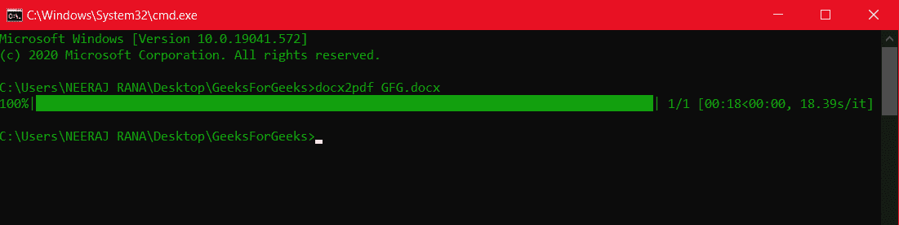
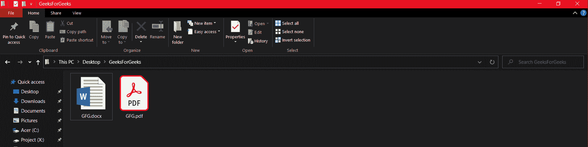
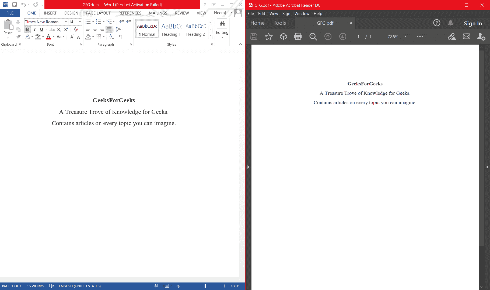

# 使用 Python 中的 docx2pdf 模块将 Docx 转换为 Pdf

> 原文:[https://www . geesforgeks . org/convert-docx-to-pdf-usif-docx2 pdf-module-in-python/](https://www.geeksforgeeks.org/convert-docx-to-pdf-usinf-docx2pdf-module-in-python/)

厌倦了不得不使用界面蹩脚、转换受限的在线 docx 到 PDF 转换器？然后，看看你友好的邻居语言 python 的 ***docx2pdf*** 模块。在 python 语言的众多模块中，这个模块是一颗隐藏的宝石。

该模块可用于使用命令行或 python 程序单独或批量转换文件。

### **安装**

这个模块没有内置 Python。要安装此模块，请在终端中键入以下命令。

```
pip install docx2pdf
```

### 使用命令行进行转换

docx2pdf 命令行用法的基本结构是:

```
docx2pdf [input] [output]
```

如果只指定了输入文件，它会从 docx 生成一个 pdf，并将其存储在同一个文件夹中。

**示例:**



使用命令行的 docx2pdf 用法



GeeksforGeeks 文件夹包含原始的 GFG.docx 和转换后的 GFG.pdf



左边是原版 GFG.docx，右边是 GFG.pdf

对于批量转换，您可以指定包含所有 Docx 文件的文件夹。转换后的 pdf 将存储在同一文件夹中。

```
docx2pdf GeeksForGeeks_Folder/
```

您也可以通过指定路径来显式指定输入和输出文件或文件夹。

### 通过导入模块并在程序中使用它进行转换

使用这个模块可以做无数有用的应用。

## 蟒蛇 3

```
# Python3 program to convert docx to pdf
# using docx2pdf module

# Import the convert method from the
# docx2pdf module
from docx2pdf import convert

# Converting docx present in the same folder
# as the python file
convert("GFG.docx")

# Converting docx specifying both the input
# and output paths
convert("GeeksForGeeks\GFG_1.docx", "Other_Folder\Mine.pdf")

# Notice that the output filename need not be
# the same as the docx

# Bulk Conversion
convert("GeeksForGeeks\")
```

**输出:**

