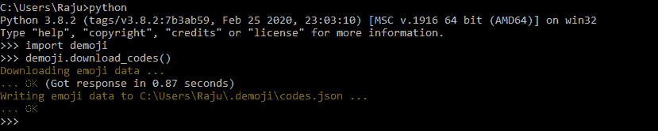
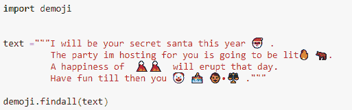
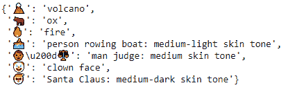
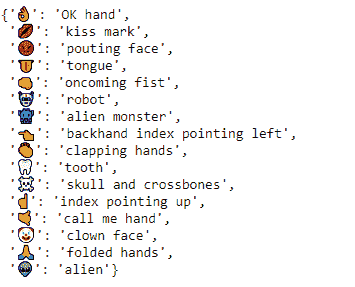
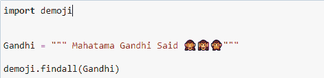
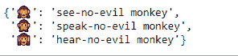

# 将表情符号转换为 Python 中的文本

> 原文:[https://www . geesforgeks . org/convert-emoji-to-text-in-python/](https://www.geeksforgeeks.org/convert-emoji-into-text-in-python/)

使用 **demoji 模块**可以将 Python 中的表情符号或表情符号转换为文本。它用于准确地移除和替换文本字符串中的表情符号。要安装 demoji 模块，可以使用以下命令:

```
pip install demoji
```

由于表情列表本身经常更新和更改，演示模块还需要从 Unicode 联盟的[表情代码存储库](http://unicode.org/Public/emoji/12.0/emoji-test.txt)中初始下载数据。上述下载应使用以下代码块:

## 蟒蛇 3

```
import demoji

demoji.download_codes()
```

**输出:**



现在我们都准备好使用 demoji 模块了，我们可以跳到几个例子。
**例 1:**



**输出:**



**例 2:**


**输出:**


**例 3:**


**输出:**



**例 4:**



**输出:**

