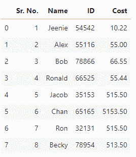

# 用 Python 将 Excel 转换成 CSV

> 原文:[https://www . geesforgeks . org/convert-excel-to-CSV-in-python/](https://www.geeksforgeeks.org/convert-excel-to-csv-in-python/)

在本文中，我们将讨论 Excel()的转换。xlsx)文件转换为. CSV . Excel 中最多使用的格式有两种:

1.  (*。xlsx) : Excel Microsoft Office 打开 XML 格式的电子表格文件。
2.  (*。xls) : Excel 电子表格(Excel 97-2003 工作簿)。

让我们考虑一个购物商店的数据集，其中关于客户序列号、客户名称、客户标识和产品成本的数据存储在 Excel 文件中。

在此检查所有使用过的文件 [**。**T3】](https://drive.google.com/drive/folders/1_WyQ_oPZci4Ec4fFEDKMFIs-wut_I4bz?usp=sharing)

## 蟒蛇 3

```
# importing pandas as pd
import pandas as pd

# read an excel file and convert 
# into a dataframe object
df = pd.DataFrame(pd.read_excel("Test.xlsx"))

# show the dataframe
df
```

**输出:**



**现在，让我们看看将 Excel 文件转换为 CSV 文件的不同方法:**

#### 方法一:用熊猫库把 Excel 文件转换成 CSV 文件。

[**【熊猫】**](https://www.geeksforgeeks.org/pandas-tutorial/) 是为 Python 编程语言的数据操作和分析而构建的开源软件库。它在数据结构和操作方面提供了各种功能，用于操作数值表和时间序列。它可以读取、过滤和重新排列大小数据集，并以一系列格式输出它们，包括 Excel、JSON、CSV。

对于读取 excel 文件，使用 [**的 read_excel()**](https://www.geeksforgeeks.org/working-with-excel-files-using-pandas/) 方法并将数据框转换为 CSV 文件，使用 [**到 _csv()**](https://www.geeksforgeeks.org/python-pandas-series-to_csv/) 方法的 pandas。

**代码:**

## 蟒蛇 3

```
#importing pandas as pd
import pandas as pd

# Read and store content
# of an excel file 
read_file = pd.read_excel ("Test.xlsx")

# Write the dataframe object
# into csv file
read_file.to_csv ("Test.csv", 
                  index = None,
                  header=True)

# read csv file and convert 
# into a dataframe object
df = pd.DataFrame(pd.read_csv("Test.csv"))

# show the dataframe
df
```