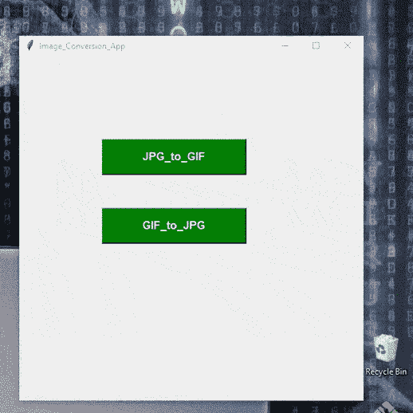

# 使用 Python 将文件从 jpg 转换为 gif，反之亦然

> 原文:[https://www . geesforgeks . org/convert-files-from-jpg-to-gif-反之亦然-使用-python/](https://www.geeksforgeeks.org/convert-files-from-jpg-to-gif-and-vice-versa-using-python/)

有时需要将图像附加到我们需要的具有指定扩展名的图像文件中。我们有不同扩展名的图像，需要用指定的扩展名进行转换，像这样，我们将转换扩展名为**的图像。jpg 到。gif** 反之亦然

我们还将为代码创建**图形用户界面**，因此我们将需要库 *tkinter* 。 [Tkinter](https://www.geeksforgeeks.org/python-gui-tkinter/) 是一个绑定到 Tk GUI 工具包的 Python。这是 Tk 图形用户界面工具包的标准 Python 接口，它提供了图形用户界面应用程序的接口

**按照以下步骤操作:**

**步骤 1:** 导入库。

```
from PIL import Image
```

步骤 2: JPG 至 GIF

```
To convert the image From JPG to GIF : {Syntax}

img = Image.open("Image.jpg")
img.save("Image.gif")
```

步骤 3: GIF 至 JPG

```
To convert the Image From PNG to JPG
img = Image.open("Image.gif")
img.save("Image.jpg")
```

添加图形用户界面

```
from tkinter import *
```

**进场:**

*   在函数 *jpg_to_gif()* 中，我们首先检查选择图像是否是相同的格式(。jpg)转换为。如果没有，则返回错误。
*   否则将图像转换为*。gif* 。
*   要打开图像，我们使用*中的函数调用*文件对话框*，这有助于从文件夹中打开图像。*
*   从 *tkinter* 导入*文件对话框*为 *fd* 。
*   JPG 的 GIF 也是如此。

**下面是实现:**

## 蟒蛇 3

```
# import required modules
from tkinter import *
from tkinter import filedialog as fd
import os
from PIL import Image
from tkinter import messagebox

# create TK object 
root = Tk()

# naming the GUI interface to image_conversion_APP
root.title("Image_Conversion_App")

# function to convert jpg to gif
def jpg_to_gif():
    global im1

    # import the image from the folder
    import_filename = fd.askopenfilename()
    if import_filename.endswith(".jpg"):

        im1 = Image.open(import_filename)

        # after converting the image save to desired
        # location with the Extersion .png
        export_filename = fd.asksaveasfilename(defaultextension=".gif")
        im1.save(export_filename)

        # displaying the Messaging box with the Success
        messagebox.showinfo("success ", "your Image converted to GIF Format")
    else:

        # if Image select is not with the Format of .jpg 
        # then display the Error
        Label_2 = Label(root, text="Error!", width=20,
                        fg="red", font=("bold", 15))
        Label_2.place(x=80, y=280)
        messagebox.showerror("Fail!!", "Something Went Wrong...")

# function to convert gif to jpg 
def gif_to_jpg():
    global im1
    import_filename = fd.askopenfilename()

    if import_filename.endswith(".gif"):
            im1=Image.open(import_filename).convert('RGB')
            export_filename=fd.asksaveasfilename(defaultextension=".jpg")
            im1.save(export_filename)
            messagebox.showinfo("Success","File converted to .jpg")

    else:
        messagebox.showerror("Fail!!","Error Interrupted!!!! Check Again")

# Driver Code

# add buttons
button1 = Button(root, text="JPG_to_GIF", width=20,
                 height=2, bg="green", fg="white",
                 font=("helvetica", 12, "bold"),
                 command=jpg_to_gif)

button1.place(x=120, y=120)

button2 = Button(root, text="GIF_to_JPG", width=20,
                 height=2, bg="green", fg="white",
                 font=("helvetica", 12, "bold"),
                 command=gif_to_jpg)

button2.place(x=120, y=220)

# adjust window size
root.geometry("500x500+400+200")
root.mainloop()
```

