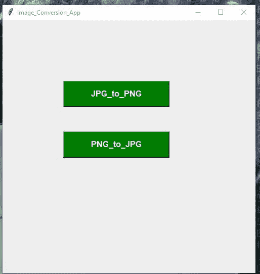

# 使用 Python 将文件从 jpg 转换为 png，反之亦然

> 原文:[https://www . geesforgeks . org/convert-files-from-jpg-to-png-反之亦然-使用-python/](https://www.geeksforgeeks.org/convert-files-from-jpg-to-png-and-vice-versa-using-python/)

**先决条件:** [枕库](https://www.geeksforgeeks.org/python-pillow-a-fork-of-pil/)

有时它需要附上我们需要的图像文件与指定的扩展名的图像。我们有不同扩展名的图像，需要用指定的扩展名进行转换，像这样，我们将把扩展名为 **PNG 的图像转换为 JPG** ，反之亦然

我们还将为代码创建**图形用户界面**，因此我们将要求库**Tkinter**[T5【Tkinter](https://www.geeksforgeeks.org/python-gui-tkinter/)是绑定到 **Tk** 图形用户界面工具包的 Python。它是 Tk 图形用户界面工具包的标准 Python 接口，也是 Python 事实上的标准图形用户界面。

**按照以下步骤操作:**

**步骤 1:** 导入库。

```
from PIL import Image
```

**步骤 2:**jpg 是 PNG

```
To convert the image From JPG to PNG : {Syntax}

img = Image.open("Image.jpg")
img.save("Image.png")
```

**步骤 3:** PNG → JPG

```
To convert the Image From PNG to JPG

img = Image.open("Image.png")
img.save("Image.jpg")
```

添加图形用户界面

```
from tkinter import *
```

**进场:**

1.  在函数 **jpg_to_png** 中，我们首先检查选择图像的格式是否相同(*)。jpg)* 要转换成哪个。 *png* 如果不是，则返回错误。
2.  否则将图像转换为*。png*
3.  为了打开图像，我们使用了 tkinter 中名为**文件对话框**的函数，该函数有助于从 tkinter 导入文件对话框为 fd 的文件夹
    中打开图像
4.  巴布亚新几内亚对 JPG 采取同样的做法

**下面是实现:**

## 蟒蛇 3

```
# import all prerequisite
from tkinter import *
from tkinter import filedialog as fd
import os
from PIL import Image
from tkinter import messagebox

root = Tk()

# naming the GUI interface to image_conversion_APP
root.title("Image_Conversion_App")

# creating the Function which converts the jpg_to_png
def jpg_to_png():
    global im1

    # import the image from the folder
    import_filename = fd.askopenfilename()
    if import_filename.endswith(".jpg"):

        im1 = Image.open(import_filename)

        # after converting the image save to desired
        # location with the Extersion .png
        export_filename = fd.asksaveasfilename(defaultextension=".png")
        im1.save(export_filename)

        # displaying the Messaging box with the Success
        messagebox.showinfo("success ", "your Image converted to Png")
    else:

        # if Image select is not with the Format of .jpg
        # then display the Error
        Label_2 = Label(root, text="Error!", width=20,
                        fg="red", font=("bold", 15))
        Label_2.place(x=80, y=280)
        messagebox.showerror("Fail!!", "Something Went Wrong...")

def png_to_jpg():
    global im1
    import_filename = fd.askopenfilename()

    if import_filename.endswith(".png"):
        im1 = Image.open(import_filename)
        export_filename = fd.asksaveasfilename(defaultextension=".jpg")
        im1.save(export_filename)

        messagebox.showinfo("success ", "your Image converted to jpg ")
    else:
        Label_2 = Label(root, text="Error!", width=20,
                        fg="red", font=("bold", 15))
        Label_2.place(x=80, y=280)

        messagebox.showerror("Fail!!", "Something Went Wrong...")

button1 = Button(root, text="JPG_to_PNG", width=20, height=2, bg="green",
                 fg="white", font=("helvetica", 12, "bold"), command=jpg_to_png)

button1.place(x=120, y=120)

button2 = Button(root, text="PNG_to_JPEG", width=20, height=2, bg="green",
                 fg="white", font=("helvetica", 12, "bold"), command=png_to_jpg)

button2.place(x=120, y=220)
root.geometry("500x500+400+200")
root.mainloop()
```

**输出:**

