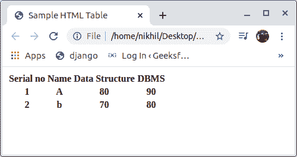
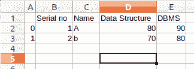

# 用 python 将 HTML 表格转换成 CSV 文件

> 原文:[https://www . geesforgeks . org/convert-html-table-to-CSV-file-in-python/](https://www.geeksforgeeks.org/convert-html-table-into-csv-file-in-python/)

**CSV 文件**是一个逗号分隔值文件，使用逗号分隔值。当我们谈论机器学习、数据处理和数据可视化时，CSV 文件在当今世界是一个有用的东西。在本文中，我们将讨论如何将一个 HTML 表转换成 CSV 文件。

## 用 Python 将 HTML 表格转换成 CSV 文件

**示例:**假设 HTML 文件看起来像，



HTML 表格可以使用 Python 的 BeautifulSoup 和 Pandas 模块转换成 CSV 文件。这些模块没有内置 Python。要安装它们，请在终端中键入以下命令。

```py
pip install BeautifulSoup
pip install pandas

```

**Python3 将 HTML 表格转换为 CSV 文件的代码**

```py
# Importing the required modules 
import os
import sys
import pandas as pd
from bs4 import BeautifulSoup

path = 'html.html'

# empty list
data = []

# for getting the header from
# the HTML file
list_header = []
soup = BeautifulSoup(open(path),'html.parser')
header = soup.find_all("table")[0].find("tr")

for items in header:
    try:
        list_header.append(items.get_text())
    except:
        continue

# for getting the data 
HTML_data = soup.find_all("table")[0].find_all("tr")[1:]

for element in HTML_data:
    sub_data = []
    for sub_element in element:
        try:
            sub_data.append(sub_element.get_text())
        except:
            continue
    data.append(sub_data)

# Storing the data into Pandas
# DataFrame 
dataFrame = pd.DataFrame(data = data, columns = list_header)

# Converting Pandas DataFrame
# into CSV file
dataFrame.to_csv('Geeks.csv')
```

**输出:**

