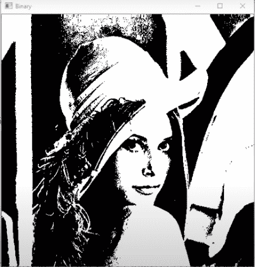

# 使用 Python 将图像转换为二进制

> 原文:[https://www . geesforgeks . org/convert-image-to-binary-using-python/](https://www.geeksforgeeks.org/convert-image-to-binary-using-python/)

在本文中，我们将把图像转换成二进制形式。二进制图像是由像素组成的单色图像，像素可以有两种颜色，通常是黑色和白色。二值图像也称为双层或二层。这意味着每个像素都存储为一个位，即 0 或 1。

Python 中图像处理需要的最重要的库是 **OpenCV。**确保您已经将库安装到 Python 中。有关安装 Opencv 的步骤，请参考本文:[使用蟒蛇环境](https://www.geeksforgeeks.org/set-opencv-anaconda-environment/)设置 OpenCV

**进场:**

1.  从该位置读取图像。
2.  由于彩色图像中有 RGB 层，并且更复杂，因此首先将其转换为灰度形式。
3.  设置阈值标记，高于给定标记的像素将变成白色，低于该标记的像素将变成黑色。

**下面是实现:**

## 蟒蛇 3

```
import cv2

# read the image file
img = cv2.imread('ff.jpg', 2)

ret, bw_img = cv2.threshold(img, 127, 255, cv2.THRESH_BINARY)

# converting to its binary form
bw = cv2.threshold(img, 127, 255, cv2.THRESH_BINARY)

cv2.imshow("Binary", bw_img)
cv2.waitKey(0)
cv2.destroyAllWindows()
```

**输出:**


原象



二元形式