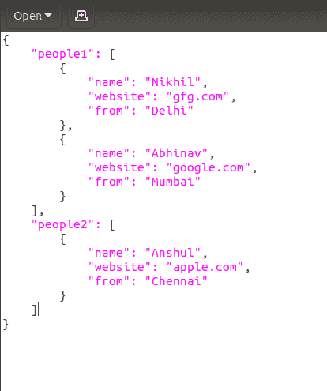
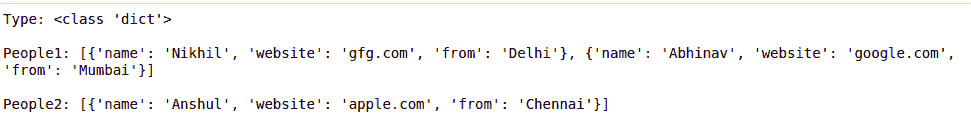
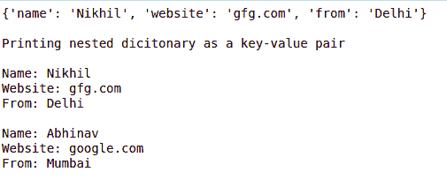

# 将 JSON 转换为 Python 中的字典

> 原文:[https://www . geesforgeks . org/convert-JSON-to-dictionary-in-python/](https://www.geeksforgeeks.org/convert-json-to-dictionary-in-python/)

JSON 代表 JavaScript 对象符号。这意味着由编程语言中的文本组成的脚本(可执行)文件用于存储和传输数据。Python 通过一个名为 json 的内置包支持 JSON。为了使用这个特性，我们在 Python 脚本中导入 json 包。JSON 中的文本是通过带引号的字符串完成的，该字符串包含{ }内键值映射中的值。它类似于 Python 中的字典。
**使用的功能:**

*   **json.load():** json.loads()函数存在于 python 内置的‘JSON’模块中。该函数用于解析 JSON 字符串。

> **语法:** json.load(file_name)
> **参数:**它以 json 文件为参数。
> **返回类型:**返回 python 字典对象。

**示例 1:** 假设 JSON 文件如下所示:



我们想把这个文件的内容转换成 Python 字典。下面是实现。

## 蟒蛇 3

```py
# Python program to demonstrate
# Conversion of JSON data to
# dictionary

# importing the module
import json

# Opening JSON file
with open('data.json') as json_file:
    data = json.load(json_file)

    # Print the type of data variable
    print("Type:", type(data))

    # Print the data of dictionary
    print("\nPeople1:", data['people1'])
    print("\nPeople2:", data['people2'])
```

**输出:**



**示例 2:** 读取嵌套数据
在上面的 JSON 文件中，第一个关键字 people1 中有一个嵌套字典。下面是读取嵌套数据的实现。

## 蟒蛇 3

```py
# Python program to demonstrate
# Conversion of JSON data to
# dictionary

# importing the module
import json

# Opening JSON file
with open('data.json') as json_file:
    data = json.load(json_file)

    # for reading nested data [0] represents
    # the index value of the list
    print(data['people1'][0])

    # for printing the key-value pair of
    # nested dictionary for loop can be used
    print("\nPrinting nested dictionary as a key-value pair\n")
    for i in data['people1']:
        print("Name:", i['name'])
        print("Website:", i['website'])
        print("From:", i['from'])
        print()
```

**输出:**

