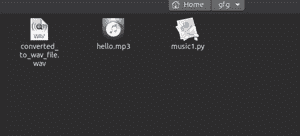

# 使用 Python 将 mp3 转换为 wav

> 原文:[https://www . geesforgeks . org/convert-MP3-to-wav-using-python/](https://www.geeksforgeeks.org/convert-mp3-to-wav-using-python/)

在本文中，我们将讨论使用 Python 将 mp3 转换为波形文件格式的各种方法。

### **方法 1:**

首先我们需要安装 *ffmpeg。* 这是一个免费的开源软件项目，由一大套用于处理视频、音频和其他多媒体文件的库和程序组成。

```py
sudo apt-get install ffmpeg 
```

所以首先让我们安装 T2。这是一个音频处理模块。Python 提供了一个名为*的模块来处理音频文件。 *pydub* 是一个只可以使用的 Python 库。wav 文件。*

```py
sudo apt-get install -y python-pydub
```

**程序:**

## 蟒蛇 3

```py
# import required modules
from os import path
from pydub import AudioSegment

# assign files
input_file = "hello.mp3"
output_file = "result.wav"

# convert mp3 file to wav file
sound = AudioSegment.from_mp3(input_file)
sound.export(output_file, format="wav")
```

**输出:**


这里你可以看到有一个 python 脚本和 hello.mp3 文件，它把它转换成一个 result.wav 文件。

*pydub* 模块使用 *ffmpeg* 或 *avconf* 程序进行实际转换。所以你必须安装 *ffmpeg* 才能使这个工作。但是如果其他不需要 *pydub* 的话，可以直接使用内置的*子流程*模块调用类似 *ffmpeg* 的转换器程序，如下图方法所示。

### 方法 2:

将 mp3 文件转换为 wav 文件是一个简单的两行脚本或代码。

这里不需要 *pydub* 模块，可以使用内置的*子流程*模块调用转换器程序 *ffmpeg* ，如下图:

**程序:**

## 蟒蛇 3

```py
# import required modules
import subprocess

# convert mp3 to wav file
subprocess.call(['ffmpeg', '-i', 'hello.mp3',
                 'converted_to_wav_file.wav'])
```

**输出:**



如您所见，生成了波形格式。