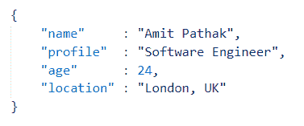
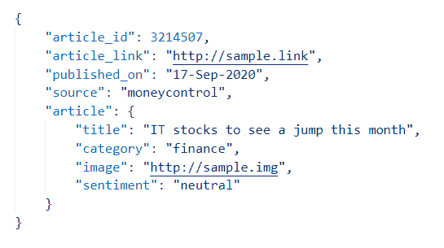
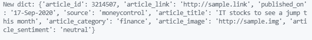
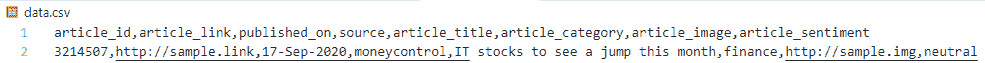
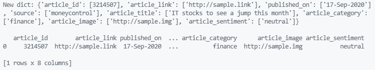
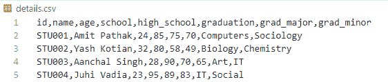

# 在 Python 中将嵌套的 JSON 转换为 CSV

> 原文:[https://www . geesforgeks . org/convert-nested-JSON-to-CSV-in-python/](https://www.geeksforgeeks.org/convert-nested-json-to-csv-in-python/)

在本文中，我们将讨论如何在 Python 中将嵌套的 JSON 转换为 CSV。

**一个简单 JSON 文件的例子:**



一个简单的 JSON 表示

如示例所示，单个键值对由冒号(:)分隔，而每个键值对由逗号(，)分隔。这里，“姓名”、“个人资料”、“年龄”和“地点”是关键字段，而对应的值分别是“ *Amit Pathak* ”、“*软件工程师*、“24”、“英国伦敦”。

嵌套 JSON 是一种结构，其中一个或多个字段的值可以是另一种 JSON 格式。例如，按照下面的例子，我们将使用转换为 CSV 格式。

**嵌套 JSON 文件的示例:**



嵌套的 JSON 示例

在上例中，关键字字段“ *article* ”的值是另一种 JSON 格式。如果需要，JSON 支持多个嵌套来创建复杂的 JSON 文件。

## 嵌套 JSON 到 CSV 的转换

我们的工作是将 JSON 文件转换为 CSV 格式。关于我们为什么需要执行这种转换，可能有许多原因。当在电子表格图形用户界面应用程序(如谷歌工作表或微软电子表格)中打开时，CSV 文件很容易阅读。它们很容易用于数据分析任务。在处理表格数据时，它也是一种被广泛排斥的格式，因为它对人类来说很容易查看，与 JSON 格式不同。

### 方法

*   第一步是将 JSON 文件作为 python dict 对象读取。这将帮助我们利用 python dict 方法来执行一些操作。任务使用 ***read_json()*** 函数，该函数将文件路径连同扩展名作为参数，并将 json 文件的内容作为 python dict 对象返回。
*   我们使用 ***normalize_json()*** 函数来规范化 dict 对象。它检查 dict 对象中的键值对。如果该值再次是 dict，那么它将键字符串与嵌套 dict 的键字符串连接起来。
*   使用 ***生成 _csv_data()*** 功能创建所需的 CSV 数据。该函数使用逗号(，)连接每条记录，然后所有这些单独的记录都附加一个新行(' python 中的\n ')。
*   最后一步，我们将前一步生成的 CSV 数据写入通过*文件路径*参数提供的首选位置。

**使用的文件:** article.json 文件

```py
{
    "article_id": 3214507,
    "article_link": "http://sample.link",
    "published_on": "17-Sep-2020",
    "source": "moneycontrol",
    "article": {
        "title": "IT stocks to see a jump this month",
        "category": "finance",
        "image": "http://sample.img",
        "sentiment": "neutral"
    }
}
```

**示例:**将 JSON 转换为 CSV

## 计算机编程语言

```py
import json

def read_json(filename: str) -> dict:

    try:
        with open(filename, "r") as f:
            data = json.loads(f.read())
    except:
        raise Exception(f"Reading {filename} file encountered an error")

    return data

def normalize_json(data: dict) -> dict:

    new_data = dict()
    for key, value in data.items():
        if not isinstance(value, dict):
            new_data[key] = value
        else:
            for k, v in value.items():
                new_data[key + "_" + k] = v

    return new_data

def generate_csv_data(data: dict) -> str:

    # Defining CSV columns in a list to maintain
    # the order
    csv_columns = data.keys()

    # Generate the first row of CSV 
    csv_data = ",".join(csv_columns) + "\n"

    # Generate the single record present
    new_row = list()
    for col in csv_columns:
        new_row.append(str(data[col]))

    # Concatenate the record with the column information 
    # in CSV format
    csv_data += ",".join(new_row) + "\n"

    return csv_data

def write_to_file(data: str, filepath: str) -> bool:

    try:
        with open(filepath, "w+") as f:
            f.write(data)
    except:
        raise Exception(f"Saving data to {filepath} encountered an error")

def main():
    # Read the JSON file as python dictionary
    data = read_json(filename="article.json")

    # Normalize the nested python dict
    new_data = normalize_json(data=data)

    # Pretty print the new dict object
    print("New dict:", new_data)

    # Generate the desired CSV data 
    csv_data = generate_csv_data(data=new_data)

    # Save the generated CSV data to a CSV file
    write_to_file(data=csv_data, filepath="data.csv")

if __name__ == '__main__':
    main()
```

**输出:**



代码块 1 的 Python 控制台输出



代码块 1 的 CSV 输出

通过使用熊猫 Python 库也可以达到同样的效果。 **Pandas** 是一个用于数据操作和分析的免费源码 python 库。它通过将数据转换成“T2”熊猫来执行操作。数据帧格式。它提供了许多可以在数据帧上执行的功能和操作。

### 方法

*   第一步是将 JSON 文件作为 python dict 对象读取。这将帮助我们利用 python dict 方法来执行一些操作。read_json()函数用于该任务，它将文件路径和扩展名作为参数，并将 json 文件的内容作为 python dict 对象返回。
*   我们使用 ***normalize_json()*** 函数来规范化 dict 对象。它检查 dict 对象中的键值对。如果该值再次是 dict，那么它将键字符串与嵌套 dict 的键字符串连接起来。
*   在这一步中，我们使用 [***熊猫，而不是手动添加单个对象作为 CSV 的每个记录。DataFrame()***](https://www.geeksforgeeks.org/python-pandas-dataframe/) 法。它接收 dict 对象，并以 pandas DataFrame 对象的形式生成所需的 CSV 数据。上述代码中有一点值得注意，即“*new _ data*”dict 变量的值出现在一个列表中。原因是，在传递字典来创建 pandas dataframe 时，dict 的值必须是一个值列表，其中每个值代表该键或列名的每行中的值。这里，我们只有一排。
*   我们用 [***熊猫。data frame . to _ csv()***](https://www.geeksforgeeks.org/python-pandas-series-to_csv/)**方法，该方法将路径以及要保存 CSV 的文件名作为输入参数，并将步骤 3 中生成的 CSV 数据保存为 CSV。**

****示例:**使用熊猫进行 JSON 到 CSV 的转换**

## **计算机编程语言**

```py
import json
import pandas

def read_json(filename: str) -> dict:

    try:
        with open(filename, "r") as f:
            data = json.loads(f.read())
    except:
        raise Exception(f"Reading {filename} file encountered an error")

    return data

def normalize_json(data: dict) -> dict:

    new_data = dict()
    for key, value in data.items():
        if not isinstance(value, dict):
            new_data[key] = value
        else:
            for k, v in value.items():
                new_data[key + "_" + k] = v

    return new_data

def main():
    # Read the JSON file as python dictionary
    data = read_json(filename="article.json")

    # Normalize the nested python dict 
    new_data = normalize_json(data=data)

    print("New dict:", new_data, "\n")

    # Create a pandas dataframe 
    dataframe = pandas.DataFrame(new_data, index=[0])

    # Write to a CSV file
    dataframe.to_csv("article.csv")

if __name__ == '__main__':
    main()
```

****输出:****

**

代码块 2 的 python 控制台输出** **

代码块 2 的 CSV 输出** 

**当我们有一个单一层次的 JSON 嵌套时，上面的两个例子是很好的，但是随着嵌套的增加和记录的增加，上面的代码需要更多的编辑。使用熊猫库，我们可以非常轻松地处理这样的 JSON。让我们看看如何。**

## **将 N 嵌套 JSON 转换为 CSV**

**使用**熊猫**中的“***【JSON _ normalize()***”方法，可以用最少的代码处理 JSON 中的任意数量的嵌套和记录。**

****语法:****

> **json_normalize(数据)**

****正在使用的文件:** details.json 文件**

```py
{
    "details": [
        {
            "id": "STU001",
            "name": "Amit Pathak",
            "age": 24,
            "results": {
                "school": 85,
                "high_school": 75,
                "graduation": 70
            },
            "education": {
                "graduation": {
                    "major": "Computers",
                    "minor": "Sociology"
                }
            }
        },
        {
            "id": "STU002",
            "name": "Yash Kotian",
            "age": 32,
            "results": {
                "school": 80,
                "high_school": 58,
                "graduation": 49
            },
            "education": {
                "graduation": {
                    "major": "Biology",
                    "minor": "Chemistry"
                }
            }
        },
        {
            "id": "STU003",
            "name": "Aanchal Singh",
            "age": 28,
            "results": {
                "school": 90,
                "high_school": 70,
                "graduation":65
            },
            "education": {
                "graduation": {
                    "major": "Art",
                    "minor": "IT"
                }
            }
        },
        {
            "id": "STU004",
            "name": "Juhi Vadia",
            "age": 23,
            "results": {
                "school": 95,
                "high_school": 89,
                "graduation": 83
            },
            "education": {
                "graduation": {
                    "major": "IT",
                    "minor": "Social"
                }
            }
        }
    ]
}
```

**这里“*细节*”键由 4 个元素的数组组成，其中每个元素包含 **3 层嵌套的 JSON** 对象。每个对象中的“*主*”和“*次*”键都处于三级嵌套中。**

### **方法**

*   **第一步是将 JSON 文件作为 python dict 对象读取。这将帮助我们利用 python dict 方法来执行一些操作。任务使用 ***read_json()*** 函数，该函数将文件路径连同扩展名作为参数，并将 json 文件的内容作为 python dict 对象返回。**
*   **我们已经对细节数组中的每个 JSON 对象进行了迭代。在每次迭代中，我们首先规范化 JSON，并创建一个临时数据帧。该数据帧随后被附加到输出数据帧。**
*   **完成后，为了更好的可见性，列名被重命名。如果我们看到控制台输出，重命名前“*专业*”列被命名为“*教育.毕业.专业*”。这是因为“ ***json_normalize()*** ”方法使用完整嵌套中的键来生成列名，避免了重复列的问题。所以，“*学历*”是第一层次，“*毕业*”是第二层次，“*专业*”是 JSON 嵌套中的第三层次。所以“ *education .毕业证.专业*一栏就简单改名为“毕业”。**
*   **重命名列后，**到 _csv()** 方法将 pandas dataframe 对象作为 csv 保存到提供的文件位置。**

****示例:**将 n 嵌套 JSON 转换为 CSV**

## **计算机编程语言**

```py
import json
import pandas

def read_json(filename: str) -> dict:

    try:
        with open(filename, "r") as f:
            data = json.loads(f.read())
    except:
        raise Exception(f"Reading {filename} file encountered an error")

    return data

def create_dataframe(data: list) -> pandas.DataFrame:

    # Declare an empty dataframe to append records
    dataframe = pandas.DataFrame()

    # Looping through each record
    for d in data:

        # Normalize the column levels
        record = pandas.json_normalize(d)

        # Append it to the dataframe 
        dataframe = dataframe.append(record, ignore_index=True)

    return dataframe

def main():
    # Read the JSON file as python dictionary 
    data = read_json(filename="details.json")

    # Generate the dataframe for the array items in 
    # details key 
    dataframe = create_dataframe(data=data['details'])

    # Renaming columns of the dataframe 
    print("Normalized Columns:", dataframe.columns.to_list())

    dataframe.rename(columns={
        "results.school": "school",
        "results.high_school": "high_school",
        "results.graduation": "graduation",
        "education.graduation.major": "grad_major",
        "education.graduation.minor": "grad_minor"
    }, inplace=True)

    print("Renamed Columns:", dataframe.columns.to_list())

    # Convert dataframe to CSV
    dataframe.to_csv("details.csv", index=False)

if __name__ == '__main__':
    main()
```

****输出:****

> **$控制台输出**
> 
> **—–**
> 
> **规范化列:['id '，'姓名'，'年龄'，'成绩.学校'，'成绩.高中'，'成绩.毕业'，'教育.毕业.专业'，'教育.毕业.辅修']**
> 
> **已重命名的列:['id '，'姓名'，'年龄'，'学校'，'高中'，'毕业'，'研究生'，'研究生']**

**

代码块 3 的 CSV 输出**