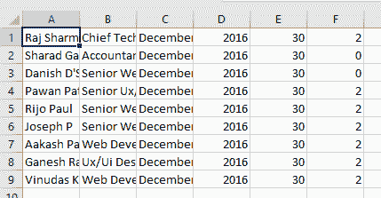

# 使用 Python 将 PDF 转换为 CSV

> 原文:[https://www . geesforgeks . org/convert-pdf-to-CSV-using-python/](https://www.geeksforgeeks.org/convert-pdf-to-csv-using-python/)

Python 是一种高级、通用且非常流行的编程语言。Python 编程语言(最新的 Python 3)正被用于网络开发、机器学习应用以及软件行业的所有前沿技术。Python 编程语言非常适合初学者，也适合使用其他编程语言(如 C++和 Java)的有经验的程序员。

在本文中，我们将学习如何使用 Python 将 PDF 文件转换为 CSV 文件。这里我们将讨论各种转换方法。对于所有方法，我们都使用输入 [PDF](https://drive.google.com/file/d/1gAbGpmP5T1Lr64Ok2toS4o_Fs-snp6Vm/view) 文件。

**方法 1:**

这里将使用 **pdftables_api** 模块将 PDF 文件转换为任何其他格式。pdftables_api 模块用于读取 PDF 中的表格。它还允许我们将 PDF 文件转换成另一种格式。

**安装:**

```py
Open Command Prompt and type "pip install git+https://github.com/pdftables/python-pdftables-api.git"
```

*   它将安装 **pdftables_api** 模块
*   安装后，您需要一个应用编程接口密钥。
*   前往[PDFTables.com](https://pdftables.com/)注册，然后访问 [API 页面](https://pdftables.com/pdf-to-excel-api)查看您的 API 密钥。

**进场:**

*   验证应用编程接口密钥。
*   对于将 PDF 文件转换为 CSV 文件，我们将使用 **csv()** 方法。

**语法:**

```py
pdftables_api.Client('API KEY').csv(pdf_path, csv_path)
```

**下面是实现:**

**使用的 PDF 文件:**


**PDF 文件**

## 蟒蛇 3

```py
# Import Module
import pdftables_api

# API KEY VERIFICATION
conversion = pdftables_api.Client('API KEY')

# PDf to CSV 
# (Hello.pdf, Hello)
conversion.csv(pdf_file_path, output_file_path)
```

**输出:**



**CSV 文件**

**方法二:**

这里将使用**白板**模块将 PDF 文件转换为任何其他格式。tabula-py 是 tabula-java 的一个简单的 Python 包装器，可以读取 PDF 中的表格。你可以从 PDF 中读取表格，并将其转换成熊猫数据帧。白板还使您能够将 PDF 文件转换为 CSV、TSV 或 JSON 文件。

**安装:**

```py
pip install tabula-py
```

在开始之前，首先我们需要安装 java，并在 PATH 变量中添加一个 java 安装文件夹。

*   安装 java [**点击这里**](https://www.oracle.com/in/java/technologies/javase-jre8-downloads.html)
*   将 java 安装文件夹(C:\ Program Files(x86)\ Java \ JRE 1 . 8 . 0 _ 251 \ bin)添加到环境路径变量中

**进场:**

*   使用 **read_pdf()** 方法读取 **PDF** 文件。
*   然后我们将使用**到 _csv()** 方法将 PDF 文件转换成 CSV 文件。

**语法:**

```py
read_pdf(PDF File Path, pages = Number of pages, **agrs)
```

**下面是实现:**

**使用的 PDF 文件:**


**PDF 文件**

## 蟒蛇 3

```py
# Import Module 
import tabula

# Read PDF File
# this contain a list
df = tabula.read_pdf(PDF File Path, pages = 1)[0]

# Convert into Excel File
df.to_csv('Excel File Path')
```

**输出:**


**CSV 文件**