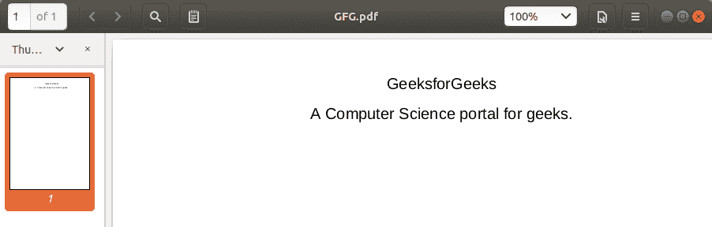
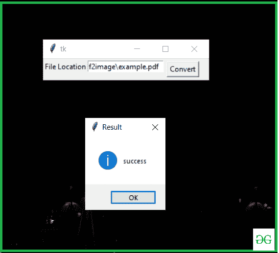
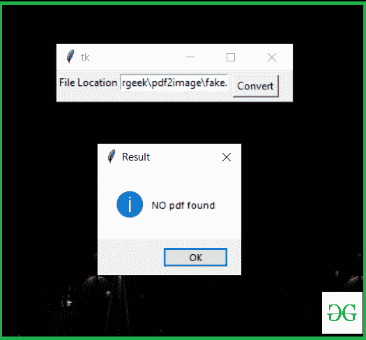

# 使用 Python 将 PDF 转换为图像

> 原文:[https://www . geesforgeks . org/convert-pdf-to-image-using-python/](https://www.geeksforgeeks.org/convert-pdf-to-image-using-python/)

互联网上有许多工具可以将 PDF 转换成图像。在本文中，我们将编写将 pdf 转换为图像的代码，并在 python 中制作一个方便的应用程序。在编写代码之前，我们需要安装所需的模块 [**pdf2image**](https://pypi.org/project/pdf2image/) 和 [**poppler。**](https://github.com/oschwartz10612/poppler-windows/releases/)

### **所需模块**

*   **pdf2image 1.14.0:** 此模块将 pdf 转换为 PIL 对象。要安装此模块，请在终端中键入以下命令。

```py
pip install pdf2image
```

*   **弹出器:**该模块允许读取、渲染或修改 PDF 文档。Windows 用户将不得不为 Windows 构建或下载 poppler。[点击此处](https://github.com/oschwartz10612/poppler-windows/releases/)下载

> 然后，您必须将 bin/文件夹添加到 PATH 或使用
> 
> pop pler _ path = r " C:\ path \ to \ pop pler-xx \ bin "作为 convert_from_path 中的参数。

**进场:**

*   导入 pdf2image 模块
*   用 **convert_from_path()** 存储一个 PFD
*   用**保存图像保存()**

下面是实现。

**使用的 PDF 文件:**



## 计算机编程语言

```py
# import module
from pdf2image import convert_from_path

# Store Pdf with convert_from_path function
images = convert_from_path('example.pdf')

for i in range(len(images)):

      # Save pages as images in the pdf
    images[i].save('page'+ str(i) +'.jpg', 'JPEG')
```

**输出:**


**让我们使用 Tkinter 为应用程序编写代码:**这个脚本将上述实现实现到一个 GUI 中。

下面是实现。

## 蟒蛇 3

```py
from pdf2image import convert_from_path
from tkinter import *
from tkinter import messagebox

def pdf2img():
    try:
        images = convert_from_path(str(e1.get()))
        for img in images:
            img.save('new_folder\output.jpg', 'JPEG')

    except  :
        Result = "NO pdf found"
        messagebox.showinfo("Result", Result)

    else:
        Result = "success"
        messagebox.showinfo("Result", Result)

master = Tk()
Label(master, text="File Location").grid(row=0, sticky=W)

e1 = Entry(master)
e1.grid(row=0, column=1)

b = Button(master, text="Convert", command=pdf2img)
b.grid(row=0, column=2,columnspan=2, rowspan=2,padx=5, pady=5)

mainloop()
```

**输出:**



**如果你给定的位置没有 PDF 文件。**

