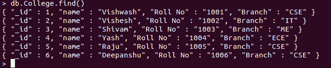

# 将 PyMongo 光标转换为数据框

> 原文:[https://www . geesforgeks . org/convert-pymongo-cursor-to-data frame/](https://www.geeksforgeeks.org/convert-pymongo-cursor-to-dataframe/)

**先决条件:** [MongoDB Python 基础知识](https://www.geeksforgeeks.org/mongodb-and-python/)

这篇文章是关于把 PyMongo 光标转换成熊猫数据帧的。像 find()和 find_one()这样的函数返回游标实例。

让我们开始吧:

1.  **Importing Required Modules:** Import the required module using the command:

    ```py
    from pymongo import MongoClient
    from pandas import DataFrame
    ```

    如果您的机器上尚未安装 MongoDB，您可以参考指南:[使用 Python 安装 MongoDB 的指南](https://www.geeksforgeeks.org/guide-install-mongodb-python-windows/)

    如果熊猫没有安装，你可以用 pip 安装，如果你用的是 Python3，那么用 **pip3** 代替 pip 安装所需的模块。

    ```py
    pip install pandas

    ```

2.  **创建连接:**现在我们已经导入了模块，是时候建立与 MongoDB 服务器的连接了，该服务器大概运行在端口 27017(端口号)的 localhost(主机名)上。

    ```py
    client = MongoClient(‘localhost’, 27017)
    ```

3.  **访问数据库:**由于与 MongoDB 服务器的连接已经建立。我们现在可以创建或使用现有的数据库。

    ```py
    mydatabase = client.name_of_the_database
    ```

4.  **访问集合:**我们现在使用以下语法从数据库中选择集合:

    ```py
    collection_name = mydatabase.name_of_collection
    ```

5.  **获取文档:**使用 find()方法从集合中获取所有文档。它返回光标的实例。

    ```py
    cursor = collection_name.find()

    ```

6.  **Converting the Cursor to Dataframe:** Converting the Cursor to the Pandas Dataframe.
    First, we convert the cursor to the list of dictionary.

    ```py
    list_cur = list(cursor)

    ```

    现在，将列表转换为数据帧

    ```py
    df = DataFrame(list_cur)

    ```

下面是实现。

**样本数据库:**



```py
# Python Program for demonstrating the 
# PyMongo Cursor to Pandas DataFrame

# Importing required modules
from pymongo import MongoClient
from pandas import DataFrame

# Connecting to MongoDB server
# client = MongoClient('host_name',
# 'port_number')
client = MongoClient('localhost', 27017)

# Connecting to the database named
# GFG
mydatabase = client.GFG

# Accessing the collection named
# gfg_collection
mycollection = mydatabase.College

# Now creating a Cursor instance
# using find() function
cursor = mycollection.find()
print('Type of cursor:',type(cursor))

# Converting cursor to the list of 
# dictionaries
list_cur = list(cursor)

# Converting to the DataFrame
df = DataFrame(list_cur)
print('Type of df:',type(df))

# Printing the df to console
print()
print(df.head())
```

**输出:**

```py
Type of cursor: <class 'pymongo.cursor.Cursor'>
Type of df: <class 'pandas.core.frame.DataFrame'>

   _id      name Roll No Branch
0    1  Vishwash    1001    CSE
1    2   Vishesh    1002     IT
2    3    Shivam    1003     ME
3    4      Yash    1004    ECE
4    5      Raju    1005    CSE
```