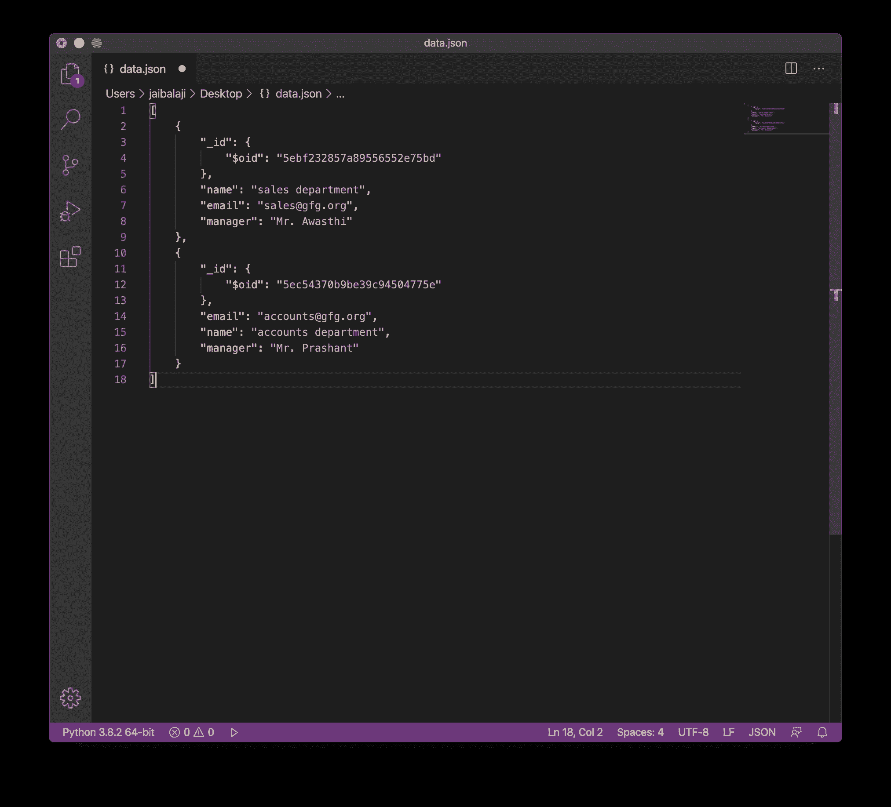

# 将 PyMongo 光标转换为 JSON

> 原文:[https://www . geesforgeks . org/convert-pymongo-cursor-to-JSON/](https://www.geeksforgeeks.org/convert-pymongo-cursor-to-json/)

**先决条件:** [MongoDB Python 基础知识](https://www.geeksforgeeks.org/mongodb-and-python/)

本文是关于将 PyMongo 游标转换为 JSON 的。像 find()和 find_one()这样的函数返回游标实例。

让我们开始吧:

1.  **Importing Required Modules:** Import the required module using the command:

    ```
    from pymongo import MongoClient
    from bson.json_util import dumps
    ```

    如果您的机器上尚未安装 MongoDB，您可以参考指南:[使用 Python 安装 MongoDB 的指南](https://www.geeksforgeeks.org/guide-install-mongodb-python-windows/)

2.  **创建连接:**现在我们已经导入了模块，是时候建立与 MongoDB 服务器的连接了，该服务器大概运行在端口 27017(端口号)的 localhost(主机名)上。

    ```
    client = MongoClient(‘localhost’, 27017)
    ```

3.  **访问数据库:**由于与 MongoDB 服务器的连接已经建立。我们现在可以创建或使用现有的数据库。

    ```
    mydatabase = client.name_of_the_database
    ```

4.  **访问集合:**我们现在使用以下语法从数据库中选择集合:

    ```
    collection_name = mydatabase.name_of_collection
    ```

5.  **获取文档:**使用 find()方法从集合中获取所有文档。它返回光标的实例。

    ```
    cursor = collection_name.find()

    ```

6.  **Converting the Cursor to JSON:** Converting the Cursor to the JSON.
    First, we will convert the Cursor to the list of dictionary.

    ```
    list_cur = list(cursor)
    ```

    现在，使用来自 bson.json_util 的方法 dumps()将 list_cur 转换为 JSON

    ```
    json_data = dumps(list_cur)

    ```

    现在，您可以将其保存到文件中，或者使用 loads()函数在程序中使用它。

下面是实现。

```
# Python Program for
# demonstrating the 
# PyMongo Cursor to JSON

# Importing required modules
from pymongo import MongoClient
from bson.json_util import dumps, loads

# Connecting to MongoDB server
# client = MongoClient('host_name',
# 'port_number')
client = MongoClient('localhost', 27017)

# Connecting to the database named
# GFG
mydatabase = client.GFG

# Accessing the collection named
# gfg_collection
mycollection = mydatabase.College

# Now creating a Cursor instance
# using find() function
cursor = mycollection.find()

# Converting cursor to the list 
# of dictionaries
list_cur = list(cursor)

# Converting to the JSON
json_data = dumps(list_cur, indent = 2) 

# Writing data to file data.json
with open('data.json', 'w') as file:
    file.write(json_data)
```

**输出:**

