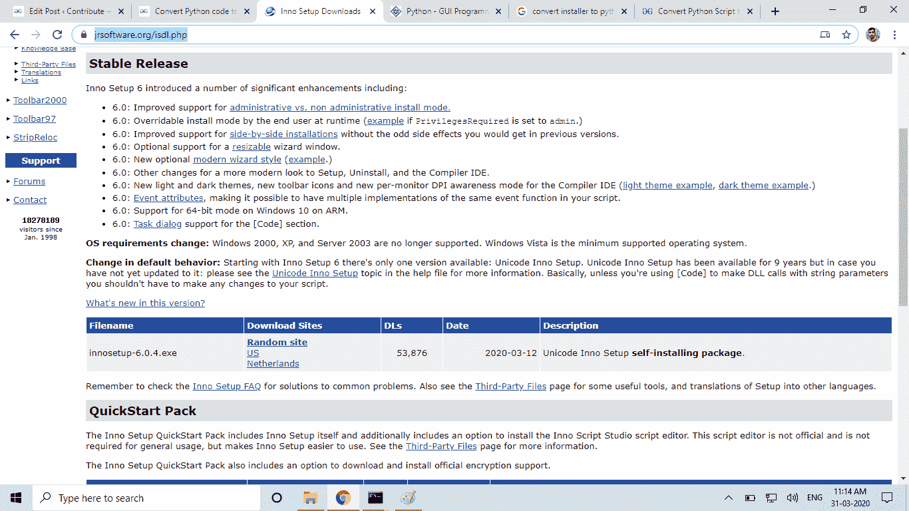
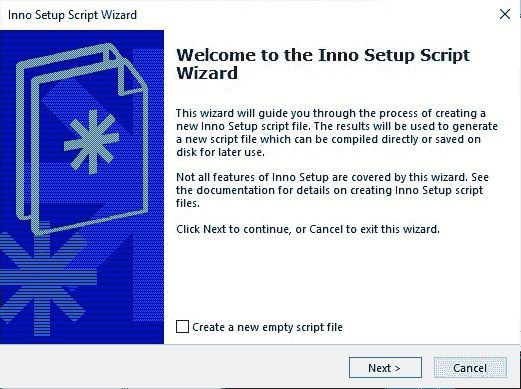
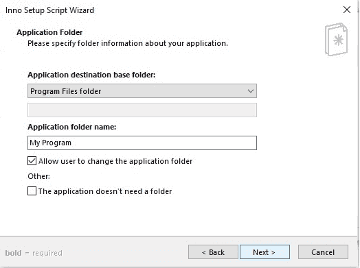
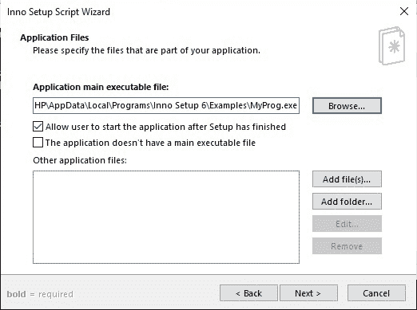
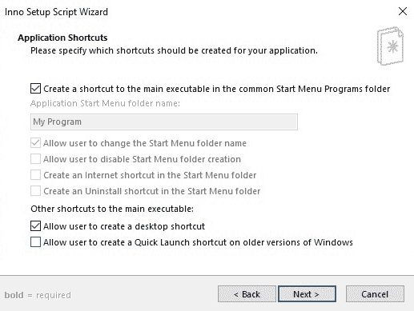
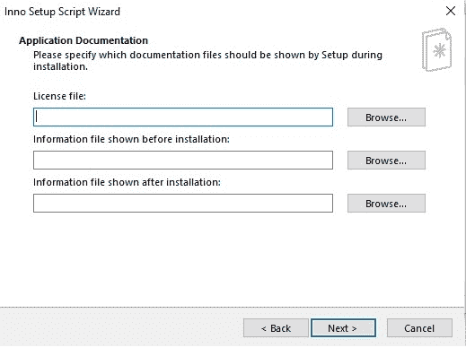
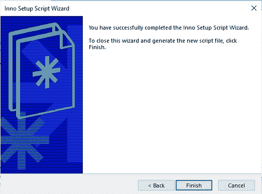

# 使用 Inno Setup 编译器将 Python 代码转换为要在 Windows 上安装的软件

> 原文:[https://www . geesforgeks . org/convert-python-code-a-software-to-install-on-windows-use-inno-setup-compiler/](https://www.geeksforgeeks.org/convert-python-code-to-a-software-to-install-on-windows-using-inno-setup-compiler/)

用户只能得到任何软件的安装程序，公司没有给用户源代码文件。虽然有些开源软件是有源代码的。我们也可以用 python 源代码制作一个安装程序，这样你就不用分享你的源代码了。使用任何图形库编写您的 python 代码，我在这里使用 Tkinter，我们将使用 [Inno setup 编译器](https://jrsoftware.org/isdl.php)将其转换为 windows 10 中的安装程序软件。*转产。py to。exe* ，可以访问 [Python 到 exe 转换](https://www.geeksforgeeks.org/convert-python-script-to-exe-file/)。

### 制作安装程序的步骤。py 文件

**转换。安装安装程序:**该步骤包括以下一系列步骤。

**第一步:**下载 [inno 设置软件。](https://jrsoftware.org/isdl.php)

**Step 2:** Choose *Create new script file using the Script Wizard*.

**Step 3:** Fill Application Information.

**第 4 步:**添加文件和文件夹，点击下一步。

这里我们必须加上。我们使用 pyinstaller 从 python 代码中创建的。浏览 exe 文件后，也添加该文件所在的文件夹。

**步骤 5:** 选择应用程序快捷方式的选项，然后单击下一步。

**第六步:应用文档:**这些取决于你，如果你想把这个软件作为商业软件使用，那么你可以填充它们，否则就保持原样。单击下一步。

**第 7 步:**选择设置语言。
T3】

**第八步:编译设置:**这里你要设置输出设置要存储的文件夹。如果要设置密码，请填写，否则请留下。
T3】

**第九步:**点击*完成*。

您的 Windows 安装软件已准备好，现在您可以使用它进行分发。