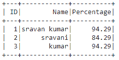

# 将 Python 字典列表转换为 PySpark 数据帧

> 原文:[https://www . geesforgeks . org/convert-python-dictionary-list-to-py spark-data frame/](https://www.geeksforgeeks.org/convert-python-dictionary-list-to-pyspark-dataframe/)

在本文中，我们将讨论如何将 Python 字典列表转换为 Pyspark 数据帧。

**可以这样做:**

*   使用推断模式。
*   使用显式模式
*   使用 SQL 表达式

**方法 1:从** **词典**中推断图式

我们将把字典直接传递给 createDataFrame()方法。

> **语法:** spark.createDataFrame(数据)

**示例:**使用此方法从字典列表创建 pyspark 数据帧的 Python 代码

## 蟒蛇 3

```
# import the modules
from pyspark.sql import SparkSession

# Create Spark session app name
# is GFG and master name is local
spark = SparkSession.builder.appName("GFG").master("local") .getOrCreate()

# dictionary list of college data
data = [{"Name": 'sravan kumar',
         "ID": 1,
         "Percentage": 94.29},
        {"Name": 'sravani',
         "ID": 2,
         "Percentage": 84.29},
        {"Name": 'kumar',
         "ID": 3,
         "Percentage": 94.29}
        ]

# Create data frame from dictionary list
df = spark.createDataFrame(data)

# display
df.show()
```

**输出:**



**方法 2:使用显式模式**

在这里，我们将创建一个模式，并将该模式和数据一起传递给 createdataframe()方法。

**图式结构:**

> schema = StrUctype([
> 
> structure field(' column _ 1 '，DataType()，False)，
> 
> structure field(' column _ 2 '，DataType()，False)])

其中，列是要在 pyspark dataframe 中获取的字典列的名称，数据类型是特定列的数据类型。

> **语法:** spark.createDataFrame(数据，模式)
> 
> **在哪里，**
> 
> *   数据是字典列表
> *   模式是数据帧的模式

使用此方法从字典列表创建 pyspark 数据帧的 Python 程序。

## 蟒蛇 3

```
# import the modules
from pyspark.sql import SparkSession
from pyspark.sql.types import StructField, StructType,
StringType, IntegerType, FloatType

# Create Spark session app name is
# GFG and master name is local
spark = SparkSession.builder.appName("GFG").master("local") .getOrCreate()

# dictionary list of college data
data = [{"Name": 'sravan kumar',
         "ID": 1,
         "Percentage": 94.29},
        {"Name": 'sravani',
         "ID": 2,
         "Percentage": 84.29},
        {"Name": 'kumar',
         "ID": 3,
         "Percentage": 94.29}
        ]

# specify the schema
schema = StructType([
    StructField('Name', StringType(), False),
    StructField('ID', IntegerType(), False),
    StructField('Percentage', FloatType(), True)
])

# Create data frame from
# dictionary list through the schema
df = spark.createDataFrame(data, schema)

# display
df.show()
```

**输出:**


**方法三:使用 SQL 表达式**

这里我们使用 Row 函数将 python 字典列表转换为 pyspark 数据帧。

> **语法:**spark . createdata frame([数据中迭代器的行(* *迭代器))
> 
> **其中:**
> 
> *   createDataFrame()是创建数据帧的方法
> *   行(* *迭代器)来迭代字典列表。
> *   数据是字典列表

Python 代码将字典列表转换为 pyspark 数据帧。

## 蟒蛇 3

```
# import the modules
from pyspark.sql import SparkSession, Row

# Create Spark session app name
# is GFG and master name is local
spark = SparkSession.builder.appName("GFG").master("local") .getOrCreate()

# dictionary list of college data
data = [{"Name": 'sravan kumar',
         "ID": 1,
         "Percentage": 94.29},
        {"Name": 'sravani',
         "ID": 2,
         "Percentage": 84.29},
        {"Name": 'kumar',
         "ID": 3,
         "Percentage": 94.29}
        ]

# create dataframe using sql expression
dataframe = spark.createDataFrame([Row(**variable) 
                                   for variable in data])

dataframe.show()
```

**输出:**

