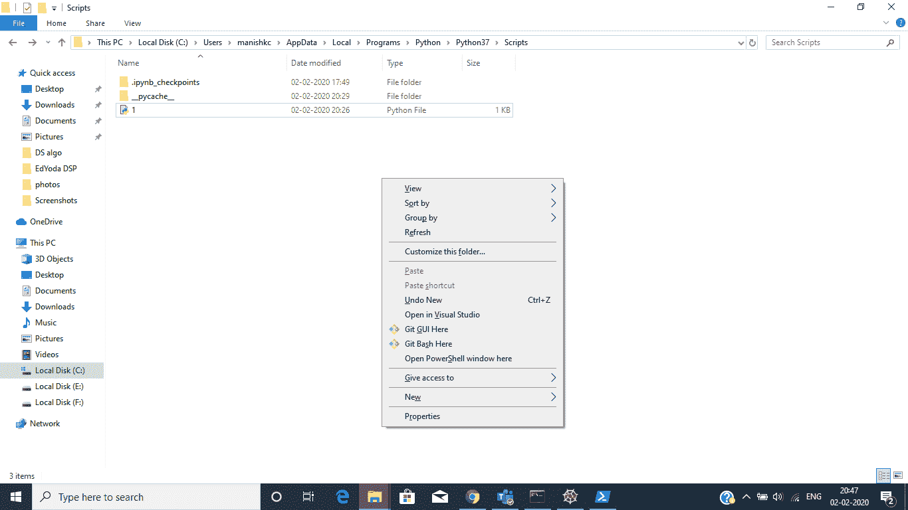
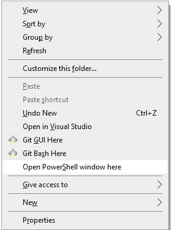
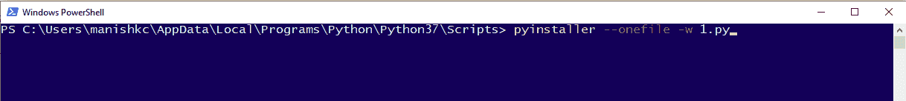
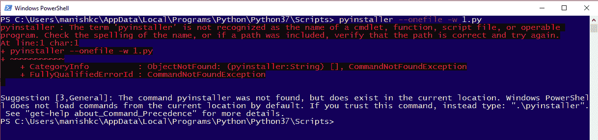
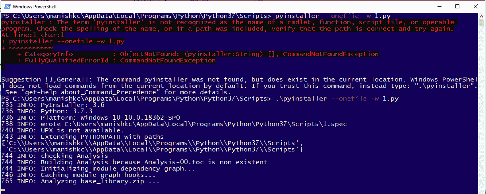
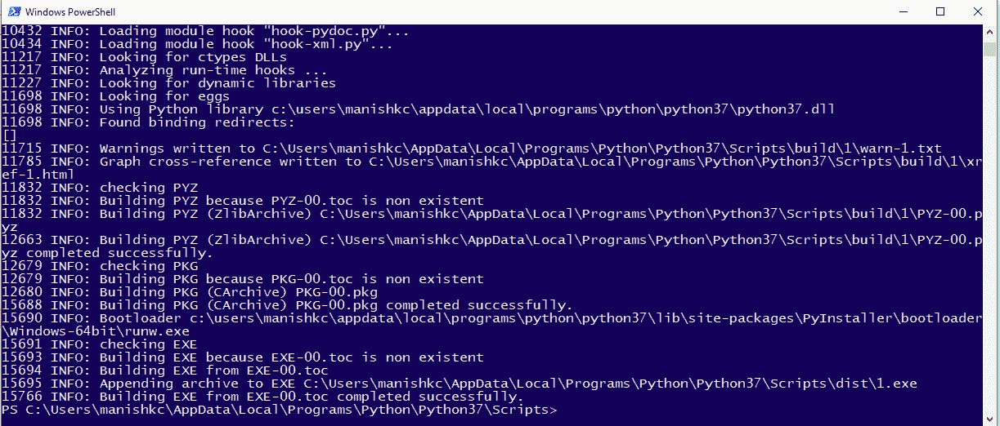
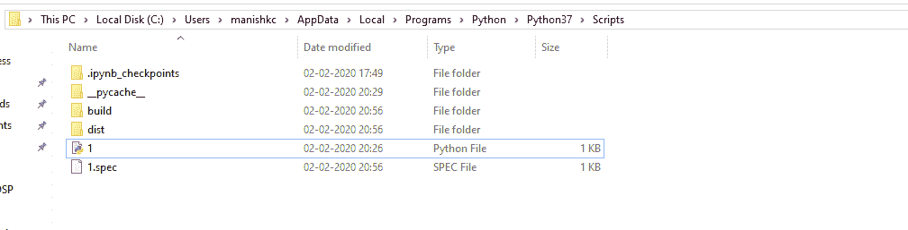
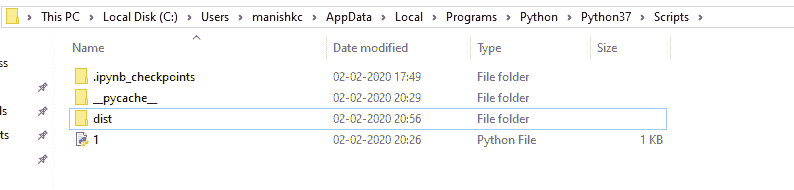
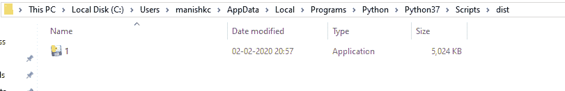
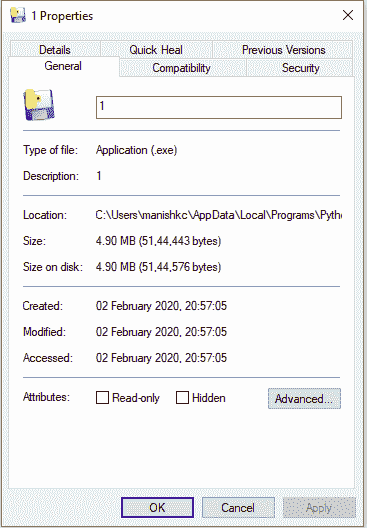

# 将 Python 脚本转换为。exe 文件

> 原文:[https://www . geesforgeks . org/convert-python-script-to-exe-file/](https://www.geeksforgeeks.org/convert-python-script-to-exe-file/)

我们每天都会创建大量的 Python 程序，并希望与世界共享。这并不是说你要和所有人分享那个 Python 程序，他们会在一些 IDLE shell 中运行这个脚本。但是您希望每个人都在没有安装 Python 的情况下运行您的 Python 脚本。因此对于这项工作，您可以将。将文件复制到。exe 文件。在本文中，您将学习如何转换。将文件复制到。exe 文件。按照以下步骤进行操作。

**步骤 1:**
安装库 pyinstaller。
在命令提示符下键入以下命令。

```py
pip install pyinstaller
```

**第二步:**
进入你所在的目录。找到“py”文件。


**步骤 3:**
按下 shift⇧按钮，同时在同一位置右键单击。你会得到下面的盒子。



**第四步:**
点击【在此打开 PowerShell 窗口】。



您将看到如下所示的窗口。


**第 5 步:**
在 PowerShell 窗口中键入下面给出的命令。

```py
pyinstaller --onefile -w 'filename.py'
```

这是。“py”文件名为“1”。
见下图:



如果此时在 PowerShell 窗口中出现如下错误:



输入上述命令时的修正:

```py
.\pyinstaller --onefile -w 'filename.py'

For any missing package:
pyinstaller --hidden-import 'package_name' --onefile 'filename.py'
```



**第 6 步:**
输入命令“回车”后。
根据文件的大小和你的项目有多大，完成这个过程需要一些时间。
处理完毕后，窗口如下图:



**第七步:**
看目录应该是这样的:



“build”文件夹和“1.spec”没有用。你可以删除这些如果你想，它不会影响你的。'文件。



**第八步:**
打开上面的‘dist’文件夹。在这里你会得到你的。'文件。



右键单击文件并检查属性。

