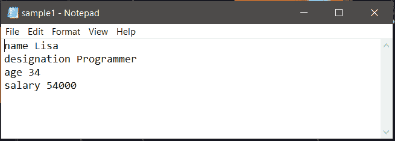
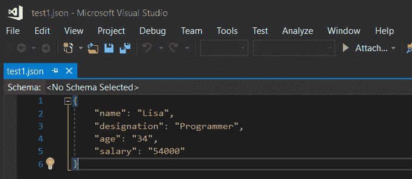
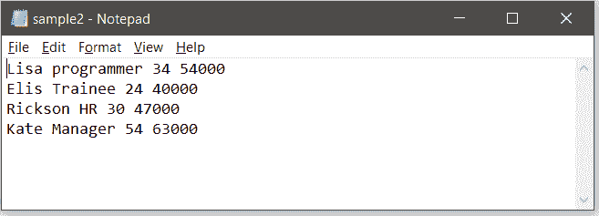
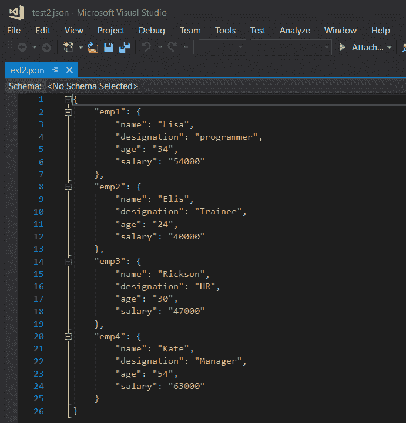

# 将文本文件转换为 Python 中的 JSON

> 原文:[https://www . geesforgeks . org/convert-text-file-to-JSON-in-python/](https://www.geeksforgeeks.org/convert-text-file-to-json-in-python/)

[JSON (JavaScript 对象符号)](https://www.geeksforgeeks.org/javascript-json/)是一种人类可读文本的数据交换格式，用于传输数据，尤其是在网络应用程序和服务器之间。JSON 文件就像 Python 中的嵌套字典。要将一个文本文件转换成 JSON，Python 中有一个`json`模块。该模块内置 Python 标准模块，无需外接安装。

请看下面给出的表格，看序列化 JSON，即编码 JSON 的过程。

| Python 对象 | jsonobject |
| --- | --- |
| **格言** | 目标 |
| **列表，元组** | 排列 |
| **str** | 线 |
| **int，long，float** | 数字 |
| **真** | 真实的 |
| **假** | 错误的 |
| **无** | 空 |

为了处理文件中的数据流，Python 中的 JSON 库使用`dump()`函数将 Python 对象转换成它们各自的 JSON 对象，这样就可以轻松地将数据写入文件。

**语法:**

> json.dump()

各种参数可以传递给这个方法。它们有助于提高 JSON 文件的可读性。它们是:

*   **字典对象:**保存键值对的字典。
*   **缩进:**适合可读性的缩进(数值)。
*   **分隔符:**对象必须如何相互分离，值必须如何与其键分离。像“、”、“:”、“；”这样的符号, "."被使用
*   **排序关键字:**如果设置为真，则关键字按升序排序

这里的想法是将文本内容作为键值对存储在字典中，然后将其转储到 JSON 文件中。下面解释一个简单的例子。文本文件包含一个人的详细信息。text1.txt 文件如下所示:



现在要将其转换为 JSON 文件，可以使用下面的代码:

```py
# Python program to convert text
# file to JSON

import json

# the file to be converted to 
# json format
filename = 'data.txt'

# dictionary where the lines from
# text will be stored
dict1 = {}

# creating dictionary
with open(filename) as fh:

    for line in fh:

        # reads each line and trims of extra the spaces 
        # and gives only the valid words
        command, description = line.strip().split(None, 1)

        dict1[command] = description.strip()

# creating json file
# the JSON file is named as test1
out_file = open("test1.json", "w")
json.dump(dict1, out_file, indent = 4, sort_keys = False)
out_file.close()
```

当执行上述代码时，如果给定名称中存在一个 JSON 文件，它将被写入其中，否则，在目标路径中创建新文件，并将内容写入其中。

输出:



请注意下面的代码行:

```py
command, description = line.strip().split(None, 1)
```

在这里，split(None，1)用于修剪键值对之间的所有多余空格，“1”表示一行中只拆分一次。这确保了在键值对中，值中的空格不会被移除，并且这些字不会被拆分。只有键与其值是分开的。

**如果文本文件中存储了多条记录，如何转换？**
让我们考虑下面的文本文件，它是一个包含 4 行的员工记录。



这个想法是将每个员工的详细信息转换成一个中间字典，并将其附加到一个主结果字典中。对于每个中间字典，创建一个唯一的 id，并用作密钥。因此，在这里，雇员 id 和中间字典构成了要转储的结果字典的键值对。

```py
# Python program to convert text
# file to JSON

import json

# the file to be converted
filename = 'data.txt'

# resultant dictionary
dict1 = {}

# fields in the sample file 
fields =['name', 'designation', 'age', 'salary']

with open(filename) as fh:

    # count variable for employee id creation
    l = 1

    for line in fh:

        # reading line by line from the text file
        description = list( line.strip().split(None, 4))

        # for output see below
        print(description) 

        # for automatic creation of id for each employee
        sno ='emp'+str(l)

        # loop variable
        i = 0
        # intermediate dictionary
        dict2 = {}
        while i<len(fields):

                # creating dictionary for each employee
                dict2[fields[i]]= description[i]
                i = i + 1

        # appending the record of each employee to
        # the main dictionary
        dict1[sno]= dict2
        l = l + 1

# creating json file        
out_file = open("test2.json", "w")
json.dump(dict1, out_file, indent = 4)
out_file.close()
```

与每列相关联的属性存储在一个名为**“字段”**的单独列表中。在上面的代码中，每一行都是基于空间分割的，并转换成字典。每次执行**打印(属性)**一行时，如下所示。

```py
['Lisa', 'programmer', '34', '54000']
['Elis', 'Trainee', '24', '40000']
['Rickson', 'HR', '30', '47000']
['Kate', 'Manager', '54', '63000']

```

由这段代码创建的 JSON 文件如下所示:

