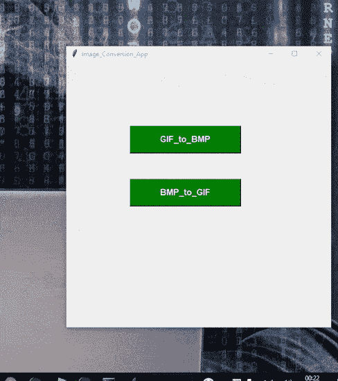

# 转换。GIF 到。在 Python 中是 BMP，反之亦然

> 原文:[https://www . geesforgeks . org/convert-the-gif-to-BMP-its-反之亦然-in-python/](https://www.geeksforgeeks.org/convert-the-gif-to-bmp-and-its-vice-versa-in-python/)

有时需要附加图像，我们需要一个指定扩展名的图像文件。我们有不同扩展名的图像，需要用指定的扩展名进行转换，像这样，我们将转换扩展名为的图像。bmp 到。gif，反之亦然。在本文中，我们将转换。GIF 到。BMP 和。BMP 转换为. GIF。

此外，我们将创建代码的图形用户界面，因此我们将需要库 [**Tkinter**](https://www.geeksforgeeks.org/python-gui-tkinter/) 。Tkinter 是一个绑定到 Tk GUI 工具包的 Python。这是 Tk 图形用户界面工具包的标准 Python 接口，它提供了图形用户界面应用程序的接口。

## **所需模块:**

*   [**Tkinter**](https://www.geeksforgeeks.org/python-gui-tkinter/)**:**Tkinter 是一个绑定到 Tk GUI 工具包的 Python。
*   **PIL:** 是Python 成像库为 Python 解释器提供图像编辑功能。

**让我们逐步实现:**

**第一步:导入库。**

```
from PIL import Image
```

步骤 2: JPG 至 GIF

```
To convert the image From BMP to GIF : {Syntax}
img = Image.open("Image.bmp")
img.save("Image.gif")
```

步骤 3: GIF 至 JPG

```
To convert the Image From GIF to PNG
img = Image.open("Image.gif")
img.save("Image.bmp")
```

**进场:**

*   在函数 bmp_to_gif 中，我们首先检查选择图像的格式是否相同。bmp)转换为。如果不是，则返回错误。
*   否则将图像转换为。可交换的图像格式
*   为了打开图像，我们使用了 tkinter 中的函数 FileDialog 来帮助打开文件夹中的图像
*   从 tkinter 导入文件对话框作为 fd
*   同样的方法为 GIF 到 BMP

**以下是完整实现:**

## 蟒蛇 3

```
from tkinter import *
from tkinter import filedialog as fd
import os
from PIL import Image
from tkinter import messagebox

root = Tk()

# naming the GUI interface to image_conversion_APP
root.title("Image_Conversion_App")

# creating the Function which converts the jpg_to_png
def gif_to_bmp():
    global im

    import_filename = fd.askopenfilename()

    if import_filename.endswith(".gif"):

        im = Image.open(import_filename)
        export_filename = fd.asksaveasfilename(defaultextension = ".bmp")
        im.save(export_filename)
        messagebox.showinfo("Success", "File converted to .png")
    else:
        messagebox.showerror("Fail!!", "Error Interrupted!!!! Check Again")
def bmp_to_gif():

    import_filename = fd.askopenfilename()
    if import_filename.endswith(".bmp"):

        im = Image.open(import_filename)
        export_filename = fd.asksaveasfilename(defaultextension = ".gif")
        im.save(export_filename)
        messagebox.showinfo("Success", "File converted to .gif")
    else:

        messagebox.showerror("Fail!!", "Error Interrupted!!!! Check Again")

button1 = Button(root, text = "GIF_to_BMP",
                 width = 20, height = 2,
                 bg = "green", fg = "white",
                 font = ("helvetica", 12, "bold"),
                 command = gif_to_bmp)

button1.place(x = 120, y = 120)

button2 = Button(root, text = "BMP_to_GIF",
                 width = 20, height = 2,
                 bg = "green", fg = "white",
                 font = ("helvetica", 12, "bold"),
                 command = bmp_to_gif)

button2.place(x = 120, y = 220)
root.geometry("500x500+400+200")
root.mainloop()
```

**输出:**

